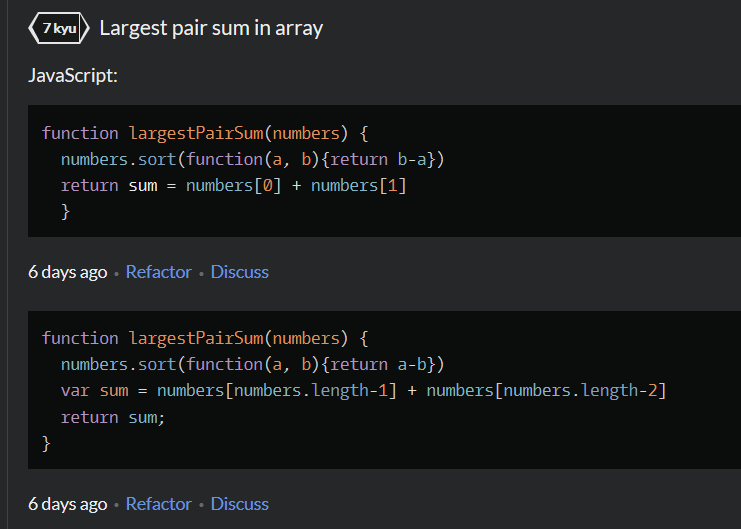
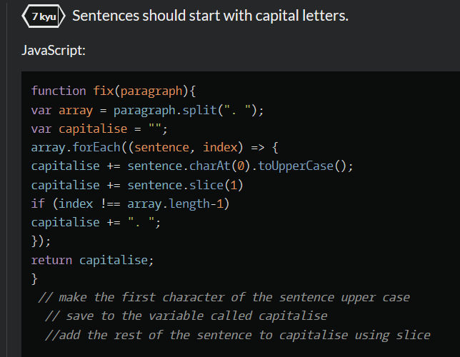

# 100 Days Of Code Diary 2020

## Day 1

_30th June_

### Today's progress:

- I learnt a new mark-up language called Markdown (the very language I'm now writing in!)
- I sorted out my GitHub repos's and pushed up any new changes to my projects.
- I used markdown to create README docs for some of my GitHub repo's.

### Thoughts:

I'm feeling really excited to have started 100 Days Of Code and already feel more motivated to code every day. I think having a goal of just one hour a day seems very managable for me, rather than feeling like unless I spend at least 3 hours a day learning it's not worth it.

### Links to work / resources:

[An example of the README files I have started making](https://github.com/katiehawcutt/interval-timer-app)

## Day 2

_1st July_

### Today's progress:

- I started learning SQL and I now know a bit more about databases, select queries, the insert into, update and delete statements, joins, views and indexes. I really enjoyed watching these quirky Socratica videos to get a good overview of the basics!
- Attended a CodeFirstGirls online event at lunchtime to find out more about life as an engineer.

### Thoughts:

I really enjoyed learning something brand new today (SQL) and exploring a different area of programming. I was feeling like I needed something fresh and a little break from HTML, CSS and JavaScript and this hit the spot! It's amazing how quickly I am picking up new languages now that I've got a good grasp of HTML, CSS and JS. They all have similarities which really helps.

### Links to work / resources:

[Socratica SQL videos](https://www.youtube.com/results?search_query=socratica+sql)

## Day 3

_2nd July_

### Today's progress:

- I practised some SQL using SQL Bolt which was a really good way to put some theory into practice. I got up to Lesson 10.
- I completed a CodeWars ("Largest Pair Sum In An Array") using the array method sort(). I then refactored it to make it cleaner and more consise.

### Thoughts:

I enjoyed putting my SQL learning into pratice and found that I could recall a lot of what I watched in the videos yesterday which really helped me to complete the exercises. I'm really excited that I was able to complete a 7kyu Kata and then refactor it myself with no help at all! It really boosted my confidence and I finished today's learning on a high!

### Links to work / resources:

[SQL Bolt Exercises](https://sqlbolt.com/lesson/introduction)

CodeWars Challenge:

## Day 4

_3rd July_

### Today's progress:

- I spent some time working on another CodeWars 7kyu Kata ("Sentences Should Start With Capital Letters"), using some string methods (split() and slice()) and array methods (forEach()) to complete it. I found this one harder than yesterday's challenge and needed a little help to complete it. I hadn't used split(". ") like this before so it was a really good learning point.

### Thoughts:

I used to always feel like I'd failed if I couldn't complete a CodeWars kata all by myself and had to ask for help. Rather than seeing it as an opportunity to learn I'd just feel frustrated and disappointed (something to do with me wanting to acheive perfection the whole time!). I've really been working hard to create new pathways in my brain that allow me to not be perfect and to be okay with not knowing things straight away. I'm pleased to say that I'm getting much better at it! I see this kata as a success as I was 80% there and then just needed a little help to get over the final hurdle (in which I learnt something new so that was a valuable process). I think the universe rewarded me as I then got a new rank of 6kyu!

### Links to work / resources:

CodeWars Challenge:

## Day 5

_4th July_

### Today's progress:

- Listened to a SyntaxFM podcast on servers and what makes them fast. I learnt about :

  [RAM](https://www.digitaltrends.com/computing/what-is-ram/) (Random Access Memory) which is basically short term memory in your deivce. It is an extremely fast component that temporarily stores all the information your PC needs right now and in the near future.

  [CPU's](https://www.digitaltrends.com/computing/what-is-a-cpu/) (Central Processing Units) which are responsible for processing and executing instructions.

  [GPU's](https://www.itpro.co.uk/hardware/30399/what-is-a-gpu) (Graphics Processing Unit) which are processors that are specially-designed to handle intensive graphics rendering tasks.

  [SSD's](https://www.avast.com/c-what-is-ssd) (Solid-State Drives) which are a new generation of storage device used in computers. SSDs replace traditional mechanical hard disks by using flash-based memory which is significantly faster.

- I also watched Lecture 2 (Arrays) of Havard's CS50 course. I'm learning more C as we go along and although it feels a bit different I am noticing the similarities it has with JavaScript.

### Thoughts:

I'm about to make my own sever so it was interesting to listen to this podcast and learn about some of their components. When I first started listening to SyntaxFM podcasts I didn't really understand or know about anything they discussed (I just tried to absorb everything). It's nice now to feel a little less out of my depth and to understand much more of what they talk about!

The teaching on the CS50 course is really good and I'm enjoying these videos a lot. It's also interesting to learn a slightly lower level programming language (C) and to understand how things fit together in the wider spectrum of Computer Science.

### Links to work / resources:

[SyntaxFM Server Episode](https://open.spotify.com/episode/0NqiSqPzkKFnBH34g6Cvxg?si=LHrcv-6JRs60pPFXxn_tNA)

[CS50 Lecture 2: Arrays](https://www.youtube.com/watch?v=8PrOp9t0PyQ)

## Day 6

_5th July_

### Today's progress:

- I did a recap on node.js and learnt how to create and run a programme in node using npm (node package manager).
- I created and edited a package JSON.
- I built my own server using http (a core node module) and then using Express.

### Thoughts:

I understand how it works and want to practice creating more node.js programs and servers to establish some muscle memory with it all. Still not totally sure how it fits into the bigger picture of things though so looking forward to a project where I can work on both the front end and back end which will help me to join the dots.

### Links to work / resources:

## Day 7

_6th July_

### Today's progress:

- Continued with Wes Bos' CSS Grid Course and learnt how to make a responsive website with grid without using any media queries! You use the minMax property instead - pretty cool!

### Thoughts:

Found it hard to focus today as I had lots of other non-code related things on my mind which kept distracting me. So I did a shorter session but really pleased I still did something.

### Links to work / resources:

[Wes Bos CSS Grid Course](https://wesbos.com/courses)

## Day 8

_8th July_

### Today's progress:

- I did Wes Bos' Mastering Markdown course and learnt a few new tricks! It was really helpful seeing as I'm going to be using markdown a lot more over the coming weeks as I do this diary.
- I finished writing README files for all my GitHub repo's which was a really useful and productive activity. As I was reflecting on my main learning points for each project, it allowed me recap on lots of useful topics (fetch, asynchronous callback functions, promises, JSON). A really good refresher!
- I created this 100 Days Of Code diary and filled in the last weeks worth of notes. I'm really pleased I'm doing this diary as part of the challenge as it is helping me to reflect upon and consolidate my learning. I think it's also going to be super encouraging to be able to look back on all I've learnt and see how much I've progressed.

### Thoughts:

I'm feeling really good about code at the moment and I've got quite a few things I want to learn about/ achieve this week. I'm in a good flow currently and having the target of one hour a day really helps to motivate me. I am also enjoying the twitter cominuty of 100DaysOfCode and it's encouraging to see other code newbies learning code / having fun / struggling / overcoming problems too. I feel part of something bigger which is a good driving force.

### Links to work / resources:

[My GitHub repos's with all my README files](https://github.com/katiehawcutt?tab=repositories)

[Wes Bos Mastering Markdown Course](https://wesbos.com/courses)

## Day 9

### Today's progress:

### Thoughts:

### Links to work / resources:

## Day 10

### Today's progress:

### Thoughts:

### Links to work / resources:
