# 100 Days Of Code Diary / School of Code Bootcamp Diary

## Day 1

_30th June_

### Today's progress:

- I learnt a new mark-up language called Markdown (the very language I'm now writing in!)
- I sorted out my GitHub repos and pushed up any new changes to my projects.
- I used markdown to create README docs for some of my GitHub repos.

### Thoughts:

I'm feeling really excited to have started 100 Days Of Code and already feel more motivated to code every day. I think having a goal of just one hour a day seems very manageable for me, rather than feeling like unless I spend at least 3 hours a day learning it's not worth it.

### Links to work / resources:

[An example of the README files I have started making](https://github.com/katiehawcutt/interval-timer-app)

## Day 2

_1st July_

### Today's progress:

- I started learning SQL and I now know a bit more about databases, select queries, the insert into, update and delete statements, joins, views and indexes. I really enjoyed watching these quirky Socratica videos to get a good overview of the basics!
- Attended a CodeFirstGirls online event at lunchtime to find out more about life as an engineer.

### Thoughts:

I really enjoyed learning something brand new today (SQL) and exploring a different area of programming. I was feeling like I needed something fresh and a little break from HTML, CSS and JavaScript and this hit the spot! It's amazing how quickly I am picking up new languages now that I've got a good grasp of HTML, CSS and JS. They all have similarities which really helps.

### Links to work / resources:

[Socratica SQL videos](https://www.youtube.com/results?search_query=socratica+sql)

## Day 3

_2nd July_

### Today's progress:

- I practised some SQL using SQL Bolt which was a really good way to put some theory into practice. I got up to Lesson 10.
- I completed a CodeWars ("Largest Pair Sum In An Array") using the array method `sort()`. I then refactored it to make it cleaner and more concise.

### Thoughts:

I enjoyed putting my SQL learning into practice and found that I could recall a lot of what I watched in the videos yesterday which really helped me to complete the exercises. I'm really excited that I was able to complete a 7kyu Kata and then refactor it myself with no help at all! It really boosted my confidence and I finished today's learning on a high!

### Links to work / resources:

[SQL Bolt Exercises](https://sqlbolt.com/lesson/introduction)

CodeWars Challenge:

## Day 4

_3rd July_

### Today's progress:

- I spent some time working on another CodeWars 7kyu Kata ("Sentences Should Start With Capital Letters"), using some string methods (`split()` and `slice()`) and array methods (forEach()) to complete it. I found this one harder than yesterday's challenge and needed a little help to complete it. I hadn't used `split(". ")` like this before so it was a really good learning point.

### Thoughts:

I used to always feel like I'd failed if I couldn't complete a CodeWars kata all by myself and had to ask for help. Rather than seeing it as an opportunity to learn I'd just feel frustrated and disappointed (something to do with me wanting to achieve perfection the whole time!). I've really been working hard to create new pathways in my brain that allow me to not be perfect and to be okay with not knowing things straight away. I'm pleased to say that I'm getting much better at it! I see this kata as a success as I was 80% there and then just needed a little help to get over the final hurdle (in which I learnt something new so that was a valuable process). I think the universe rewarded me as I then got a new rank of 6kyu!

### Links to work / resources:

CodeWars Challenge:

## Day 5

_4th July_

### Today's progress:

- Listened to a SyntaxFM podcast on servers and what makes them fast. I learnt about :

  [RAM](https://www.digitaltrends.com/computing/what-is-ram/) (Random Access Memory) which is basically short term memory in your device. It is an extremely fast component that temporarily stores all the information your PC needs right now and in the near future.

  [CPU's](https://www.digitaltrends.com/computing/what-is-a-cpu/) (Central Processing Units) which are responsible for processing and executing instructions.

  [GPU's](https://www.itpro.co.uk/hardware/30399/what-is-a-gpu) (Graphics Processing Unit) which are processors that are specially-designed to handle intensive graphics rendering tasks.

  [SSD's](https://www.avast.com/c-what-is-ssd) (Solid-State Drives) which are a new generation of storage device used in computers. SSDs replace traditional mechanical hard disks by using flash-based memory which is significantly faster.

- I also watched Lecture 2 (Arrays) of Harvard's CS50 course. I'm learning more C as we go along and although it feels a bit different I am noticing the similarities it has with JavaScript.

### Thoughts:

I'm about to write my own server so it was interesting to listen to this podcast and learn about some of their components. When I first started listening to SyntaxFM podcasts I didn't really understand or know about anything they discussed (I just tried to absorb everything). It's nice now to feel a little less out of my depth and to understand much more of what they talk about!

The teaching on the CS50 course is really good and I'm enjoying these videos a lot. It's also interesting to learn a slightly lower level programming language (C) and to understand how things fit together in the wider spectrum of Computer Science.

### Links to work / resources:

[SyntaxFM Server Episode](https://open.spotify.com/episode/0NqiSqPzkKFnBH34g6Cvxg?si=LHrcv-6JRs60pPFXxn_tNA)

[CS50 Lecture 2: Arrays](https://www.youtube.com/watch?v=8PrOp9t0PyQ)

## Day 6

_5th July_

### Today's progress:

- I did a recap on node.js and learnt how to create and run a programme in node using npm (node package manager).
- I created and edited a package JSON.
- I made my own server using http (a core node module) and then using Express.

### Thoughts:

I understand how it works and want to practice creating more node.js programs and servers to establish some muscle memory with it all. Still not totally sure how it fits into the bigger picture of things though so looking forward to a project where I can work on both the front end and back end which will help me to join the dots.

### Links to work / resources:

## Day 7

_6th July_

### Today's progress:

- Continued with Wes Bos' CSS Grid Course and learnt how to make a responsive website with grid without using any media queries! You use the `minMax` property instead - pretty cool!

### Thoughts:

Found it hard to focus today as I had lots of other non-code related things on my mind which kept distracting me. So I did a shorter session but really pleased I still did something.

### Links to work / resources:

[Wes Bos CSS Grid Course](https://wesbos.com/courses)

## Day 8

_8th July_

### Today's progress:

- I did Wes Bos' Mastering Markdown course and learnt a few new tricks! It was really helpful seeing as I'm going to be using markdown a lot more over the coming weeks as I do this diary.
- I finished writing README files for all my GitHub repo's which was a really useful and productive activity. As I was reflecting on my main learning points for each project, it allowed me recap on lots of useful topics (fetch, asynchronous callback functions, promises, JSON). A really good refresher!
- I created this 100 Days Of Code diary and filled in the last weeks worth of notes. I'm really pleased I'm doing this diary as part of the challenge as it is helping me to reflect upon and consolidate my learning. I think it's also going to be super encouraging to be able to look back on all I've learnt and see how much I've progressed.

### Thoughts:

I'm feeling really good about code at the moment and I've got quite a few things I want to learn about/ achieve this week. I'm in a good flow currently and having the target of one hour a day really helps to motivate me. I am also enjoying the twitter community of 100DaysOfCode and it's encouraging to see other code newbies learning code / having fun / struggling / overcoming problems too. I feel part of something bigger which is a good driving force.

### Links to work / resources:

[My GitHub repos's with all my README files](https://github.com/katiehawcutt?tab=repositories)

[Wes Bos Mastering Markdown Course](https://wesbos.com/courses)

## Day 9

_9th July_

### Today's progress:

- I made a program called Randomizer that console logged a random number between 1 and 6. I created a package JSON and then ran the program in node.
- I made another http server by myself to see if I could remember how (and I could!)
- I finished working through the SQL Bolt Interactive Tutorial and learnt how to implement aggregate expressions (functions), recapped the order of execution of a select query, and then practiced inserting, updating and deleting rows in a table, creating, altering and dropping tables.

### Thoughts:

It was good to dive back in to SQL after a few days away from it. I had to look a few things up again to start with but I soon got back in to it. I found creating the program in node quite easy. I've done a lot of learning theory for the last week so I might start another little project again soon.

### Links to work / resources:

## Day 10

_10th July_

### Today's progress:

- I started a new project with Scratch and made an interactive animation about a dancing dinosaur called Dino! It was my first time properly using Scratch and I really enjoyed it. Looking forward to exploring more of its potential.

### Thoughts:

It felt good to work on something creative again after getting stuck into a lot of theory over the last couple of weeks. I really enjoyed the design aspect of it as well as getting it to function in the way I wanted.

### Links to work / resources:

[Dino The Dancing Dinosaur animation using Scratch](https://scratch.mit.edu/projects/410791742)

### Day 11

_13th July_

### Today's progress:

- I read a really good article entitled [23 Alternative Career Paths That Software Developers Can Grow Into](https://www.freecodecamp.org/news/alternative-career-paths/) and spent some time reflecting and researching into which areas of work I might be interested in / suited to. It was really helpful to think about the bigger picture and my end goal for learning to code / getting into tech.

### Thoughts:

As well as being exciting, it can be overwhelming thinking ahead as I am venturing into a industry which is completely new to me. I don't even know all the possible jobs I could get let alone which one I want! But reading this article and looking into a few more roles specifically has helped, and I do know that I want to work as part of team, I really love organising things, communicating with people and feeling on top of / managing situations. At the moment, the roles that I am most drawn to are project manager, product manager, scrum master and teacher / trainer (I have prior experience in teaching), as well as web developer. It's good to bear this in mind as I move forward as I can aim to upskill in the relevant areas and try to connect with people currently in those roles to find out more about them.

### Links to work / resources:

[23 Alternative Career Paths That Software Developers Can Grow Into](https://www.freecodecamp.org/news/alternative-career-paths/)

[How To Get Into Product Management](https://medium.com/hackernoon/how-to-get-into-product-management-78c58bd9c8cf)

[How To Succeed In A Project Manager Role In The Tech Industry](https://www.randstad.co.uk/career-advice/career-guidance/how-to-succeed-a-project-manager-role-tech-industry/)

### Day 12

_14th July_

### Today's progress:

- I spent all morning researching and learning about Agile Methodolody and the Scrum framework. I found the [Atlassian website](https://www.atlassian.com/agile) particularly helpful along with their YouTube videos and I now feel like I have a much clearer understanding of agile principles and agile project management frameworks.

- I also read an article on [Mission, Strategy, Tactics and Vision](https://boz.com/articles/strategy-tactics). I learnt more about what each of them are and why they are important.

### Thoughts:

Having looked into lots of possible job roles yesterday, I realised that the one skill that ties a lot of them together is the ability to be able to work effectively in a team. This inspired me to look into agile methodology and the scrum framework as I know these are widely used approaches in the tech sector. (I'd also like to look into other frameworks such as Kanban and XP.) I felt inspired after my research / learning and it increased my desire to work in an environment like this and be part of such a well functioning team. Whatever line of work I go into, I know these skills and knowledge will be very useful. I can't wait to join a bootcamp and start learning / working as a team rather than as a solo learner!

### Links to work / resources:

[The Original Agile Manifesto](https://agilemanifesto.org/)

[Atlassian Website](https://www.atlassian.com/agile)

[Atlassian YouTube videos on What Is Scrum?](https://www.youtube.com/watch?v=dJNCHvqKljU&list=PLaD4FvsFdarT0B2yi9byhKWYX1YmrkrpC&index=10)

### Day 13

_16th July_

### Today's progress:

- I completed the first stage of the School of Code bootcamp application process. I made three avatars using the School of Code's introduction to HTML, CSS and JavaScript on their learning platform. I also had to write a little bit about why I wanted to do the bootcamp.
- I listened to a Syntax Podcast episode and learnt a bit more about frameworks, fonts and CMS's.

### Thoughts:

I'm really excited to be starting the application stages for SoC and although I found it an easy task and didn't struggle to complete it, I was still a bit nervous about it. I think it's because I've had a lot of time over the last few months to think about how much I want to do the course and it's become quite a big deal to me now. I'm trying to keep things in perspective, stay calm and just do my thing!

### Links to work / resources:

SoC Application Avatar Task:

[Syntax FM Podcast - Potluck on fonts, frameworks, and more...](https://open.spotify.com/episode/3bktBVChDHgDnOFqU8Cakv?si=qMKxNr36ToKIoVwxjyuD3w)

### Day 14

_17th July_

### Today's progress:

- I completed the FreeCodeCamp learning section on Applied Accessibility. I learnt that "accessibility" generally means having web content and a user interface that can be understood, navigated, and interacted with by a broad audience. This includes people with visual, auditory, mobility, or cognitive disabilities.The main points I took away were that it's important to:

  1. Have well-organized code that uses appropriate markup

  2. Ensure text alternatives exist for non-text and visual content

  3. Create an easily-navigated page that's keyboard-friendly

I learnt about some HTML tags that are particularly useful and important for this (eg. main, header, footer, section, article, fieldset, legend, date) and that it's important to label images / inputs /graphs, etc. appropriately using alt / for / figcaption. We should also style our pages with CSS in a colour friendly way and use the correct contrast.

### Thoughts:

I was listening to a podcast yesterday in which they mentioned accessibility and it reminded me that it was something I wanted to look into again. I did cover it when I first got into coding but I wanted to refresh myself. It was much easier to take it all in now I've learnt more and have a framework in my mind to attch new knowledge too. It nice to be reminded of how far I've come since March!

### Links to work / resources:

### Day 15

_18th July_

### Today's progress:

- I worked on a couple of Codewars challenges and learnt how to chain array methods together!

### Thoughts:

I was really pleased as I managed to complete the 7kyu kata by myself (which I still get really excited about!). I'm finding myself being able to think through the logic of the solution so much faster and I'm able to break down the solution into manageable chunks. This really encouraged me as it used to take me ages to even be able to formulate a pseudo plan. It's now happening much more quickly and naturally. Ben helped me with the 6kyu kata and I learnt how to chain together array methods which we'd talked about before but I'd never actually done. This was a really good learning session.

### Links to work / resources:

### Day 16

_21st July_

### Today's progress:

- I submitted my School of Code Bootcamp Video Application. This involved answering four different questions (with around a minute for each question) and then editing them together into a little film.

- I read an article on [How To Go From A Junior Developer To A Mid-Level Developer](https://www.freecodecamp.org/news/how-to-go-from-junior-developer-to-mid-level-developer/). I know I'm a way off yet but it's good to look ahead and make sure I'm going in the right direction!

### Thoughts:

I've had a couple of days off from actual coding as I've been working on my School of Code Bootcamp Video Application which I submitted last night. This involved me spending quite a lot of time planning my answers to four questions and then filming them / editing them together into a little video. I have never done a video interview before and I found it difficult. I think I tend to over-think these things and would have much preferred a live interview! After I'd filmed the different questions I found a video editor on my laptop (which I'd never used before) and I really enjoyed editing the different sections of film together. It was a great new experience and I'd like to do more of it!

### Links to work / resources:

### Day 17

_22nd July_

### Today's progress:

- I started work on a little CodePen project using CSS to draw a beach scene. I've not used CodePen before so it was fun to try it out!

### Thoughts:

It was great to be using CSS again as I've haven't used any for a few weeks. I really enjoy the visual design aspect of coding and get into a nice work flow with it. As I'm in Devon near the beach at the moment I thought I'd create something relevant! Looking forward to finishing this off and getting more stuck into CSS.

### Links to work / resources:

### Day 18

_24th July_

### Today's progress:

- I finished my first Scratch project - an interactive animation called Deeno The Dancing Dinosaur. This is the third part of my School of Code Application and I'm very pleased to have submitted it today!

### Thoughts:

I really enjoyed working on this animation project and absolutely loved the creative aspect of it. I also really enjoyed using Scratch - the coding building blocks (with their different shapes and colours) remind me of Lego and serve as a really helpful visual aid to building code. It was a good recap on logical / programmatic thinking.

### Links to work / resources:

[Deeno The Dancing Dinosaur](https://scratch.mit.edu/projects/410791742)

### Day 19

_29th July_

### Today's progress:

- I learnt about the history of open source by listening to a couple of great Command Line Heroes podcasts called OS Wars: Part 1 & 2. It was really interesting to learn more about the history of computing, the development of operating systems and the battles between the big players - Microsoft, Apple and Linux.

### Thoughts:

After completing my School of Code application last week I had a few days off from coding / learning to refresh myself as I realised I'd been feeling quite anxious about the bootcamp application and it felt right to have a little break. Listening to these podcasts was a great was to ease myself back in and I'm feeling inspired to get down to some good coding over the coming weeks!

### Links to work / resources:

[OS Wars: Part 1](https://open.spotify.com/episode/1YyKEZ71i9af1hohHoNjYu?si=qA0vnm4WSquFe08gfCHJzg)

[OS Wars: Part 2](https://open.spotify.com/episode/5cQ9coeieMnnnpUedANIqe?si=tJMikHFXS2udh3vOhIP98Q)

### Day 20

_31st July_

### Today's progress:

I followed a CodePen tutorial and made a CSS sheep! It was a really helpful exercise and I learnt about quite a few new things such as:

- How to use clip-path to make shapes (and I used [Clippy](https://bennettfeely.com/clippy/) to help)

- Using CSS variables

- Using `::before` and `::after` selectors

I also got to recap on a few things which I'd not done for a while:

- The position property - specifically using absolute and relative

- Positioning elements with %'s

### Thoughts:

I really enjoyed making this little sheep! As well as learning a few new things it opened my eyes to how many lines of code is needed just to make one small image with CSS!

### Links to work / resources:

[My CSS Sheep on CodePen](https://codepen.io/katiehawcutt/pen/jOWgOwR)

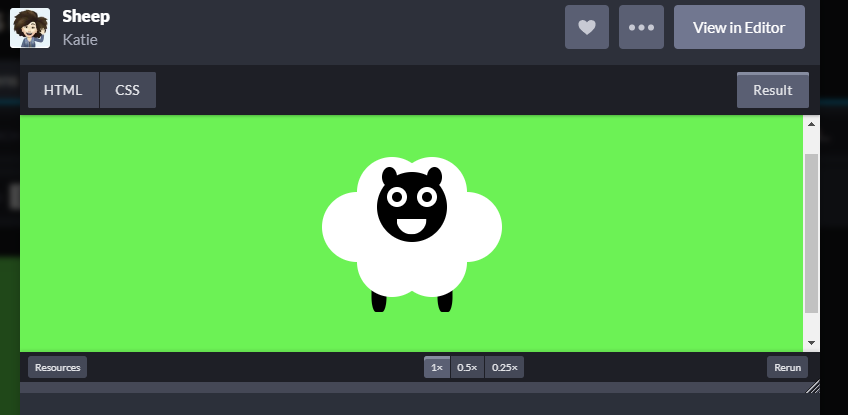

### Day 21

_2nd August_

### Today's progress:

I used what I learnt making my CSS sheep to add to my Beach Scene (in Codepen):

- I added quite a few other elements including a kite, spade, shark-fin, starfish and shell and I used clip-path to make the shapes of these elements
- I took the process I used to make the sheep fluff and used it to make the cloud (they are very similar!)
- I used the `::before` and `::after` selectors quite a few times to cut down on div's
- I got much better at positioning using % and px
- I added some animation to the elements using `@keyframes` and the transform / trnaslate properties

### Thoughts:

I really enjoyed making this animated picture and it was great to implement lots of the things I'd learnt about making the CSS sheep into my own project. It's been a really useful few days getting into CSS again and going into detail with positioning and creating shapes.

### Links to work / resources:

[My Beach Scene on CodePen](https://codepen.io/katiehawcutt/pen/QWyYvGe)

### Day 22

_3rd August_

### Today's progress:

- I started Wes Bos' JavaScript30 Course and made a drum-kit by following his first tutorial! I learnt about key events, playing audio and listening for the transition end event. I also used an attribute selector which I'd not done before. Then I custom styled it with a video background of a concert so I feel like a rock star when I'm playing it!

- I talked through the code with Ben when I'd finished and explained to him what everything did. I find this helps to solidify my learning and makes sure that I really know what's going on in detail on each line of code, rather than just getting the gist of things.

- I also looked into `this` as I had to use it again today and wanted a refresher. I found the below very helpful:

## What is this?

The JavaScript `this` keyword refers to the object it belongs to.

It has different values depending on where it is used:

    In a method, this refers to the owner object.

    Alone, this refers to the global object.

    In a function, this refers to the global object.

    In a function, in strict mode, this is undefined.

    In an event, this refers to the element that received the event.

    Methods like call(), and apply() can refer this to any object.

Handy tip: if you're not sure what 'this' is, just console log it!

### Thoughts:

I've made similar audio apps before so the ideas I used today weren't completely foreign to me but I definitely learnt some new things about events which was really helpful. In terms of technical understanding of the code and committing processes to memory I just find repetition so helpful so the more I can talk through the code / refactor / make more, the better!

### Links to work / resources:

My drumkit:

### Day 23

_4th August_

### Today's progress:

- I've started making a To-Do List App. I'm happy with the design and I've got it working but I want to refactor it tomorrow as I've got quite a bit of repetition in my code at the moment.

### Thoughts:

I tried to make this to-do list app a little while ago when I first started coding. I followed a tutorial at the time and didn't really understand what I was doing. Now when I look at the code I understand it all which is great! I never finished the project properly and I'd left it in quite a basic state. I've now overhauled the whole design and made three lists instead of one which meant adding quite a bit of new code. I felt a bit frustrated at the end as I wanted to refactor it straight away but I'm really tired now so I'll tackle it tomorrow when I'm fresh!

### Links to work / resources:

### Day 24

_5th August_

### Today's progress:

- I made an analogue clock with the help of the next JavaScript30 tutorial. I really enjoyed combining CSS and JavaScript to make something really functional. I found it surprisingly simple and although I did have help with the JS (in the tutorial) I feel like I understand what everything is doing and like I could recreate it on my own. Also, all the CSS I've been doing over the past few weeks really helped me to design my clock quickly, efficiently and confidently.

- I used the CSS property `transform-origin` for the first time which was very exciting! I could have done with that the other day when I was making my beach scene! I want to try and make a sun with rays of light now I've learnt about that.

- I started refactoring my To-Do List app but didn't get too far before I broke it! Struggled with it for a while and managed to reduce a few lines of code and get part of it working. But I'm a bit stuck now - I will ask Ben for a bit of help at some point.

### Thoughts:

I found the refactoring hard and I feel like I'm struggling to get my JavaScript to the next level. I know that I am able to do quite a few different things with JS and use methods / solve problems (for example, on Codewars I'm doing okay) but when it comes to pulling a real life app / project together I can't seems to connect all the dots. I know that with practice this will improve but I feel myself getting frustrated sometimes and like I'm having a complete blank! I'm happy I can get things working but I want my code to be as efficient and non-repetitive as possible. I'm choosing to see it as a good test of my mental robustness which I know I need to work on!

### Links to work / resources:

[Click here to see my clock in action!](https://codepen.io/katiehawcutt/pen/eYZYexw)

### Day 25

_6th August_

### Today's progress:

I made a little app in which you can adjust the border width, color and blur of a photo. I made it as part of [Wes Bos' JavaScript30](https://wesbos.com/) course to practice using CSS variables and then updating them with JavaScript.

Things I learnt:

- I used the HTML `range` input and `color` input for the first time.

- I learnt that when you use `querySelector / querySelectorAll` it returns you a Node List which is very similar to an array except there are a lot less methods you can use on it. `forEach` _is_ one of the methods you can use on a Node List and I used this one today.

- I learnt that there is an `EventListener` called 'change'.

- I learnt that `document.documentElement` returns you the element which is the root element of the HTML document.

- I learnt how to update a CSS variable with JavaScript.

### Thoughts:

I really enjoyed this little project and learnt lots! I'm having a really positive week code-wise and feeling super motivated to learn everyday!

### Links to work / resources:

[Click here to see my app which uses JavaScript to update CSS variables!](https://github.com/katiehawcutt/CSS-variables-project)

### Day 26

_8th August_

### Today's progress:

- I refactored my To-Do-List app which I am so pleased about as although I was happy I'd got it working this week there was a lot of repetition in my code and the data wasn't stored in a very efficient way. With a little help from Ben, I did a big refactor and got 80 lines of JavaScript down to 47! I've changed the data structure so that the items are now stored in an array (rather than as HTML strings) and that allowed me to store and access the data more efficiently. I learnt a lot during the refactoring process including:

  - Thinking about good ways to store data - in this case, an array of objects.

  - Accessing data in an object using dot notation and using the index.

  - Saving data to `localStorage` and using the `setItem()` and `getItem()` methods on localStorage.

  - Using `JSON.stringify()` to save my array to localStorage (which only takes data in a string format) and `JSON.parse()` to get the data back out as an array.

  - Practiced using the array methods `forEach()`, `splice()` and `indexOf()`.

  - How to stop a page refreshing on 'submit' when using the HTML form element.

- I read a really good article about CSS positioning using %'s and what the %'s actually means ([What Does 100% Actually Mean In CSS?](https://wattenberger.com/blog/css-percents)). I've been getting into CSS more recently and using %'s but sometimes they haven't worked how I thought they would. This article clears it all up and is super helpful! This is the main thing to take away:

- I updated my GitHub repo README's so they contained a screenshot of my project before the little write-up. I think it really adds to be able to see a snapshot of each project and brings the README file to life a bit more!

### Thoughts:

I really enjoyed doing the refactor of my list app with Ben. It was so helpful to have some one to one help and I felt really positive about all the learning. I think grasping and understanding ideas about effective data structures will really help me going forward as I build new apps / projects.

I found out last night that I've got through to the final stage of the SoC bootcamp application stages so I'm feeling really happy about that! Just a final interview left to go next week!

### Links to work / resources:

[View my To-Do-List App source code on GitHub](https://github.com/katiehawcutt/to-do-list-app)

### Day 27

_9th August_

### Today's progress:

- I listened to two podcasts from the Command Line Heroes series about the Agile revolution and DevOps. I really enjoyed learning a bit more about the history of development and operations and it's helped me to understand more about the role of DevOps in the current world of tech.

### Thoughts:

I've got my School of Code Final Interview tomorrow so I'm looking forward to that (and a little bit nervous / excited as I've been working towards this for a while!).

### Links to work / resources:

[The Agile Revolution (Command Line Heroes Podcast)](https://open.spotify.com/episode/5GaPzvIM5cSffaULtGP3nR?si=p3iB3ng1RB6wOgvAbyXnIw)

[DevOps Tear Down That Wall (Command Line Heroes Podcast)](https://open.spotify.com/episode/7i4d7AYsSapMG6bDtVPY1y?si=7w5mV-qURHqSnETLiusS_w)

### Day 28

_10th August_

### Today's progress:

- I had my SoC final interview this morning!

- This afternoon I worked through the next JavaScript30 Challenge which was called Array Cardio (Day 1). I used `map()`, `filter()`, `sort()`, `reduce()` and `split()` to complete some exercises. I worked out a couple almost by myself but needed to watch the tutorial for the rest of them. I'd not used `sort()` in the way I used it today before so that was interesting. We also did one exercise in the browser using querySelector to access the div with the information we wanted. We then turned that information from a Node List into an array using `Array.from()` which was new to me. So lots to take in!

### Thoughts:

I was feeling quite tired this afternoon (it's very, very hot and I'd expended lots of energy building up to my interview this morning!) so I found the Array Cardio challenge this afternoon quite a slog - I kep losing concentration because I was tired! I'm pleased I powered through though (and drank lots of water!) as I learnt a lot from these exercises. I still find JavaScript overwhelming at times as there is a lot to learn and understand with all the maths. But I am getting there and I know the key to success is repetition so I am planning on trying to do at least one CodeWars kata everyday for the rest of this week to practice all these array methods and also practice some ES6 syntax such as arrow functions.

### Links to work / resources:

[Array Cardio Day 1](https://github.com/katiehawcutt/array-cardio)

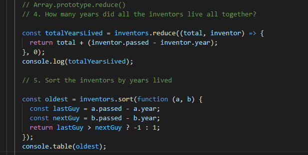

### Day 29

_11th August_

### Today's progress:

- I spent a few hours working on some CodeWars challenges and tried to put into practice some string methods, array methods and use what I learnt doing the JS30 Array Cardio yesterday.

### Thoughts:

I almost finished two more tricky kata but have got a bit stuck on the last hurdle so hoping to get some help finishing them this week. I made some good progress though and it was good to get back into some serious JavaScript!

### Links to work / resources:

Kata I worked on today:

[Ordered Count Of Characters (7kyu)](https://www.codewars.com/kata/57a6633153ba33189e000074)

[Sum Of Parts (6kyu)](https://www.codewars.com/kata/5ce399e0047a45001c853c2b)

### Day 30

_12th August_

### Today's progress:

- I'm all about the JavaScript this week so I continued working on some more CodeWars Kata. Did a few easier ones today including one called Keep Hydrated! (see below) which I thought was apt as it's sooo hot!

### Thoughts:

It feels good to be practising JavaScript everyday at the moment and I'm seeing good results. I'm getting much quicker at getting my head around the problem and coming up with the right steps to solve it. It's feeling more natural. I'm also getting much more confident using ES6 syntax which I'm really pleased about!

### Links to work / resources:

Keep Hydrated! Kata 8kyu:

### Day 31

_13th August_

### Today's progress:

- I solved another CodeWars kata called Fake Binary. With some help from Ben I then refactored it using `map()` rather than `forEach()` and cut down the lines of code quite significantly! It was good to practice chaining array methods.

- I completed the next JavaScript30 challenge and made a responsive image gallery. I used toggle for the first time!

### Thoughts:

I enjoyed my coding today and did a good mix of technical and creative work. As usual, I made the JS30 project my own and changed the background images, words and font.

### Links to work / resources:

Fake Binary Kata 8kyu:

[JS30 Responsive Image Gallery on GitHub](https://github.com/katiehawcutt/responsive-image-gallery)

### Day 32

_14th August_

### Today's progress:

- Today I woke up and wanted to make something cute so I created a little, grumpy, white cat on CodePen! I enjoyed using some of the skills I've recently learned. These included using `clip-path` to make the ears and nose, using the `transform-origin` property to rotate the whiskers correctly and using `::before` and `::after` to make the eyes, mouth and feet. I then added some animation at the end to make the eyes move!

### Thoughts:

I really enjoyed a very relaxed coding session today and ended up doing it all morning. It was a simple idea but I'm really pleased at how neat I managed to get it and I think adding the animation at the end really brings it to life!

### Links to work / resources:

[Cat on CodePen](https://codepen.io/katiehawcutt/pen/qBZbwmw)

### Day 33

_20th August_

### Today's progress:

- I finished a CodeWars Kata that I had got a bit stuck on and used a `Map object` for the first time. I was having trouble getting the numbers to show in order of appearance as somewhere along the way they were getting put into numerical order. That is why I ended up using Map as the Map object holds key-value pairs and remembers the original insertion order of the keys.

### Thoughts:

I needed some help to finish this one off and luckily Ben was on hand to assist! I hadn't used the Map object before so I did some good learning about that.

### Links to work / resources:

[Ordered Count Of Characters 7kyu Kata](https://www.codewars.com/kata/57a6633153ba33189e000074)

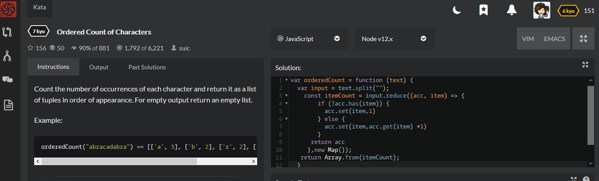

### Day 34

_25th August_

### Today's progress:

- I completed the next JavaScript30 Challenge which was called Type Ahead. It's a little feature which allows you to search a list of American cities / states for a specific word / group of letters. My main learning points were:

  - `fetch` returns a `promise`
  - a `promise` is `then-able`
  - using the spread operator to put data into an const variable
  - a regular expression is a pattern used to match character combinations in strings. As well as matching it can also perform "search-and-replace" functions
  - a regular expression is also an object (RegExp)

- I decided I wanted to learn more about RegExp's so I started the Regular Expressions section on freeCodeCamp and got two thirds of the way through. I used `match()` and learnt how to use modifiers, brackets, metacharacters and quantifiers to search for matches.

### Thoughts:

I'd already used `fetch` a couple of times before when making my quiz and a Kanye West quote generator. It was helpful to go over it again and it was nice that it felt like a familiar concept. The `RegExp` object was completely new to me so I decided to do a bit more learning around that afterwards to get to grips with it more.

I felt very tired this afternoon and found it hard to focus and take things in. Hoping I'll have more energy tomorrow!

### Links to work / resources:

JavaScript30 Type Ahead Challenge:

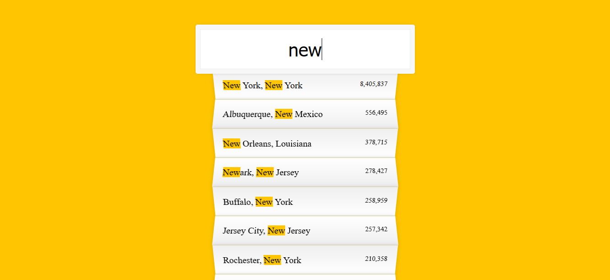

freeCodeCamp Regular Expressions:

### Day 35

_27th August_

### Today's progress:

- I finished off the Regular Expression section on freeCodeCamp.

- I did some more array method practice with Javacript30's Array Cardio 2! I used `some()`, `every()`, `find()` and `findIndex()`.

### Thoughts:

I enjoyed learning about RegExp and felt that I did grasp it by the end. It would be nice to practice using them some more as I feel like it's the kind of thing you need to be doing regularly to remember and get fluent with. The array cardio I did today was a bit easier than last time. I'd not used `some()` or `every()` before so it was good to learn those!

### Links to work / resources:

### Day 36

_28th August_

### Today's progress:

- I learnt about HTML5 `<canvas>` and made a little drawing app (part of the JavaScript30 challenge). I learnt that the `getContext()` method returns an object that provides methods & properties for drawing on the canvas. I'm planning to develop this more so that the user can change the colour, thickness and style of the pen!

### Thoughts:

- I really enjoyed learning something totally new today - it's exciting to discover a new element in HTML! I definitely feel like I'm picking up and understanding JavaScript more quickly now which is great.

### Links to work / resources:

### Day 37

_2nd September_

### Today's progress:

- I recapped on Markdown and completed a Markdown Tutorial / Course on Gibhub. New things I learnt were:

  - How to write a reference link
  - How to format a soft break within a paragraph

I'm looking forward to using my Markdown skills to write my first blog post!

### Thoughts:

**I got into the School of Code and I can officially tell the world! Woohoo! I'm so excited and happy to be on the next bootcamp and I can't wait to get started!**

After all the work I've put in over the last 6 months it feels so fantastic to have this opportunity to take my coding to the next level and to have the chance to make a career in tech a reality. I can't quite believe it and it's amazing to think where I'll be in 6 months time. I really looking forward to meeting lots of new people on the course, making new friends and getting stuck in to a new industry! Bring on 21st September 😀

### Links to work / resources:

[Markdown Tutorial](https://www.markdowntutorial.com/)

### Day 38

_3rd September_

### Today's progress:

- I recapped on HTML using the [Learn HTML course on Codecademy](https://www.codecademy.com/learn/learn-html). It was really to go back to basics again and solidify my knowledge. I found it particularly helpful going over the `<table>` and `<form>` elements again.

- I refactored my SoC Avatar so it has the appropriate size hair (eg. very big) and I'm now really happy with it! I think it looks just like me 😀

- I also read quite a few interesting articles today which were on the suggested reading list from SoC. They included:

  - [Stack Overflow 2020 Developer Survey](https://insights.stackoverflow.com/survey/2020#work-hours-worked-per-week-overall) - I found this a really interesting insight into the wider context around the programming landscape and community. It's great to learn more about the industry I'm moving into.

  - [What is Pair Programming?](https://stackify.com/pair-programming-advantages/) - having been learning to code by myself this year I am so excited to work with actual other humans and do some pair programming on the bootcamp!

  - [HTTP Requests](https://www.codecademy.com/articles/http-requests) - as I was learning about the HTML `<form>` element the subject of `POST` requests came up so I decided to do a bit of reading into HTTP requests. Although I've learnt about these before it was a great article which clearly explains how the web browser communicates with the internet.

### Thoughts:

I really enjoyed recapping on some HTML today and I feel very comfortable with this language now. It shows how far I've come in the last six months and fills me with confidence about what I can achieve in the next few!

### Links to work / resources:

### Day 39

_4th September_

### Today's progress:

- I finished the Learn HTML Course on Codecademy and learnt about client side form validation and semantic HTML. I'd not done form validation before so I really enjoyed learning about that and it included a bit of RegExp which I learnt about last week so that was nice!

- I practiced some more JavaScript and did a couple of CodeWars Kata (8kyu and 7kyu). Still get a buzz when I solve one! Also, I'm really enjoying refactoring my solutions in ES6 syntax and getting more comfortable with arrow functions now.

### Thoughts:

Feeling motivated at the moment to keep pushing forward with my learning so I can hit the ground running when the bootcamp starts. I'm enjoying feeling more confident with the languages I'm learning and it's motivating me to learn even more!

### Links to work / resources:

### Day 40

_7th September_

### Today's progress:

- I made a drawing app called Let's Draw! by building on the concepts I learnt in JS30 (CSS Variables and HTML5-Canvas). I'm using `<canvas>` to draw and you can adjust the size, style and colour of the brush. There is also a magical rainbow mode! 🌈 I'm really pleased with this and feel great that I've been able to bring together a few different concepts and make something cool.

- I completed almost all of [CSS Diner](https://flukeout.github.io/) and practiced using CSS selectors. Getting better at this - I only got stuck on 19 and 24!

- I started the [CodePen course on CSS](https://www.codecademy.com/learn/learn-css) and completed the first couple of modules. Although I feel quite comfortable with CSS now I still learnt some new things:

  - Horizontal margins add
  - Vertical margins collapse
  - `margin: 0 auto;` horizontally centres an element inside of its parent content area, if it has a width.
  - the `visibility` property can `hide` or `show` elements.
  - Content box-model, border box-model and the `box-sizing` property.

- Here's more on the `box-sizing`:

  - The `box-sizing` property controls the box model used by the browser.
  - The default value of the box-sizing property is `content-box`.
  - In the default box model, box dimensions are affected by border thickness and padding.
  - The value for the new box model is `border-box`.
  - The `border-box` model is not affected by border thickness or padding. The height and width of the box will remain fixed. The border thickness and padding will be included inside of the box, which means the overall dimensions of the box do not change.

### Thoughts:

I'm really pleased with my JavaScript progress and can feel myself getting more confident and familiar with concepts all the time. A few weeks ago I definitely would not have been able to put Let's Draw! together - the JS30 Course has been amazing at introducing me to different concepts and showing me how to build using javascript. 🙂

Enjoying going over some CSS basics again - I'll finish the course tomorrow!

### Links to work / resources:

### Day 41

_8th July_

### Today's progress:

- Today is an exciting day as I deployed my first ever web app. Let's Draw! is live on the web! I spent some time today making it work for mobile and you can now save your image too! My main learning points were:

  - Mobile event listeners - touchstart, touchend and touchmove.
  - How to download a canvas image by using `canvas.toDataURL()`. This method returns a data URL containing a representation of the image in the format specified by the type parameter (defaults to PNG).
  - How to add an icon to the browser tab
  - `this` used in an arrow function refers to the whole window
  - Made a Netlify account and deployed my website

- I continued with the Codecademy CSS Course and have almost finished it. Recapped on a lot of CSS Grid stuff which was really useful and I also learnt some new things:

  - The `word-spacing` property changes how far apart individual words are.
  - The `letter-spacing` property changes how far apart individual letters are.
  - The vertical spacing between lines of text can be modified with the `line-height` property.
  - `Serif` fonts have extra details on the ends of each letter. `Sans-Serif` fonts do not.
  - Fallback fonts are used when a certain font is not installed on a user’s computer.
  - Local fonts can be added to a document with the `@font-face` property and the path to the font’s source.

### Thoughts:

I am super excited to have made something worthy of putting out in the real world and it was great to deploy my first ever website. I'm really proud of what I've achieved with Let's Draw! It's a relatively simple app but works well and is fun. Hoping I get some positive feedback from Twitter!

### Links to work / resources:

[Let's Draw!](https://letsdraw.netlify.app/)

### Day 42

_9th September_

### Today's progress:

- I finished the CSS Course on Codecademy. Today I learnt about CSS Transitions. CSS Transitions have 4 components:

  - `transition-property` - a property that will transition.
  - `transition-duration` - the duration which describes how long the transition takes.
  - `transition-timing-function` - the timing function that describes the transition’s acceleration.
  - `transition-delay` - the delay to pause before the transition will take place.
  - These can be combined into the shorthand `transition`.
  - You can use `all` as a value for `transition-property` and this means that every value that changes will be transitioned in the same way.

- I completed another JS30 called Dev Tool Domination! I learnt a bit more about what you can do in the console including `console.table`, `console.error`, `console.warn`, `console.assert`, `console.info`, `console.clear`, `console.dir`, `console.group`, `console.count` and `console.time`.

- Started the [JavaScript Course on Codeacedemy](https://www.codecademy.com/learn/introduction-to-javascript). Good to go back to basics. I want to try and finish this before the bootcamp starts.

### Thoughts:

Looking forward to our first pre-bootcamp session this evening and meeting everyone on SoC Bootcamp 4.0! Can't wait to work with other people and be in a group learning environment 🙂

### Links to work / resources:

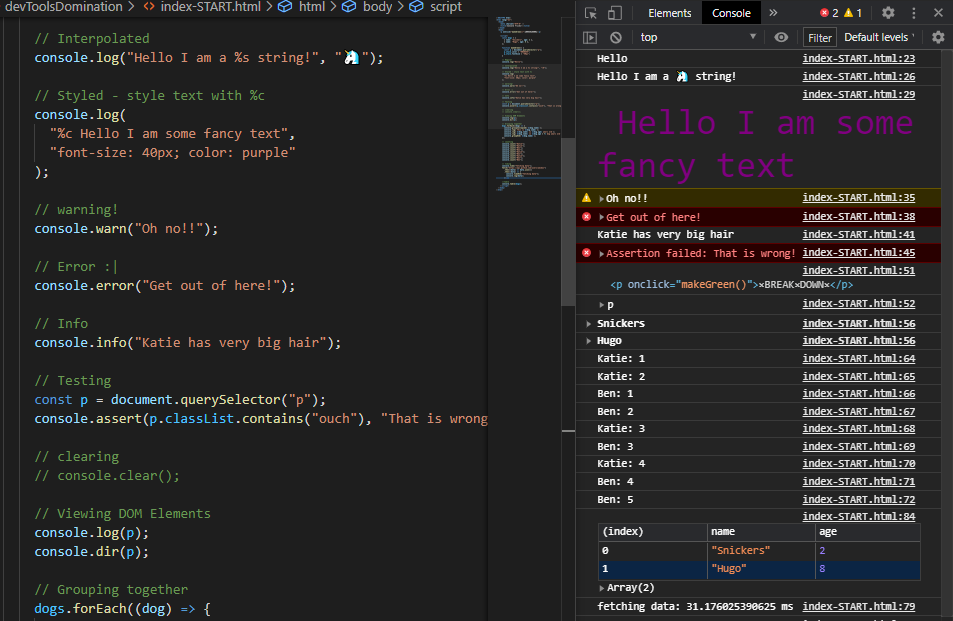

### Day 43

_10th September_

### Today's progress:

- I finished a CSS Drawing I started yesterday of a cocktail glass. I'm really pleased with it and it didn't take me too long at all. I'm definitely getting quicker with my coding which is great! I used `@keyframes` to animate the bubbles. I think I could have done it more concisely with JavaScript so I may refactor it at some point.

- I did some SoC homework which included:
  - CSS Diner (again! - I only did it earlier in the week! 😂). This time I managed to complete all the levels! (last time I got stuck on 19 but did a bit of reading into `:nth-last-child` and was able to figure it out: [CSS Tricks article on :nth-last-child](https://css-tricks.com/almanac/selectors/n/nth-last-child/)).
  - Watching three videos from Crash Course Computer Science (#28, #29 & #30) on Computer Networks, The Internet and The World Wide Web. I've seen them before but great to go over them again.

### Thoughts:

I really enjoyed making another CSS picture! I get a real buzz out of it and totally get in the zone. I enjoy designing things and making them look good.

I think I will watch all of the [Crash Course Computer Science videos](https://www.youtube.com/playlist?list=PL8dPuuaLjXtNlUrzyH5r6jN9ulIgZBpdo) as they are really good and will be a fantastic intro to CS as a whole.

I enjoyed the SoC pre-bootcamp session last night. Can't wait to get started properly. Really pleased I have a good grasp of HTML, CSS and JS now as I think I'd find it very fast-paced and maybe a little overwhelming otherwise!

### Links to work / resources:

[Check out my cocktail on Codepen!](https://codepen.io/katiehawcutt/pen/bGpvNXN)

JS30 Dev Tools Challenge:

### Day 44

_11th September_

### Today's progress:

- I continued with the JavaScript course on Codecademy which is proving very helpful. Today I covered Conditionals, Functions, Arrays, Scope and ES6 arrow functions.

ES6 Arrow Functions:

- I completed another JS30 in which I learnt how to check multiple checkboxes by holding down the shift key.

- I completed a CodeWars 7kyu Kata which I felt really good about. I wrote pseudo code for it first and then made it happen with real code. Afterwards I refactored it and used arrow functions so it's very concise.

### Thoughts:

I achieved a lot today. Really getting in the flow of learning at the moment. There's a few things I want to finish before the bootcamp starts so that's spurring me on and I also want to get to 50 Days of Code before next weekend. So I will probably code this weekend to make sure I get there!

### Links to work / resources:

Codecademy JavaScript course progress:

JS30 Checkbox Challenge:

CodeWars 7kyu Kata - Testing 1-2-3:

### Day 45

_12th September_

### Today's progress:

- I read a really useful article - [9 Habits I Wish I Had as a Junior Developer](https://www.freecodecamp.org/news/good-habits-for-junior-developers/) - which had some helpful advice about building healthy habits.

- I completed another module of my JavaScript Course on Loops. It was really useful to go over for loops, while loops and do-while loops again as I haven't used them for a while. I found the questions a little more challenging which I enjoyed!

### Thoughts:

I've got a unique opportunity at the moment to get into some really positive habits as I've got a totally clean slate. I want to make sure I'm getting into good routines and habits, not unhealthy ones, as I embark on this new adventure and career in tech. It's very exciting to have such a fresh start and I feel in a great position, both physically and mentally, to shape a really healthy and positive new season.

### Links to work / resources:

### Day 46

_13th September_

### Today's progress:

- I finished the Higher Order Functions and Iterators modules on my JavaScript Course.

- I refactored my CSS Cocktail picture and used JavaScript to help animate it rather than just CSS. This enabled me to cut out over 100 lines of code. Very satisfying! 🙂 I used JS to set the `top` of each bubble animation to 105px, then evenly space the 10 bubbles along the length of the drink, and then used Math.random to generate different amount of `animation-delay` to each bubble so they all moved at different times:

### Thoughts:

Really enjoyed refactoring my CSS animation (with a little help from Ben!). It highlights the power of JavaScript and how it can make processes much easier and faster and your code more concise.

### Links to work / resources:

Higher Order Functions & Iterator Modules complete:

CSS Cocktail refactored using JavaScript to animate bubbles:

### Day 47

_14th September_

### Today's progress:

- I completed the Command Line game (Line Commander) as part of my SoC homework. I feel a lot more confident moving around the command line than I used to. I think using GitHub and regularly pushing work to it helps.

- I completed the next module in my JavaScript course on Objects and learnt about a few more advanced concepts including:

  - The `this` keyword which refers the calling object and can be used to access properties of the calling object. The value of `this` depends on where the `this` is being accessed from.
  - We cannot use arrow functions as methods if we want to access other internal properties using `this`.
  - Setter and getter methods allow for more detailed ways of accessing and assigning properties.
  - Factory functions allow us to create object instances quickly and repeatedly.

- I put my JavaScript into practice and solved another CodeWars 7kyu Kata called [Hungarian Vowel Harmony](https://www.codewars.com/kata/57fd696e26b06857eb0011e7!) I got a bit stuck for a few minutes but I'm really glad I persevered as I got there in the end! More great learning 😀

### Thoughts:

Really pleased with my work today and got a good buzz at the end from solving a kata! I feel like everything is sinking in at the moment and that I'm consolidating a lot of my learning which is very encouraging.

### Links to work / resources:

Line Commander complete! ⬇️

Codewars 7kyu Kata - Hungarian Vowel Harmony:

### Day 48

_15th September_

### Today's progress:

- I spent most of the day writing my first blog post about my journey from musician to School of Code bootcamper! I wrote it on Dev using Markdown. It's not published yet as SoC want drafts first, but we'll be publishing them soon!

- I watched more Crash Course Computer Science videos and refreshed on some basic Computer Science principles such as boolean logic and logic gates and learnt about ALU and RAM.

### Thoughts:

It was nice to write a blog post and reflect on my journey so far. It makes me realise how far I've come over these past few months (and I'm excited about how much further I will go as I am about to embark on the bootcamp)!

Love the Crash Course Computer Science videos - I always learn so much from them and they are so fun with great graphics!

### Links to work / resources:

[Crash Course Computer Science videos on YouTube](https://www.youtube.com/watch?v=tpIctyqH29Q&list=PLH2l6uzC4UEW0s7-KewFLBC1D0l6XRfye&ab_channel=CrashCourse)

### Day 49

_16th September_

### Today's progress:

- I continued with the Codecademy JavaScript course and learnt about JavaScript Classes. I'd never heard of them or used them before so it was really useful! Here are my main learning points:

  - Classes are templates for objects.
  - Javascript calls a constructor method when we create a new instance of a class.
  - Inheritance is when we create a parent class with properties and methods that we can extend to child classes.
  - We use the extends keyword to create a subclass.
  - The super keyword calls the constructor() of a parent class.
  - Static methods are called on the class, but not on instances of the class.

- I then did another module on Browser Compatibility & Transpilation and used Babel for the first time to convert ES5 code into ES6 code.

  - Babel is a JavaScript package that transpiles JavaScript ES6+ code to ES5.
  - caniuse.com — a website you can use to look up HTML, CSS, and JavaScript browser compatibility information.

### Thoughts:

Really enjoyed learning brand new content on my JavaScript course today. I'm finding it easier to understand and remember new information now that I have a broader understand of programming and syntax. It's like my brain knows where to file the new information!

We had a final pre-bootcamp session tonight and went over Git and Github which was a useful refresher. I enjoyed working with another person again and helping someone else really helps to consolidate my own learning.

### Links to work / resources:

['How to use Babel' document I made](https://docs.google.com/document/d/1GpxPjWSaRwdItfeffks2MflTHcNcYYY7vNkZ45skvG8/edit)

### Day 50

_17th September_

### Today's progress:

Today I started making myself a webpage using just HTML and CSS as part of my SoC pre-bootcamp homework. I spent quite a while working on the design and I'm really happy with it so far. Excited to continue working on it tomorrow and hopefully get it finished!

### Thoughts:

Tomorrow I want to refresh myself on CSS Grid some I can make a little photo gallery.

### Links to work / resources:

Nothing to show yet...the grand reveal will be tomorrow!

### Day 51

_18th September_

### Today's progress:

Continued working on my webpage:

- Added a photo gallery using CSS Grid and I'm pleased that I managed to make it responsive without using any media queries. Love the power of CSS grid!

- Added content to the 'about' section.

- Finished off my webpage, made it work well on mobile (used a couple of media queries for H1 and H2's but that's it!). Then I hosted it on Netlify so it's now live!

### Thoughts:

- I've loved designing and making this simple but effective webpage over the past two days. I have been so in the flow that time has passed super quickly! I'm really pleased with the outcome and it shows how much you can achieve with just HTML and CSS. Maybe at some point I'll add a few extra features using JavaScript.

### Links to work / resources:

[Link to my page!](https://helloimkatie.netlify.app/)

### Day 52

_20th July_

### Today's progress:

- I completed another section of my JavaScript course on Modules. This was totally new to me and I was struggling a bit to put it in context but apparently it's what I'm going to be doing when I start using React so it's good practice for then! Here's what I learnt:

  - Modules in Node.js are reusable pieces of code that can be exported from one program and imported for use in another program.
  - `module.exports` exports the module for use in another program.
  - `require()` imports the module for use in the current program.

  ES6 introduced a more flexible, easier syntax to export modules:

  - default exports: use `export default` to export JavaScript objects, functions, and primitive data types.
  - named exports: use the `export` keyword to export data in variables.
  - named exports can be aliased with the `as` keyword.
  - `import` is a keyword that imports any object, function, or data type.

- I improved the accessibility of my webpage by adding semantic HTML tags such as `<header>`, `<footer>`, `<nav>`, `<main>` and `<section>`. I also added `<alt>` tags to all of my photos.

- I read an article on [Transport Layer Security Encryption (TLS)](https://www.freecodecamp.org/news/what-is-tls-transport-layer-security-encryption-explained-in-plain-english/) and learnt the basics of what it is and how it works.

### Thoughts:

I really wanted to finish my JavaScript course before starting the bootcamp tomorrow but I've still got a few modules to go and don't want to rush through them so I will finish it off in my evenings this week or next weekend. Can't believe the bootcamp starts tomorrow! Nervous and excited! 😀

### Links to work / resources:

### Day 53

_21st September_

### Today's progress:

#### First day of the SoC Bootcamp!

- We went over javascript fundamentals. My main learning points were:
  - Algorithms are processes / rules / a set of steps followed to achieve an output.
  - The 5 pillars of programming are operators, variables & types, logic flow, loops and functions.
  - Types are number, string, boolean, undefined, null, bigint, symbol, object and function.
  - while loops are useful when we're are working with an undetermined number (eg. something === true)
  - for loops are useful when we're working with a determined number (eg. arr.length)
  - a function is a reusable block of code that groups together a sequence of statements to perform a specific task

### Thoughts:

I really enjoyed working in pairs / teams. It's quite different to working alone and I need to get used to it. But it's totally great! Although there was nothing that was new to me today I thoroughly enjoyed going over the basics again and it really helped to reaffirm the fundamentals. I'm exhausted now though! 😅

### Links to work / resources:

Here's a little password checker we made using JS:

### Day 54

_22nd September_

### Today's progress:

#### Day 2 of of the MOB (Massive Online Bootcamp)

- Today we learnt about objects and arrays. My main learning points were:

  - Objects are made up of key-value pairs
  - We can access properties and values in an object using dot or bracket notation
  - Objects and functions are NOT primitive types which means they are mutable. Primitive types are immutable.
  - Two empty objects are not the same. Every time we create a new object it is distinct.
  - Arrays are JavaScript's way of making lists - they are ordered. We can access their contents using the index.
  - The reason we can use a function on a string (eg. `"string".toUpperCase()`) is because of **Primitive Wrapping** - this is where the string (or other primitive type) is wrapped in a helper object so that we can perform functions on it.
  - When we separate our HTML, CSS and JavaScript into different file this is called _separation of concerns_.
  - We can use `Object.is()` to compare different types and see if they are the same. It will return true or false.
  - Different case types
  - Brief intro to object destructuring (want to practice doing this more)

- After SoC I did some extra learning on asynchronous JavaScript and promises on my Codecademy course. (I still want to keep pushing myself as the last two days have mostly been re-cap!) I found them quite tricky to get my head around although I have used them before so I know I can do it! Here's a long list of what I learnt:

  - Promises are JavaScript objects that represent the eventual result of an asynchronous operation.
  - Promises can be in one of three states: pending, resolved, or rejected.
  - A promise is settled if it is either resolved or rejected.
  - We construct a promise by using the new keyword and passing an executor function to the Promise constructor method.
  - `setTimeout()` is a Node function which delays the execution of a callback function using the event-loop.
  - We use `.then()` with a success handler callback containing the logic for what should happen if a promise resolves.
  - We use `.catch()` with a failure handler callback containing the logic for what should happen if a promise rejects.
  - Promise composition enables us to write complex, asynchronous code that’s still readable. We do this by chaining multiple `.then()`‘s and `.catch()`‘s.
  - To use promise composition correctly, we have to remember to return promises constructed within a `.then()`.
  - We should chain multiple promises rather than nesting them.
  - To take advantage of concurrency, we can use `Promise.all()`.

### Thoughts:

Another big day of learning and concentrating but I'm getting into the swing of the bootcamp now! I enjoyed today's tasks and working with Max on our Objects and Array Challenges. I found it quite hard to concentrate once I got to my evening learning (already had a long day!) but wanted to push through this time and pleased I did. I'm learning that with small but regular learning steps you can go a long way in the course of a week or month!

### Links to work / resources:

Case types:

Intro to destructuring:

### Day 55

_23rd September_

### Today's progress:

#### Day 3 of the MOB

- This morning we learnt about pair-programming and how it's really important to be able to work together. Teamwork is an essential skill to have in the workplace and without it you won't get hired! We can think of pair-programming with a driver / navigator analogy. Both are contributing but the drivers main role is to sit at the steering wheel and practically drive the car (eg. sit at the keyboard and do the typing), while the navigators main role is to give directions and lead the way with the route (eg. say out loud what we should be coding and and directing the next steps). Obviously both are looking out for hazards or a faster route (eg. bugs/errors or more effective solutions) so either person will speak up if they need to. Swap around roles every five minutes.

- We also learnt how to go about problem solving and that we should always write pseudo code and break the problem down into little steps until you are able to find a solution. We practiced our problem solving skills with some CodeWars challenges.

- In the afternoon we learnt about the DOM (Document Object Model) and how we can use it to create dynamic and interactive web pages. We can access anything on the HTML page using `document.querySelector()` and then select the element using any CSS selectors. We practiced using these new skills with some DOM practice tasks.

- After Soc I finished another module of my Codecademy JavaScript course on Async...Await. Here's what I learnt:

  - `async...await` is syntactic sugar built on native JavaScript promises and generators.
  - We declare an `async` function with the keyword `async`.
  - Inside an `async` function we use the `await` operator to pause execution of our function until an asynchronous action completes and the awaited promise is no longer pending .
  - `await` returns the resolved value of the awaited promise.
  - We can write multiple await statements to produce code that reads like synchronous code.
  - We use `try...catch `statements within our async functions for error handling.
  - We should still take advantage of concurrency by writing `async` functions that allow asynchronous actions to happen in concurrently whenever possible.

### Thoughts:

I enjoyed doing some good pair programming today and I'm getting used to working with another person! I found the Codewars Kata really helpful and always get a good buzz out of completing those! I also really enjoyed working through the DOM practice exercises this afternoon. I found a couple of them quite challenging but we persevered and managed to complete them without asking for help which was great!

Feeling rather tired today so need to make sure I'm getting enough 'switch off' time and working in a sustainable manner.

### Links to work / resources:

Some of the DOM tasks we worked through:

Async...Await module complete on Codecademy:

### Day 56

_25th Septemer_

### Today's progress:

#### Day 4 of the MOB

- Today on the bootcamp we learnt about JavaScript Events and event listeners. We went over the difference between invoking a function and handing a reference to a function. When we use `addEventListener()` the first argument handed to it is the event (eg. `"click"`) and the second argument is a reference to a function (or an inline function).

- I learnt about event bubbling, capturing and propagation. To put it simply, when an event happens on an element, it first runs the handlers on it (the target), then on its parent, then all the way up on other ancestors. Sometimes we don't want this to happen and we can stop it using `event.stopPropagation()` which prevents the event from bubbling up.

- In the afternoon we put all our knowledge about the DOM together and made a To-Do List. During this process I learnt how to toggle between adding and removing a `className` from an element with JavaScript. I also practiced accessing properties on the events which I had not done very much of before (eg. e.shiftKey === true) so that was really helpful.

- We also had a talk on Growth Mindset which was interesting. SoC is not just about learning to code - it's going to change our lives! And to make the most of it we need to have a growth mindset rather than a fixed mindset. See the pictures below (in today's resources) of my favourite / important points.

### Thoughts:

I really enjoyed all the tasks today (they were fun and engaging!) and I feel my understanding of Javacript really growing. I've been able to make things work previously but I haven't always totally understood why or the details about what is really happening under the hood. But now I am starting too which is fab! I'm also getting really good a googling!

### Links to work / resources:

Some work we did on JavaScript Events:

Growth Mindset:

### Day 57

_26th September_

##### Day 5 of the MOB

### Today's progress:

- Today on the SoC Bootcamp we had our first hackathon and the task was to make a Rock, Paper, Scissors game. We started off using `prompt()`, `alert()` and `confirm()` to play the game and then started on refactoring it so that all interactions were through HTML elements using the DOM.

- I also did another module of my Codecademy JavaScript course and learnt about `GET` and `POST` requests. Here are my main learning points:

  - JavaScript is the language of the web because of its asynchronous capabilities. AJAX, which stands for Asynchronous JavaScript and XML, is a set of tools that are used together to take advantage of JavaScript’s asynchronous capabilities.
  - There are many HTTP request methods, two of which are GET and POST.
  - GET requests only request information from other sources.
  - POST methods can introduce new information to other sources in addition to requesting it.
  - GET requests can be written using an XMLHttpRequest object and vanilla JavaScript.
  - POST requests can also be written using an XMLHttpRequest object and vanilla JavaScript.
  - Writing GET and POST requests with XHR objects and vanilla JavaScript requires constructing the XHR object using new, setting the responseType, creating a function that will handle the response object, and opening and sending the request.
  - To add a query string to a URL endpoint you can use ? and include a parameter.
  - To provide additional parameters, use & and then include a key-value pair, joined by =.
  - Determining how to correctly write the requests and how to properly implement them requires carefully reading the documentation of the API with which you’re working.

### Thoughts:

I struggled with the hackathon a bit today because we didn't totally stick to the instructions the first time we made the game (which was totally my fault) and went a bit off track. We made a game that worked but it wasn't in the way required so we decided to refactor it and got it working the correct way. However, this meant that we didn't get a far as I'd hoped and didn't managed to implement using the DOM at all. I found this frustrating as I wanted to have got further and have a better end point to show. However, with reflection, I realise that throughout this task I was functioning more with a fixed mindset rather than a growth one. I was more interested in the destination rather than the journey when in reality, the journey is where all the learning happens. We actually learnt a lot from refactoring - more than if we'd ploughed on with our own ideas. It was a big learning curve. I felt frustrated at the time but I know I need to move and turn it into a positive learning point. Which I will! My main learning points being - 1) read instructions and don't think you know better 2) try to cultivate a growth mindset by putting less pressure on myself to achieve and enjoy the learning journey - see mistakes as an opportunity to learn rather than a failure.

### Links to work / resources:

A while loop that we used today when making Rock, Paper, Scissors:

### Day 58

_27th September_

### Today's progress:

- I refactored my Rock, Paper, Scissors game so that all the interactions are through HTML elements and using the DOM rather than `prompt()`, `alert()` and `confirm()`. I made this game a while ago before the SoC Bootcamp but after Friday's hackathon I was inspired to make it better! I also seperated the CSS out into it's own file and refactored the styling to use flexbox rather than grid.

### Thoughts:

I wasn't planning to do much today but then I got carried away! I have loved working in pairs this week but it's also nice to be able to work on something in my own time again and at my own pace. I'm really pleased with the outcome and I was able to refactor the JavaScript without any help. It's definitely consolidated my learning from the bootcamp this week!

### Links to work / resources:

### Day 59

_28th September_

##### Day 6 of the MOB

### Today's progress:

- This morning we completed some individual coding tasks, recapping all the basic JavaScript we learnt last week. I found this a really helpful way to consolidate all my SoC learning to date.

- This afternoon we went into Advanced JavaScript Functions and I learnt:
  - how to use default parameter syntax (you can set defaults for where there are missing arguments)
  - how to use fat arrow functions (which have an implicit return)
  - what type coercion is and when to watch out for it
  - that function composition is when you take a function that already exists and compose some new functionality from it
  - what an immediately invoked function expression (IIFE) is and when it might be used
  - that when a function is on an object, it's called a method
  - what callback functions are and how to use them
  - how to use destructured parameters to make code more concise and easier to read
  - that using a spread operator and rest parameter is easier than I thought!

### Thoughts:

I was really happy with the recap task this morning and the fact that I could complete all the problems without any help boosted my confidence. I'm pleased I've got the basics down as wow! - lots covered this afternoon on advanced javascript! This stuff is less familiar to me and I'm loving having something to get my teeth into. Really enjoying wrestling with some problems and overcoming them. Feeling more refreshed than I thought after a weekend off so that's good. Just got to remember to pace myself this week now!

### Links to work / resources:

Function composition practice:
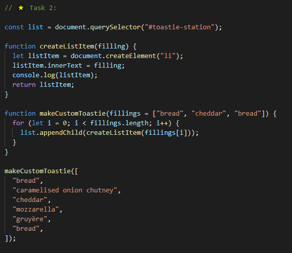

Using callback functions:

Object destructuring:

### Day 60

_29th September_

#### Day 7 of the MOB

### Today's progress:

- I learnt the difference between imperative and declarative code:

  - Imperative code (eg. for loops) is when you have to tell the computer exactly what to do as if you are micro-managing it's actions.
  - Declarative code (eg. methods) is when the method handles the details - you tell it what you want and it decides how to do it. The details are abstracted away.

- We spent the day learning about different array methods, how to use them and what each of them return you. I learnt that some array methods take in a callback function as an argument. These callback functions can be written inline using fat arrow syntax or they can be written separately as a traditional function. We practiced using these different array methods by solving lots of different tasks.

### Thoughts:

Today was definitely a step up in terms of difficulty. I found a couple of the last tasks particularly challenging - the ones that involved using `sort()`. I want to understand more fully how the `sort()` compare function works when comparing different types of data. I found it quite a tough day in terms of problem solving and I'm rather tired and drained now!

### Links to work / resources:

Some of our array methods tasks:

Using `filter()` :

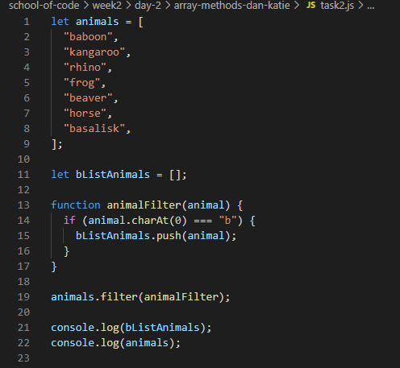

Using `sort()` :

Making another to-do list with :

### Day 61

_30th September_

#### Day 8 of the MOB

### Today's progress:

- We started the day with a guest lecture on Web Accessibility - what it is, why it matters and how we achieve it. I learnt all about semantic HTML and how HTML is declarative, fault-tolerant, backwards compatible and interoperable.

- For the rest of the day we continued learning more about asynchronous programming and I learnt the following:

  - `setTimeout()`, and `setInterval()` are API's
  - when JavaScript is using an API it delegates the work out to the run-time environment
  - this relationship between JavaScript and it's run-time environment allows JavaScript to behave asynchronously
  - JSON stands for JavaScript Object Notation. It is an interchange format which allows us to send data (which looks like a JavaScript object) across the internet
  - in a JSON object, the keys are stringified. This is the main difference between JSON and a JavaScript object
  - `fetch()` returns a promise
  - a promise has 3 possible states - pending, resolved or rejected
  - async allows us to write asynchronous functions, and allows us to await promises
  - we must always await a promise

- We put all this knowledge into practice today by building a clock and a Kanye West quote generator!

### Thoughts:

I really enjoyed today. It was nice to have a bit of a 'bigger picture' talk first thing this morning to break up the Javacript intensity! But then I really enjoyed all of the rest of our learning today. I thought the lectures were clear and interesting and I really enjoyed the tasks. Although we were still very much practicing our JavaScript it was nice that they had more of a visual aspect too. They were a good contrast from yesterday's tasks.

### Links to work / resources:

Using our new knowledge of asynchronous programming we made a clock:

And a Kanye West quote generator!

### Day 62

_1st October_

#### Day 9 of the MOB

### Today's progress:

- This morning we had a talk from Joe on personality types which was really interesting. In preparation for the lecture we had all done Myers-Briggs before hand so knew what our own types were. We discussed the benefits of working with different types to our own, what makes a strong team, what we love about our personality type and what can be our weaknesses. This will hopefully help us to understand each other better, build robust teams and work together more effectively.

- For the rest of the day we had a big recap on everything we have learnt so far over the past two weeks! (lots) I really enjoyed doing all the recap tasks and it was great to see how far we'd come already.

- After the SoC Bootcamp I finished my Codecademy JavaScript course and the last module was on `fetch()` and asynchronous functions which we'd done this week on the SoC Bootcamp anyway so that was really good!

### Thoughts:

I enjoyed today and I'm feeling confident that I understand the fundamentals of everything we've learnt so far. It's nice to be able to get a task, understand the problem, make a plan to solve it and then implement the plan. Obviously I still get thrown sometimes but more often than not I'm able to solve these problems alone now. Also the muscle memory of writing certain lines of code is definitely kicking in!

Feeling a bit apprehensive about tomorrow (hackathon) as I didn't have a very positive day last Friday but I'm going to just enjoy it, be in the moment and see how far we get. I think my expectations are set better this week.

### Links to work / resources:

Some of the recap tasks we did today were on functions:

And we also did some setTimeout() and setInterval() practice:

Completed Codecademy JavaScript course:

### Day 63

_2nd October_

#### Day 10 of the MOB

### Today's progress:

- First thing today we split into small teams to record our findings about some research we did yesterday afternoon. My teams research topic was CSS Box Model and we made a little video explaining what it is, how it works and then did a live demo to show how elements can be manipulated using the padding, border and margin properties. I learnt that everything in CSS is a box!

- The rest of the day was spent on our hackathon challenge! Today was all about `fetch()` and me and Dan used a jokes API to create a Dad Jokes Generator! We used all of the knowledge we had learned over the past two weeks to make it which included variables, types, scope, functions, helper functions, objects, arrays, array methods, the DOM, asynchronous programming, async, await, `fetch()`, CSS and sematic HTML. We tried to make it unbreakable by only allowing certain buttons to be pressed at certain times, and only allowing jokes to be added to the lists once. This required some more tricky programming but we got there! (and without help!). We were both super pleased with the outcome. 😀

### Thoughts:

I really enjoyed the hackathon today and I know it's because I approached it with a better mindset. We did some great planning, talked everything through at each stage and then did all the coding together which worked well. I'm still getting used to pair-programming but I think I'm getting better at it! Ironically, because I was less bothered about a perfect end product and tried to focus more on the building and learning, we actually ended up with something that looked and worked great! But without the stress! It was a great way to consolidate all the learning we did over the last fortnight and it was the perfect end to the week!

### Links to work / resources:

### Day 64

_5th October_

#### Day 11 of the MOB

### Today's progress:

- We started the day doing individual recap tasks on all that we have covered over the last two weeks including advanced functions, array methods, asynchronous programming, setTimeout() and setInterval(), API's and fetch(). I learnt that there are often many ways to solve a problem and it's good to try to solve problems in different ways (rather than just in the way we might have done previously) as that way we learn new things. This increases our understanding of how things work and makes us better problem solvers.

- In the afternoon we started learning about databases and SQL. So far I have learnt that:

  - CRUD (create, read, update, delete) is what you can do with any form of data (the basic operations)
  - databases are computer programs that allow us to store data in a structured way that is easy to access
  - there are two types of databases - relational (made up of tables, good for lots of interconnected data) and non-relational (looks like objects, more of a document store)
  - SQL stands for structured query language - it was invented by IBM in the 1970's
  - we use SQL to operate on the data stored in a database
  - we are learning PostgreSQL which is a particular flavour / dialect of SQL
  - how to make a SELECT query /statement and use FROM, WHERE, ORDER BY, LIMIT, OFFSET
  - we can join two or more tables together using JOINS of which there are four types - INNER, LEFT, RIGHT and FULL
  - we can also use the INSERT INTO, UPDATE and DELETE statements on data

### Thoughts:

I found the individual recap tasks today really helpful and I enjoyed working through the problems at my own pace. I'm feeling much more confident with approaching problems now and getting better at breaking them down into manageable steps and then solving each one. It feels like it has all clicked this week.

It was nice to have a break from JS and learn something brand new. I'm excited to start learning more about the back end and looking forward to the rest of the week.

### Links to work / resources:

One of my week 2 individual recap tasks - making a ToDo list and using using `sort()` to display the list items in order of priority:

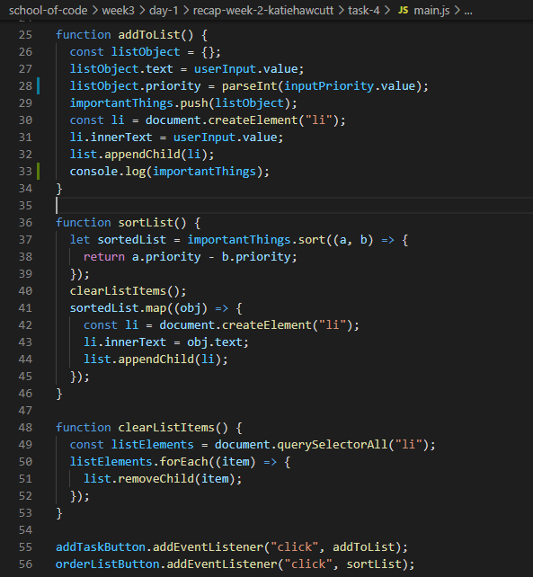

Types of databases:

SQL queries with constraints:

### Day 65

_6th October_

#### Day 12 of the MOB

### Today's progress:

- Today we continued learning SQL and practiced using it with lots of tasks including a murder mystery challenge! (we found the murderer btw) Some of the challenges required us to write more complex SELECT statements using JOINS (inner and left), the WHERE, GROUP BY, CASE and ORDER BY clause and the DISTINCT keyword. One of the brand new things I learnt was that you can join a table to itself!

- I also learnt how to insert, update and delete rows, create, alter and drop (delete) a table.

- I learnt about primary and foreign keys and that tables can reference other tables by ID.

### Thoughts:

I enjoyed working on the tasks today (with my new partner Tom) and we had good momentum through all the challenges as we work at a similar pace which is great! Although picking up the basic syntax of SQL has been fairly easy, once we started working on harder challenges the queries we were having to write were quite complex. They certainly got me thinking and I'm rather tired now!

I'm looking forward to seeing how databases link into the bigger picture of what we've been learning as we continue through the week.

### Links to work / resources:

I learnt how to create a table:

I learnt about primary and foreign keys and that tables can reference other tables by ID:

### Day 66

_7th October_

#### Day 13 of the MOB

### Today's progress:

Today we learnt about Node.js - what it is and how we use it! Main learning points:

- Node is a free, open-source server environment which runs on any platform and it allows us to run JavaScript outside of the browser.
- Web servers are one of Node's most common uses
- PHP is another programming language used to interact with servers - it is a synchronous language. The benefits of using Node (rather than PHP) is that JavaScript can run asynchronously which means that it can handle multiple requests (many more per server) making it more resource efficient and faster, and it is also quick to build a server in Node.
- Node can collect files, interact with data and dynamically fetch web pages.
- modules are files containing code that other people have written which we can use in our own code. To do this we have to `require()` them into the file where we want to use them.
- if you want to find out what certain modules do / how to use them, read the docs! All the information is out there.
- we can also make our own modules and use them in the same way.
- there are sources of modules - ones that are automatically built in to Node, ones that we can import from the internet, and ones that we make ourselves.
- NPM stands for Node Package Manager. We can make a project a node project by npm init. This creates a package.json file (which makes it a node project)
- the package.json contains all the information about our project including the dependencies. It allows us to keep track of external modules we've required.

This afternoon we put all of this new knowledge into practice and created our own database using node.js, created a table, inserted values into it, read the file, and then deleted the whole schema!

### Thoughts:

I learnt loads today! It was great to finally see how JavaScript / Node.js and SQL all work together and I really enjoyed all the tasks of creating and populating our own database. Tom and I did some really great problem solving / pseudo code to overcome the challenge of inserting data from our array into the table. Feeling great about our teamwork this week and I'm learning lots plus getting to practice some really effective pair programming.

### Links to work / resources:

How we created our table in Node using SQL:

How we populated our table with data from our array:

### Day 67

_8th October_

#### Day 14 of the MOB

### Today's progress:

- First thing this morning we had a talk from Joe on Deep Listening - it was about how to become better listeners and why this is important when we are working in a team. When we don't listen to people properly this can lead to frustration, hurt feelings and lack of progress. Things I learnt are:

  - It's important to acknowledge what people are saying and not interrupt them.
  - It's important to let there be pauses in the conversation and not try to fill the space, as the other person may not have finished talking.
  - Remember - it's okay to just listen!
  - There are different types of listeners - the Lost Listener, the Interrupting Listener, the Shrewd Listener and the Dramatic Listener. I tend to verge on the Interrupting Listener so I need to watch that!
  - When approaching conversations / discussions it's important to have a constructive and generative dialogue approach.
  - Joe gave us some good suggestions for positive meetings (see slide below).

- For the rest of the day we learnt how to make a server and interact with it! My main learning points were:

  - We can communicate with servers with HTTP requests. There are different types of HTTP requests including GET, POST, PUT and DELETE. These are know as HTTP methods / verbs.
  - The different HTTP requests represent the CRUD operations - create (POST), read (GET), update(PUT), delete (DELETE).
  - The URL (Uniform Resource Locator) is the address of where we are sending / receiving the info. It is made up on different sections (see picture below).
  - A port is a place where the computer can listen.
  - A path is the way to find the data we are looking for
  - We can listen to requests with JS using Node - it has built in HTTP support.
  - Express (a module we can require) allows us to create maintainable servers and takes care of the the nitty gritty so we can focus on writing declarative code about what we want the server to do.
  - REST stands for REpresentational State Transfer and it is an architectural style for providing standards between computer systems on the web, making it easier for systems to communicate with each other.
  - We can set up a server on our own computer.
  - I learnt how to make a GET and POST request to a server.
  - We can use Postman to input data into the `req.body` and see the results rather than having to create a front-end.

### Thoughts:

It was a big day of learning today and a lot to take in. I understand everything we did but I don't feel very confident with it all yet - I think the more I go over it the better. We have covered so much new content this week that I feel a little overwhelmed but I will take some time over the weekend to go over everything again and let it sink in.

### Links to work / resources:

Suggestions to improve deep listening within meetings:

What a URL is made up of:

One of the GET request tasks we did:

### Day 68

_9th October_

#### Day 15 of the MOB

### Today's progress:

- Today was hackathon day and we used all the knowledge we learnt this week to build a backend for a pre-existing front-end recipe app (we made a RESTful API). We created our own local server using Express which listened for GET and POST requests from the pre-built front-end. We then made our own database using Heroku, created a table and populated it with information from the user input (recipes). These recipes were then stored in the database and ready to be requested from the front end. My main learning points from today were:

  - when working with other people's code, take the time to thoroughly read it / look at it so that you understand what it's doing and know how you need to go about interacting with it
  - persist in trying to fix bugs and try lots of things - Google, console.log and make a plan!
  - always remember to install dependencies for the app you're working on by running `npm i` in the terminal
  - an API is just two programs talking to each other (eg. a front-end and back-end)
  - I've learnt so much this week! SQL, Express, Node.js, servers - wowzers!! And today we got to use it all!

### Thoughts:

I'm feeling happy but very drained and tired and at capacity!! This week has been hard because of the sheer amount of new information we've taken on. My brain is full and need some time to process. But I will do that over the weekend. I was really pleased with mine and Tom's results from the hackathon today. We managed to complete the task and learnt so much along the way. We did SO MUCH problem solving and trying things and managed to figure everything out without asking for help which is a good habit to try and get in to. Over the weekend I want to read over all the code we wrote today and make sure I understand what all of it is doing. I am then hoping to make the front-end of the app a bit better.

### Links to work / resources:

Some of our code from today's hackathon - here's how we populated our table:

### Day 69

_12th October_

### Today's progress:

- I restructured and refactored my Recipe App from Friday's Hackathon. I read through all the code to make sure I understood what it was doing on each line and this really helped me to consolidate all the learning we did last week.

### Thoughts:

- I was feeling a bit overwhelmed after all the information last week and although we completed the hackathon I wasn't sure if I totally understood what all our code was doing. So it was really helpful to go over everything again after a bit of downtime on Saturday when I was fresh. I now feel like I understand it all and just want to practice it again to start to develop that muscle memory.

### Links to work / resources:

### Day 70

_12th October_

#### Day 16 of the MOB

### Today's progress:

- This morning we had our usual individual Monday recap task and this week we had to make a back-end to a Cat App. A couple of things that I found it useful to go over again were:

  - writing scripts and linking them to the app.js file
  - remembering that prepared statements in SQL protect us against SQL injections.

- Over lunch I had my first meeting with my mentor and we introduced ourselves and got to know each other a bit! It was interesting to hear how he got in to tech and what he does for a job now.

- This afternoon we learnt more about about REST and Express. I learnt / recapped that:

  - Express helps us to create maintainable servers / is an easy way to set up a server. It is an npm package that we can install.
  - REST is an architectural style for providing standards between computer systems on the web.
  - An API (application programming interfaces) is a software intermediary that allows two applications to talk to each other. They make it easier for different apps to interact with each other.
  - A RESTful API is an API of a certain convention where you structure your code and get information back in a certain way`.
  - two more request types are `PUT` and `PATCH`. They are quite similar and used to update information but the big difference is that `PUT` should replace the whole item and `PATCH` should replace a bit of it.
  - `npx` is the package runner; `npm` is the package manager.
  - the `?` in a request is called a query.
  - if an express path has `/:id`, we can use `req.params.id` to access 'id'
  - we started looking into how to handle dynamic routes
  - I had a really good array method recap as I wrote functions which handled specific requests to export and use in my book app

### Thoughts:

I feel like I'm starting to understand the back-end more and more in terms of how files / code link together and developing a deeper understanding of what is going on. I felt fairly confident on the individual recap task and managed to get it working which was great! Just need to practice more now!

### Links to work / resources:

Some functions I wrote to export and use in my book app:

### Day 71

_13th October_

#### Day 17 of the MOB

### Today's progress:

- We continued with working on our books app and linked it up to a database (which we made and populated) rather than getting our data from an array. I'm getting much quicker at setting up a database and creating the script files as we have done that a lot over the past few days.
- I made good progress on understanding how we separate our code into different folders/files (models and routes), separating out the functionality from the requests. This stops the files getting out of hand as everything is broken into small manageable chunks. This will become even more vital as we make bigger applications with many more routes. However, always remember to link your files!

- This afternoon we learnt about testing, why it's important and how to write automated tests for our code:

  - We used Jest (a node package module) which is a test platform. We can use it to write tests for our code and then run the tests.
  - We have to install it like any other module.
  - When you're writing tests, you often need to check that values meet certain conditions. `expect` gives you access to a number of "matchers" that let you validate different things.
  - We have to use our own judgement / intuition about how many tests to write for our code and when we are happy that it works.
  - One of the "matchers" we used was `toBe()`. However, we cannot use this when working with objects as no two objects are the same (even if they look it!). Instead, when comparing objects we could use `toEqual()`.
  - look at the Jest docs to find out more!

### Thoughts:

I really enjoyed learning about testing today as it's something I've been wondering about for a while - I got interested seeing the Codewars tests and trying to get my code to pass them! I'm going to try the extra tasks we didn't get through to practice writing more tests.

Finding it hard to know when to stop working in the evenings as there is always more to do. Need to somehow strike the balance between doing good extra learning and then getting too tired.

### Links to work / resources:

Some tests we wrote this afternoon:

### Day 72

_14th October_

#### Day 18 of the MOB

### Today's progress:

- Today was all about problem solving! We started the day by working on some Codewars challenges and writing pseudo code for them all before we wrote actual code. I'm feeling so much more confident using Javascript now (and specifically array methods and functions) and I really feel like I understand what is going on rather than just guessing or hoping!

- For the rest of the day we worked on a debugging challenge. We were given some back-end code with quite a few errors and we had to make it work! I really enjoyed this...(well mostly!). It was very satisfying when we fixed the bug. All the hard work I've been putting in the last few days to understand the back-end and what all the code is doing really help me to troubleshoot things. It was really good to be forced to read the errors in the terminal and to use our detective skills to work our way to the specific area of code in which the problem lay.

- When we had finished the debugging task we wrote a few more routes to perform other CRUD operations (update and delete). I used PATCH for the first time.

### Thoughts:

All the tasks today were really good practice - sometimes I skip writing pseudo code if I think the problem is easy but it can be at these times that I trip up. I must do it all the time! Make the effort 😀

We got stuck on one of the debugging tasks for aaages! I think we fixed all the other bugs in the process as as soon as we got over this one bug everything else worked straight away! I could feel myself starting to get a bit frustrated at one point but we just kept reading back through all the code (and Google-ing) until we found the problem! I'm really pleased I persevered and it was very satisfying in the end!

### Links to work / resources:

I was pleased with this function I wrote using fat arrow syntax and a conditional operator:

Some routes I wrote to complete our debugging challenge:

### Day 73

_15th October_

#### Day 19 of the MOB

### Today's progress:

- This morning we had a talk from Joe on Crucial Conversations. I learnt that a Crucial Conversation is one in which the stakes feel high, opinions may differ and where emotions will likely become involved. Although it's often important and necessary to have these conversations it can be difficult to do them well and often people will either avoid them altogether, dilute down what they really need to say, shutdown or withdraw completely or force their opinion on someone else. To help stop this happening we must be willing to share our stories and listen to other peoples in order to better understand other viewpoints and hopefully enable us to come to the correct decision in a positive manner. We must respect others viewpoints, try to find a shared goal, and try to agree a way forward together.

- For the rest of the day we started working on this weeks hackathon (we got a head start this week!) and our challenge was to build our first ever full stack app! It's a scoreboard for the SoC Energizers! The criteria was that the app:
  - Must use a Database for persistent storage
  - Must use the model pattern to allow easy interaction with the data
  - Must use an REST API server to manage requests and serve back data
  - Must have a front end which allows users to at least view the data

We made fantastic progress today and got the back-end working fairly quickly and easily! We then started work on the front end and have designed a basic web page. I was super happy as I managed to connect the back-end to the front-end and display the data from our database in a table on the web page! Tomorrow we need to hook up our post request to the front end and do a bit more styling.

### Thoughts:

I am so pleased with our progress today! I really feel like I have understood all the back-end learning we have done over the past couple of weeks and so we didn't have too many problems making our own. We made a detailed plan for setting up the back-end and made sure we stuck to it which I think really helped. And I was so buzzing that I managed to connect it to the front end using the DOM. My understanding of functionality and syntax has increased so much over the last month and it's great to have the chance to prove to myself that I can tackle new problems and solve them! 😀

### Links to work / resources:

Some of the code I wrote to get the data from the database displaying on the web-page:

### Day 74

_16th October_

#### Day 20 of the MOB

### Today's progress:

- Today we finished off our hackathon project that we started yesterday! We got our front end working and did some styling on it. We were able to display the data from our database, create a new entry and save it to the database / display it on the page, and also delete all the data. If we had more time, we could have added functionality to delete rows by id. I really have learnt so much about connecting the back & front ends, reading errors messages and deciphering them, and the importance of planning before you start to do any coding!

### Thoughts:

I'm so pleased with all the progress I have made this week. It's really consolidated both the back-end and front-end and how they link together. I'm so happy that I was able to make my first full-stack app with no help! After just 4 weeks on the bootcamp that feels awesome! Going to have a rest this weekend but also keep pushing forward with my learning and recap on a couple of things. Looking forward to React next week!

### Links to work / resources:

### Day 75

_19th October_

### Today's progress:

- I completed the SoC Bootcamp JS 101 Mastery Task and submitted it.

- I wrote a few more tests and debugged some functions that we were given the other day (as I hadn't completed them all). I used Jest to write and run my tests. One new thing I learnt is that you can use a for loop inside a test to make it run a certain amount of times. This was very useful as the test I was running was to check that one of three words ('rock', 'paper' or 'scissors') was being generated randomly every time the function ran. To make this test effective I needed to run it lots of times (to check no other words might be generated every so often).

### Thoughts:

I enjoyed doing a bit of chilled coding today. I actually really enjoy writing tests and running them, then fixing bugs. I find it very satisfying!

### Links to work / resources:

A couple of tests I wrote to check that one of three words ('rock', 'paper' or 'scissors') was being generated randomly every time the function ran:

### Day 76

_19th October_

#### Day 21 of the MOB

### Today's progress:

- We started the week with our individual recap tasks as normal. We had to create a server, database, link them together, populate the database with information and then write routes for the different requests. Then we had to write a some tests for a function. I managed to complete it and get on to the bonus activity which was creating a front end - didn't get too far with this as I ran out of time!

- We took a bit more of a deep dive into problem solving and how we approach it. I learnt that:

  - Understanding the problem is the most important part of solving the problem. Really spend time doing this.
  - Once you understand the problem you can come up with solutions and then prioritise the solutions / steps as you move forward.

- We learnt that the Disney Ideation Framework (or Disney Method) is a way to think-up and refine ideas by breaking the process into three distinct chunks - the dreamer phase, the realist phase and the critic phase (see pictures below for more detail on each). It involves parallel thinking to analyse a problem, evaluate ideas, construct and critique a plan of action. This creative process bridges the gap between imagination and reality and allows teams to come up with creative solutions to problems with an action plan of how to achieve it.

- I learnt that Agile Methodology revolves around iterations with regular reviews, progress reports and tests. This means that problems can be addressed as they arise, alterations to the plan put in place and less time wasted. The project is broken up into several stages and involves constant collaboration with stakeholders and continuous improvement and iteration at every stage. Because of this, the final product is likely to fit the customers needs much better than when using a 'waterfall' approach.

- The MVP (minimum viable product) should be the first thing we aim to achieve as that way we are solving getting to the crux of the problem straight away and solving that first. Once we have the MVP we can then add more / expand from there.

- This afternoon, in our pairs, we created our own CodeWars style challenges and wrote tests to test the answer. We then swapped these with another team and they had to answer ours and we had to complete theirs. It was a fun way to generate a creative problem, practice problem solving it ourselves before then writing the tests! Feedback from the team who had ours was that it was tricky but that they managed to complete it and learnt some new array methods along the way! So that was great 🙂

### Thoughts:

I enjoyed learning about the Disney Method and discussing in our groups. I also really liked creating the CodeWars style challenge and writing the tests. Felt like a fairly easy day today and nice to have a gentle start to the week!

### Links to work / resources:

The CodeWars style challenge that we wrote and then solved ourselves before writing tests for it:

### Day 77

_20th October_

#### Day 22 of the MOB

### Today's progress:

- Today we started learning about Object Oriented Programming (OOP). I learnt that:

  - Objects (with a capital O) are different to the JavaScript objects we have worked with so far
  - Objects have state and behaviours.
  - An Objects state is the properties on an object
  - An Objects behaviour is the methods on an object
  - A function within a class is called a method
  - I learnt how to create a class and create a new instance of a class
  - Classes act as a "blueprint" for objects by specifying states and behaviours
  - They're helpful when you need to reuse behaviours and functionality.
  - I learnt that OOP helps us to solve real world problems in a computational way
  - Classes can be extended; the child class inherits the states and behaviours of its
    parent class.
  - The child class inherits all of the parents class states and properties
  - You can use super to access the methods of the parent class.
  - The downsides of OOP is that it is very rigid and relies on mutation
  - In JavaScript OOP is a design choice but some programming languages (eg. Java) are completely object oriented
  - A static method is a method you can use without declaring an instance of a class

### Thoughts:

I found this afternoons task really hard as I couldn't get my head around which classes needed which state, and how to use certain classes within others. Although it is still all JavaScript (and I know I could have completed the task fine without using Objects) somehow this new context for working really threw me. I hoping I'll get better at it throughout the week but I'm feeling a bit tired and disappointed about it all today.

### Links to work / resources:

Using OOP to make the Game Class and game loop for Nim:

### Day 78

_21st October_

#### Day 23 of the MOB

### Today's progress:

- We started the day with 90 mins of CodeWars challenges. I really enjoyed this today 🙂 We picked Kata that were challenging but not so hard that we couldn't complete them with a bit of good problem solving. We worked together as a great team and it was really satisfying to pass the tests.

- We practiced planning games using OOP (no coding allowed, only planning!) to help up to understand state and behaviour better. We had to decide which classes were needed for the game and then which states and behaviours to write for each class. Finally we had to bring it all together by writing a game loop. It turns out that pretty much all games are quite tricky to make! Even the ones that you think will be simple, like hangman or snap.

- In the afternoon we learnt about HTML5 Canvas and used it to try and re-create a famous painting! I learnt that:

  - The HTML Canvas element allows you to draw graphics on a browser using JavaScript.
  - You create a canvas in HTML with `<canvas></canvas>`
  - One way to use canvas (the way we used it) is by using the 2d getContext method.
  - We learnt how to draw a rectangle using `fillRect()` and a circle using `arc()` but there are lots of other things you can do to!
  - You can create a stand-alone line using `beginPath()`.

- To finish the day we began planning for this weeks Hackathon. Our challenge is to create a game using OOP. We chose to make Connect Four! We wrote a detailed plan about which classes, states and behaviours to use. We also briefly touched on Kanban (a workflow management method) and got introduced to Trello which is a simple implementation of Kanban style project management. We were encouraged to use it to help plan and run this weeks hackathon.

### Thoughts:

Still struggling with OOP a bit but made some progress since yesterday so that's good. We used yesterday's 'Nim' game to help us plan Connect Four as it gave us ideas about what classes, states and behaviours we might need. Feeling a bit daunted by the hackathon this week as I've struggled with getting to grips with some of this weeks content. I do believe that things will click soon but in the mean time I just need to try and stay positive and get everything in perspective! (finding that a bit hard this week as I'm tired)

### Links to work / resources:

Two of the kata's we solved:

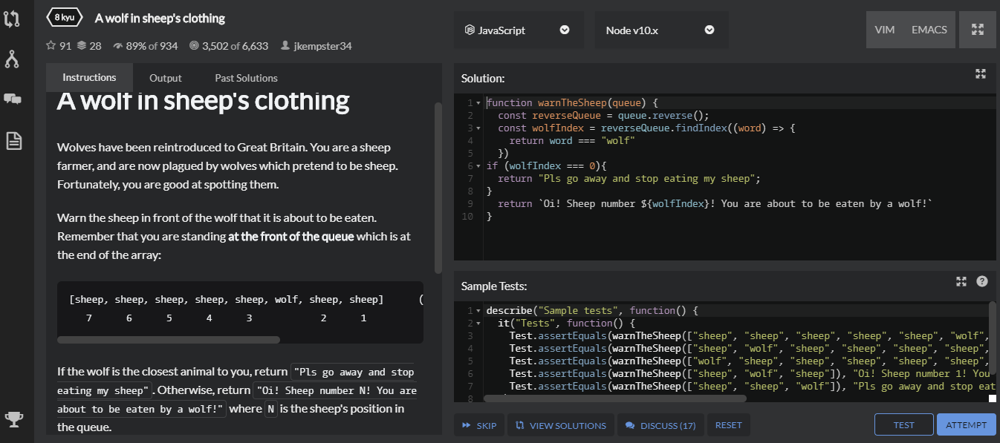

The famous painting we tried to re-create (on the right) versus our version using HTML5 (on the left) - _#3 Composition II in Red, Blue, and Yellow by Mondrian_:

### Day 79

_22nd October_

#### Day 24 of the MOB

### Today's progress:

- We learnt about Resilience & Mental Toughness in our session with Joe this morning. His main point was that everyone has setbacks from time to time and that's perfectly normal - we wouldn't be human if we didn't! But knowing how you react to them (having good self-awareness) and putting some strategies in place to cope (taking action) when you do experience them is super important and will help you to build good mental resilience. That way, when you come through the experience you will have levelled up your mindset. I know I am a perfectionist and and pusher (see pictures below) and I do often struggle with the nagging voice inside my head saying I could do more! For me, keeping things in perspective is key, and making sure I have some down time and talk to people really helps.

- We learnt about SOLID OOP Principles:
  - S.O.L.I.D is an acronym for the first five OOP principles
  - When combined together, these principles make it easy for a programmer to develop software that are easy to maintain and extend. They also make it easy for developers to avoid bad code, easily refactor code, and are also a part of the agile or adaptive software development.
  - S: single-responsibility - A class should have one and only one reason to change, meaning that a class should have only one job.
  - O: open-closed - Objects or entities should be open for extension, but closed for modification
  - L: Liskov substitution - Every subclass/derived class should be substitutable for their base/parent class (put simply - when you extend a class the methods should behave in the same way - take in the same thing and give the same thing out)
  - I: interface-segregation - A client should never be forced to implement an interface that it doesn’t use or clients shouldn’t be forced to depend on methods they do not use.
  - D: dependency-inversion - Entities must depend on abstractions not on concretions. It states that the high level module must not depend on the low level module, but they should depend on abstractions.

I don't really understand the last two but at least I know they exist so I can always look into them more at some point!

- We continued working on our Hackathon challenge and we made some good progress today. We finished the planning stage and began building, making our classes and game loop. We have purposefully made a very simple MVP plan and once we have achieved that we can keep improving from there. By the end of the day we got out game loop working and almost managed to color in the chosen square. I did some extra work in the evening and managed to get it all working! This is great as it means we can set about making it even better tomorrow.

- Some points that have been reaffirmed today about OOP:

  - The two building blocks of Classes in Object Oriented Programming are State and Behaviours.
  - Each Class in OOP should be responsible for changing its own properties.
  - OOP allows for classes in a program to be easily re-used and scaled.
  - It helps to build code that can be easily maintained and modified.
  - It helps to conceptualise programming problems by breaking them down into
    separate parts.

- We attended a SoC webinar at lunchtime in which Chris was talking about the aim of SoC, interviewing some ex-bootcampers and also a potential bootcamper employer (and head of back-end) from The Economist in Birmingham. At the end of the day we also another talk from Manu, a bootcamper from the 2nd cohort who now works at The Economist. It was really helpful and inspiring to hear how SoC has changed so many lives (hopefullly mine too!), what working in the industry is really like and how tech businesses in Birmingham love recruting from SoC as it does a really good job of preparing bootcampers for real life work in tech teams. Which is great news! The main take-aways from these talks which I found really helpful were:
  - You don't need to know everything before you start the job - you learn in the role
  - There are many different tech jobs out there and you will be able to find one that you enjoy
  - School of Code really is awesome!

### Thoughts:

Joe's session this morning came at the perfect time and was really helpful for me as I've been struggling with mental toughness a bit this week. It was also great to talk to fellow bootcampers about the struggles and it helped me to realise that I am not alone!

I'm pleased with where we've got to with out Connect Four game today - we've almost got our very basic MVP working which considering where we were on Tuesday is a great achievement! Feeling more positive and confident about OOP.

### Links to work / resources:

My inner voice is often a perfectionist or pusher!

### Day 80

_23rd October_

#### Day 25 of the MOB

### Today's progress:

- We had a guest talk on Agile Methodology - what it is and why it's useful. I learnt that Agile Methodology values:

  - Individuals ad interactions over processes and tools
  - Working software over comprehensive documentation
  - Customer collaboration over contract negotiation
  - Responding to change over following a plan

- The main reasons why Agile is better than Waterfall is that it reduces the risks associated with the delivery of the product and it delivers better value to the client. There are many way to implement Agile including Scrum, Kanban, XP (extreme programming) and FDD (feature driven development).

- We spent the rest of the day working on our OOP games. Valentina and I completed our MVP in the morning which was great! We got our game working using prompt to get the users name and their column choice. So then we set about adding even more value to it. We made inputs for the players names, and allowed them to pick their own counter color. We added buttons to the bottom of the grid which were used to select the column rather than prompt. This was interesting as it turned the game from being loop driven to event driven. Once we'd completed that we started working on an a 'winner' algorithm to work out if there are four of the same color counters in a row and if so, who's won the game. It was quite tricky as we have to check the grid / arrays horizontally, vertically and diagonally. We didn't get time to complete this but I would like to continue working on it as I'd love to find out how to do it!

### Thoughts:

I'm really pleased with the progress I've made this week - both code-wise and character-wise. It was a tough week as I didn't get OOP to start with and I really hate not understanding things. It was the first time since I started the bootcamp that I felt completely lost and it really knocked my confidence and enthusiasm and made me very emotional! BUT I persevered and was desperate to understand and so put in extra hours, went to the after-bootcamp sessions and asked lots of questions until things started to make more sense. I need to keep remembering that what we're learning is hard, to be kind to myself and to keep things in perspective. I'm making so much progress in the grand scheme of things and that's fantastic!

### Links to work / resources:

Our Connect Four game designed using OOP principles:

### Day 81

_25th October_

### Today's progress:

- I spent some time working on the SoC Bootcamp Mastery Tasks and completed one on CSS basics, logic flow and loops. The loops one was the trickiest and required me to use all sorts of loops (some of which I hadn't used before) including a for loop, do-while loop, while loop, for in, for of, and I had to use a loop label, a break statement and continue statement.

### Thoughts:

I'm enjoying doing the mastery tasks and it's giving me a good sense of where I'm at with things. I haven't struggled with any of them too much yet. It's also good to recap things we learnt a few weeks ago!

### Links to work / resources:

### Day 82

_26th October_

#### Day 26 of the MOB

### Today's progress:

- We started this week with an individual recap task on OOP and HTML5 Canvas - the two things we learnt about last week. I made a simple picture using the canvas which I think demonstrated I knew the basics but this is something I'd like to look into more at some point as I know I am just scrapping the surface at the moment!

- Before lunch we had a fun task of recreating the Google webpage but we had to do it in a text-editor (so no help from VS Code), we weren't allowed to check to see what it was looking like as we made it (we could only look at the end), we weren't allowed to Google anything and we only had 10 minutes! I feel fairly confident with CSS so I enjoyed this task and I think I did quite well considering!! (see picture below!) Big learning points from this task were:

  - how nice it is using VSCode which tidies everything up, auto fills, and uses different colors so you can see what everything does! It's so much quicker and less error prone. I had to concentrate so much when coding in the text-editor! Good practice though...
  - I look a lot in the browser when designing / creating with HTML and CSS to check that everything is rendering as I want it to - I probably don't need to do this quite as much although I am a perfectionist when it comes to design so I find it hard not to keep checking!

- We started learning about React! I learnt that:

  - React is a front-end framework
  - It allows us to keep the view and state of our app in sync
  - It's simple
  - It allows us to create modular reusable components
  - It's scalable and maintainable
  - It's open-source, infuential and widely used
  - It's almost like JavaScript!

- What does it mean to be scalable?

  - it can be worked on by a large team
  - it can get information from lots of places

- Other important things I learnt:
  - OOP relies on mutation whereas React is functional programming which should be immutable
  - React has a virtual DOM which is a virtual representation of the DOM but it is quicker to update and then it's reconciled to the real DOM
  - React uses component-based architecture - components are like building bricks in that they are re-useable and we can use them to build anything so they're very useful.
  - Components have single responsibility and should only do one thing
  - JSX stands for JavaScriptXML and it is a syntax extension specifically designed for use with React. It is a declarative API for how we write components.
  - JSX means that we can write HTML and JS together in the same file. It's easier to write.
  - Babel is a JavaScript compiler that is mainly used to convert ECMAScript 2015+ code into a backwards compatible version of JavaScript in current and older browsers or environments.
  - We need Babel if we want to use JSX. It takes JSX and transpiles it into raw Javascript (which the browser can understand)
  - Babel can transpile other things such as JS ES6 syntax into more traditional JS syntax
  - To use JSX you have to load Babel into the document which will convert the JSX we write back into the raw API

### Thoughts:

I was a bit worried about the recap task this week after struggling a bit with OOP at the start of last week but I think that making a Connect Four for our hackathon challenge really helped me to get to grips with it more. There was one hard question at the end of the recap which I'm not sure I got right but I gave it a good go (creating a juggling loop)! Definitely lots of progress since last week so overall I'm happy.

I enjoyed our introduction to React and I'm looking forward to seeing where it leads the rest of this week!

### Links to work / resources:

My Google homepage which I made in a text-editor in 10 minutes without looking at it once (until the end)! 😂

My first HTML5 Canvas picture 😂:

My first React component:

### Day 83

_27th October_

#### Day 27 of the MOB

### Today's progress:

- Today we continued learning React and I learnt lots! My main learning points are:

JSX:

- JSX allows us to combine HTML & JS together in the same file
- It's easier to read and understand which is why we use it
- properties become camelCase
- the `class` attribute becomes `className`
- tags must be closed

COMPONENTS:

- a component is a small reusable code block
- they mean we can divide the webpage (UI) into lots of small chunks
- each component has it's own HTML, CSS andJS file
- there are two types of components - Functional (stateless) and Class (stateful). The ones we are learning to build at the moment are Functional. Functional components are stateless unless we use hooks.
- a functional component is a JS function that returns a JSX element
- Function names must start with a capital letter

PROPS:

- Props is a special word in React which stands for properties
- They can be passed like function arguments
- They can only be used in a uni-directional flow (from parent to child)

OTHER REACT STUFF:

- React is immutable
- React handles the DOM updates - we don't need to worry about it
- React is modular and has a component tree
- To create a React app we have to run `npx create-react-app my-app` <-- name of app
- A Create React App does Babel transpilation for us, has Jest installed for us, runs a Webpack server for us and will build us raw HTML/CSS/JS for production
- Webpack is a tool that lets you compile JavaScript modules, also known as module bundler. Given a large number of files, it generates a single file (or a few files) that run your app. It can perform many operations: helps you bundle your resources.
- We import and export different files (not require)
- State is just stuff we want to remember such as variables, objects, arrays, etc.
- I learnt that useState is a hook and that basic state syntax is: `const[state, setState] = useState(initialState)`

### Thoughts:

I enjoyed learning more about React today and how to use it to make components. It was interesting to learn about state and how to use it. Really starting to see now how React keeps state and view in sync. Pretty awesome!

### Links to work / resources:

What is state?

Lifting state:

React hooks:

Props:

### Day 84

_28th October_

### Day 28 of the MOB

### Today's progress:

- Today we continued learning about React and built a few more little apps which helped us to understand better how component trees work, how props work, and how states and behaviours affect components. I'm getting more used to breaking down apps into components, separating out these components into different folders and files and then linking them together (importing and exporting). The work we did on OOP last week is really helping me with this 'separation of concerns' concept.

- We learnt about the spread operator `...` which is an ES6 operator which takes in an iterable (e.g an array) and expands it into individual elements. The spread operator is commonly used to make copies of JS objects. Using this operator makes the code concise and enhances its readability.

- We learnt about the `slice()` method which returns the selected elements in an array, as a new array object. It does not mutate the original array. The slice() method selects the elements starting at the given start argument (integer/index), and ends at, but does not include, the given end argument (integer/index).

- Spread and slice are really useful when we want to avoid array mutations (eg. they allow us to write immutable code). Some problems with mutation are:
  - Mutation may lead to unexpected and hard-to-debug issues, where data becomes incorrect somewhere, and you have no idea where it happens.
  - Mutation makes code harder to understand: at any time, an array or object may have a different value, so we need to be very careful when reading the code.
  - Mutation of function arguments makes the behaviour of a function surprising.

### Thoughts:

I'm not always feeling 100% clear on props and behaviour and still getting to grips with the component tree / separation of components but I think I'm getting there. I understand the overall concept now, it's just that sometimes I'm unsure of the details / which function / component needs to return what etc. After today I feel clearer on props though including when to destructure them and how to use them in components.

### Links to work / resources:

A little app we made which posts small articles of information to the page:

The Post component:

### Day 85

_29th October_

#### Day 29 of the MOB

### Today's progress:

- This morning we had a talk from Joe on Group Decision Making. We learnt that when making decisions as a group it's important to leave your ego behind. It's all about the team dynamic - that you've got each others backs and will work together to solve the problem. We learnt that some decisions are a one way door which means there is not going back and once that decision is made you are committed to that course of action. But other decisions are are two way door - you can try it, see what happens and back-track if you need too. More decisions than you think are two-way decisions so bear that in mind and if making a two-way decision, set yourselves a trip-wire/ a testing period to see if that choice is working and if not, backtrack or go another route. Another good thing to consider when making decisions is as a percentage, how confident are you that your decision is the right one? This sparks discussion and may help to bring clarity to the situation.

- We had a guest lecture on Web App Testing. I was introduced to Behaviour Driven Development (BDD) which I'd not heard of before. I learnt that:

  - BDD is an agile software development practice – introduced by Dan North in 2006 – that encourages collaboration between everyone involved in developing software: developers, testers, and business representatives such as product owners or business analysts.
  - BDD aims to create a shared understanding of how an application should behave by discovering new features based on concrete examples. Key examples are then formalized with natural language following a Given/When/Then structure.
  - BDD is facilitated through examples expressed in natural-language constructs expressing the expected system behavior, and automation validating these examples as acceptance tests.
  - BDD describes application behavior from a user’s point of view. Overall, the main goal of BDD is to improve the collaboration between all stakeholders involved in developing software and form a shared understanding among them.
  - I also learnt that when testing you can implement fakes within tests. Fakes helps you isolate the code you are testing by replacing other parts of the application with stubs or shims (types of fakes). These are small pieces of code that are under the control of your tests. By isolating your code for testing, you know that if the test fails, the cause is there and not somewhere else. Stubs and shims also let you test your code even if other parts of your application are not working yet.
  - Were were introduced to Cucumber (a platform for BDD testing), Mountebank (an open source, cross-platform, multi-protocol service virtualization tool) and Docker (an open platform for developing, shipping, and running applications). I need to look into these more and find out what exactly they do and how to use them!
  - Unit testing is when you test a function or method in code to ensure it is giving the desired outcome.
  - Examples of JavaScript testing frameworks are Mocha, Jasmine and Jest.

- We spent the rest of the day finishing off our to-do lists:
  - We added a couple of new bits of functionality - a new component which was a delete all button (which as it suggests deleted all the list items) and we also enabled a list item to have a strike-through it when clicked.
  - I learnt that a “key” is a special string attribute you need to include when creating lists of elements. Keys help React identify which items have changed, are added, or are removed. Keys should be given to the elements inside the array to give the elements a stable identity. The best way to pick a key is to use a string that uniquely identifies a list item among its siblings. Most often you would use IDs from your data as keys. Using indexes is not recommended for keys if the order of items may change. This can negatively impact performance and may cause issues with component state.
  - We spent some time styling our components and got used to using CSS within React and using individual stylesheets for each component.
  - I also learnt that you can link google fonts in the public/index.html file and then use them anywhere in the app.

### Thoughts:

I really enjoyed working on our React apps today. I felt like a lot of concepts have been solidified in my mind and I also learnt the importance of using keys, amongst lots of other things. I feel like I am understanding what's going on and I'm looking forward to testing this knowledge with our hackathon tomorrow!

### Links to work / resources:

### Day 86

_29th October_

#### Day 30 of the MOB

### Today's progress:

- Today was Hackathon Friday and we made a Noughts & Crosses game! It was really interesting as we were following a tutorial that that made Noughts & Crosses with the old style of React - using Class components. Our job was to translate that into new React - Functional Components and hooks! It was a very helpful task. My main learning points were:

  - React components automatically re-render whenever there is a change in state or props.
  - `useState()` is asynchronous which can cause problems sometimes! (I think we will be learning more about this next week)
  - Dumb components (functional components without hooks) can also be called presentational components.
  - If you're trying to create a new array from `setState()` don't forget to use the square brackets inside the parenthesis!! (held us up for ages)
  - `console.log` everything! At one point I had handed in an argument to a function as a number but it was expecting an object as I'd put curly braces around it in the params. Again this held us up for a while but was easily caught once we had console logged.
  - you can have more than one 'useState()' in a component
  - even if you're following a tutorial it's still important to make a plan

### Thoughts:

I enjoyed today and found it really useful. A lot of React code online / on StackOverflow etc. is written in the old style React (class based) which I didn't always fully understand before but after today's task I think I will be able to use that and take from it what I need much more easily. It'll be really useful when I'm Googling how to do things! I'm feeling quite tired now (I've worked pretty hard this week!) but overall really pleased with my progress and I'm feeling like I'm getting to grips with React. Looking forward to learning more next week!

### Links to work / resources:

Some of the code for our game:

### Day 87

### Today's progress:

- I started the Codecademy React course to help me solidify all the learning we did last week on the bootcamp. It's really useful to go over everything again and I've learnt a few new things including:

  - ReactDOM.render() is the most common way to render JSX. It takes a JSX expression, creates a corresponding tree of DOM nodes and adds that tree to the DOM.
  - Self-closing tags in JSX must have a /
  - You cannot insert an if statement into a JSX tag as an if statement is not a JavaScript expression. However, you can use one outside of the JSX tags.
  - However, instead of an if statement you might choose to use the ternary operator or the && operator.
  - The && operator reads the expression on the left of the && and if it is true, it renders the JSX on the right side of the &&. If it is not true, it will be ignored and not rendered.

- I listened to a great SyntaxFM podcast on Git Fundamentals. It was useful to have all the git commands explained and to understand exactly what they do.

### Thoughts:

Really enjoyed listening to Wes and Scott talk about Git Fundamentals today. I think I've only really scraped the surface of Git and I'm looking forward to doing more. The Codecademy course is good and I'm feeling reassured that I understand and took on board least week's SoC teaching!

### Links to work / resources:

[SyntaxFM Podcast on Git Fundamentals](https://open.spotify.com/episode/3E9rAq4OUO5KNH9dEFVony?si=f03z_aTCQSSAkAYBPKjhsA)

Modules completed of the Codecademy React course:

### Day 88

_2nd November_

#### Day 31 of the MOB

### Today's progress:

- This morning we had our individual recap task and we had to make a to-do list using React. I felt fairly confident doing this and managed to get it working. If I had a bit more time I might have added some extra features but I completed all the tasks given and added some CSS so was pleased with what I achieved in the time. It's great to think how far I've come in a week!

- We had a helpful Q&A session after lunch with an ex-bootcamper who now works at Jump24 in Birmingham. It was nice to hear his story and he had some helpful words of wisdom. He said that one of the most valuable things SoC taught him was _how_ to learn - it's meant that whatever challenges he faces in his job he is able to pick up new skills, learn new languages and generally be adaptable.

- Today we learnt about `useEffect()`. I learnt that:
  - `useEffect()` is a Hook that allows you to perform side-effects in functional components. These effects are only executed after the component has rendered, therefore not blocking the render itself.
  - example of effects (or side-effects) are when we are directly changing the DOM, sending HTTP requests, using `setTimeout()` or anything else you interact with outside of React.
  - when we use `useEffect()` we are telling React that our component needs to do something after `render()`. React will remember the function we passed and call it later after performing the DOM updates.
  - there are two types of side-effects - effects that don't require clean-up (such as a HTTP request or directly changing the DOM), and effects that do require a clean-up (such as using setTimeout)
  - the anatomy of `useEffect()` is: `useEffect(callback function, optional dependancies array)`
  - the callback function takes whatever function we want to run after render
  - the dependency array is the second optional argument in the useEffect function. As the name implies, it is an array of dependencies that, when changed from the previous render, will recall the effect function defined in the first argument.

### Thoughts:

I've enjoyed learning more about React today and using `useEffect()` for the first time. I'm really pleased with my progress so far over the past week and hope to build on this over the coming week. I'm not totally sure I understand about the two types of side-effect yet and what 'clean-up' actually means so I will look into this more.

### Links to work / resources:

Helpful articles:

[The Virtual DOM](https://www.codecademy.com/articles/react-virtual-dom)

[Understanding the useEffect dependency array](https://medium.com/better-programming/understanding-the-useeffect-dependency-array-2913da504c44)

My to-do list recap task - creating a to-do list with React:

My first time using useEffect() to send a HTTP request to a Pokemon API:

### Day 89

_3rd November_

#### Day 32 of the MOB

### Today's progress:

- Today we learnt about testing in React. I learnt that:

  - tests are for our users and other other developers
  - the React Testing Library is a light-weight solution for testing React components, it uses actual DOM nodes querying the DOM in the same way the user would, and it works with Jest but includes it's own React-specific matchers as well.
  - React Testing Library / Jest come with React already so there is no need to install it again. To use it to test our code we have to import it in the top of our file like so: `import {render} from @testing-library/react`
  - Some examples of custom React library matchers are `toBeInTheDocument`, `toHaveAttribute`, `toHaveBeenCalled`, `toContainElement`, `toHaveClass` and `toBeVisible`.
  - [See here for all custom matchers](https://github.com/testing-library/jest-dom)
  - queries include `getByTestId`, `getByText`, `findByValue` and `queryAllByAltText`.
  - [See here for all queries](https://testing-library.com/docs/react-testing-library/cheatsheet)
  - Remember (because I forgot) - you can also use all the normal Jest matchers!
  - we can use `fireEvent` to check if a function is being called. To use it we must import it at the top of the file along with render: `import {render, fireEvent} from @testing-library/react`

- This afternoon we learnt about PropTypes:

  - PropTypes defines type and which props are required. This benefits the future you and other developers using your component in two ways:

  1. You can easily open up a component and check which props are required and what type they should be.
  2. When things get messed up React will give you an error message in the console, saying which props is wrong/missing plus the render method that caused the problem.

  - prop-types is an npm package we can install and it enables runtime type checking for React props and similar objects.

  - You can use prop-types to document the intended types of properties passed to components. React will check props passed to your components against those definitions, and warn in development if they don’t match.

  - how to install prop-types: `npm install --save prop-types`
  - how to import prop-types into your file: `import PropTypes from 'prop-types'`

### Thoughts:

Struggling a bit with motivation today. Powered through the day and completed all the tasks but in need of a rest tonight. Not sure why today has felt like hard work - maybe the topics? And also the pace was definitely slower today and maybe I needed a bit more adrenaline! But maybe I'm just a bit tired - who knows!

### Links to work / resources:

Some of the React tests we wrote:

An example of using PropTypes in our code:

### Day 90

_4th November_

#### Day 33 of the MOB

### Today's progress:

- Today we learnt about Routing. I learnt that:

  - a router allows your application to navigate between different components (pages), changing the browser URL, modifying the browser history, and keeping the UI state in sync.
  - React is a popular library for building Single Page Applications (SPA's). However, as React focuses only on building user interfaces, it doesn’t have a built-in solution for routing.
  - React Router is the most popular routing library for React. It allows you define routes in a declarative style.
  - `react-router-dom` contains the router components for websites (which is what we need). To use it we need to install it like so: `npm install --save react-router-dom`
  - At the top of our file (the main index.js) we also need to `import { BrowserRouter as Router, Switch, Route, Link } from "react-router-dom";`
  - The React Router API is based on three components: `<Router>` : The router that keeps the UI in sync with the URL, `<Link>`: Renders a navigation link, `<Route>`: Renders a UI component depending on the URL.
  - [see the docs for more help](https://reactrouter.com/web/guides/quick-start)

- We spent the rest of the morning practicing using React by making lots of little components. I was able to practice using the ternary operator again (to toggle a class on a button) and I'm feeling quite confident using this now. 🙂

- This afternoon we got introduced to Model-View-Controller (MVC). I learnt that:
  - Model–view–controller (usually known as MVC) is a software design pattern commonly used for developing user interfaces that divides the related program logic into three interconnected elements. This is done to separate internal representations of information from the ways information is presented to and accepted from the user.
  - MVC became one of the first approaches to describe and implement software constructs in terms of their responsibilities.
  - Although originally developed for desktop computing, MVC has been widely adopted as a design for World Wide Web applications in major programming languages. Several web frameworks have been created that enforce the pattern. These software frameworks vary in their interpretations, mainly in the way that the MVC responsibilities are divided between the client and server.
  - MVC can be useful as it is a way to organize your code’s core functions into their own, neatly organized boxes. This makes thinking about your app, revisiting your app, and sharing your app with others much easier and cleaner.
  - MODEL: The central component of the pattern. It is the application's dynamic data structure, independent of the user interface. It directly manages the data, logic and rules of the application. The model is responsible for managing the data of the application. It receives user input from the controller.
  - VIEW: The view means presentation of the model in a particular format.
  - CONTROLLER: The controller responds to the user input and performs interactions on the data model objects. The controller receives the input, optionally validates it and then passes the input to the model.
  - [Helpful intorduction to MVC](https://www.codecademy.com/articles/mvc)

### Thoughts:

I struggled a bit with MVC this afternoon. I understand the overall concept and it makes sense to me. But what I didn't understand was actually how to then structure my code. For example, I don't understand how we can now pass state from the models file to the other files. Hopefully we will go over this again with maybe a few more examples!
Thankfully everyone was in the same boat so I don't feel too worried.

### Links to work / resources:

How we used react-router-dom to

Our toggleButton component which we created in React - I got to practice using the ternary operator again:

### Day 91

_5th November_

#### Day 34 of the MOB

### Today's progress:

- This morning we had a talk from Joe on Effective Teams & Psychological Safety and how to develop it in a team:

  - Making people feel safe within the team means that the team can function much more effectively so it's important to establish some group principles to help facilitate this. I want to be part of a team where people feel they can bring up problems and tough issues when appropriate, where people can ask for help and not be made to feel bad for doing so, where it's safe to take risks and mistakes are not held against you, where everyone's unique skills are valued and where everyone has the whole groups best interests at heart.
  - To enable effective meetings it might be helpful to define some roles which different people in the group take on (just to make sure things are moving in the right direction) such as a facilitator, time-keeper and project manager.
  - It's also a good idea to establish what the meeting is for before you have it - whether it's an ideas meeting, an action planning meeting or a decision-making meeting. That way, everyone comes with the right expectations and are aligned on the meeting goal.
  - A good way to see if everyone on the team is okay and whether there are any problems is to have a check-in and check-out structure in place.
  - An good idea for a check-in activity is WIFLE (What I Feel Like Now). Everyone takes a minute at the beginning of the meeting to say what's on their mind and if there are a lot of similar concerns regarding the project these can be addressed at a later point.
  - Regarding check-out, it might be helpful to have a few questions to ask at the end of the meeting to ascertain whether things are good to go after the meeting. (see example questions below)

- For the rest of the morning we continued learning about Agile Methodology and ways to implement it. I learnt that:

  - Kanban and Scrum are both ways of implementing Agile Methodology
  - When planning a product, make the MVP first and then once that's achieved you can move onto the MLP (Minimum Loveable Product)
  - story points and estimation are a big part of the planning process. Breaking down work items into little pieces and estimating via story points helps use prioritize all (and potentially hidden!) areas of work.
  - Traditional software teams give estimates in a time format: days, weeks, months. Many agile teams, however, have transitioned to story points. Story points rate the relative effort of work. The abstraction is helpful because it pushes the team to make tougher decisions around the difficulty of work.
  - [Here is a fuller explanation of story points and some reasons to use them](https://www.atlassian.com/agile/project-management/estimation)

- This afternoon we learnt how to make a branch on git! This is very useful when we are working in teams on projects as we can all work on different parts of the app at the same time. I learnt that:

  - `git checkout -b nameOfBranch` creates a new branch
  - `git branch` shows you all the branches there are
  - `git branch -d nameOfBranch` will delete a specific branch
  - `git merge main` will merge the main branch into the branch you're on
  - you can make a pull request on Github
  - if there is a merge conflict you can resolve it in Github or locally in the terminal

- We spent the last part of the day continuing with some React Cardio exercises. I was pleased with the digital clock we made in React and how we formatted it (with 0's in front of the numbers if the number was less that 10)

### Thoughts:

We covered a lot of different topics today and they are all going to be really useful as we move into project week next week. I'm looking forward to implementing the Effective Team learning and Agile Methodology we've learnt about but I'm also a little bit apprehensive as we've not worked in 4's before. My brain is feeling quite full this week and I'm feeling like I'm reaching my capacity at the moment so I'm looking forward to implementing everything we've learnt so far next week and letting everything sink in.

### Links to work / resources:

The digital clock we made in React:

The Four Quadrants of Psychological Safety:

Good questions to ask at the end of a meeting (during checkout):

### Day 92

_6th November_

#### Day 35 of the MOB

### Today's progress:

- Today was hackathon Friday and this weeks task was to make a React app and use an API. We researched some API's and decided that we wanted to make a weather app! For this hackathon we worked in teams of 4 which we hadn't done before. It was a great opportunity to put into practice some of the team work strategies we have been learning about and to implement agile methods. I think we communicated well as a team and I believe it helped that I had worked with everyone in the team before so we all knew each other and how we worked quite well. We made a good MVP, MLP and plan and used Trello to make a Kanban board. Once we'd written out all the tasks we split into pairs and worked on some specific tasks. We checked in with each other regularly and set up a Slack group so we could keep in contact all the time, and that was really useful. We got our MVP working by lunchtime and then went about working on our MLP. Me and my partner were working on a input field which queried the API for the weather in a specific city by user input. We got a bit stuck on this although we did get it working at the last minute. However, it meant that we didn't have time to merge our branches before we presented so we didn't get to show off our app in all it's glory! But we were really close!! My main take-away points from today were:
  - get really good at making branches and merging! We had lots of practice of this today but I'm still getting used to it.
  - always make a branch. The reason we had something to show at the end was because we were working on our input in another branch. This meant, we could show our main branch to the group (which was in a presentable state) and although it was our MVP rather than our MLP that was still good!
  - make sure everyone is happy in the group and has a chance to speak.
  - leave more time at the end to prepare for the group presentation. I think I often panic when sharing (often because it's a bit last minute and we are rushing to get things done at the end!) and I don't show our work off enough, explain what we've done or big it up! I need to get better at this.

### Thoughts:

I really enjoyed today. I was a bit apprehensive about working in a bigger team but on the whole it went well and I even had fun!! Super tired now and really hoping I get enough rest and recharging time over the weekend as my brain really needs it.

### Links to work / resources:

Our Trello Board for making our Weather App:

Our Weather App has a 'warm' background when the temperature is over 16°C:

And a cold background if the temperature is under 16°C or under:

### Day 93

_9th November_

#### Day 36 of the MOB

### Today's progress:

- Today was the start of project week and our aim is to build something which enhances the SoC Mentoring experience. We spent most of the day thinking about the current bootcamper/mentor experience, identifying problem areas, and coming up with some possible solutions. We used the Disney Ideation Method to help us do this and recorded our ideas on Trello. We whittled down our ideas to one which we felt solved a current problem and then worked on an MVP and MLP for that product. Then we broke the MVP down into small manageable tasks and wrote them in a to do list. In the afternoon we were ready to start coding so we assigned each pair some tasks to do and split up to work on them. We kept checking in throughout the afternoon and set up a Slack channel so we could keep in regular communication. I think this worked well. I was working on the front end and we set up our component files and started building some components, as well as using react-router-DOM to link all the pages together. In the evening I spent a bit of time working on some basic CSS.

### Thoughts:

I think today went well overall. We're still getting to know each other as a team but I think we are working and communicating well together so far. We've never spent that much time planning before and I feel like it's something I want to get better at - knowing how to plan effectively and what tools to use to help us do so (eg. Trello, Figma, etc). I feel a but overwhelmed but I think once we've made a bit more progress towards our MVP I'll be able to relax more!

### Links to work / resources:

Our Trello board we used to plan:

### Day 94

_10th November_

#### Day 37 of the MOB

### Today's progress:

- This morning we had a guest lecture on SQL. It was fantastic to hear from someone so passionate about SQL explain to us why he loves it so much! It was a really useful overview of SQL and as well as covering some of the things we'd already learnt (like how to make queries and use joins) he also introduced us to a few more complex features. Here are my main learning points:

  - There are two types of SQL statements - Data Definition Language (DDL) which is used to define the structure of the server and database (eg. create or delete tables, etc) and Data Manipulation Language (DML) which is used to manipulate the data found within databases and servers (eg. insert, delete or update records).
  - Constraints are a set of rules that define how certain elements in a table work. Some examples of constraints are `not null`, `index`, `primary key`, `unique`, `default` and `check`.
  - Data integrity: `Entity Integrity` ensures that each Primary Key value within a table is unique; `Domain Integrity` ensure that all rows follow the same data format for each column; `Referential Integrity` ensures that any references from one table or another can be satisfied by preventing the deletion of linked data.
  - Execution plans
  - Stored procedures (see below)
  - There are two types of indexes - clustered and non-clustered (see picture below for more info)
  - The Primary Key constraint is used to mark a column as a unique identifier for rows within a table. A reference to this Primary Key in another table should be marked with the constraint Foreign Key. This creates a link between the two tables and helps to maintain referential integrity.
  - Schemas are a collection of database objects (tables, functions, indexes, stored procedures, etc) that logically relate to one another. They can be used to secure sensitive data by giving them restricted access at the database level.

- Seeing other peoples project plans this morning made me /us realise we might not have done enough detailed planning as a team. We had talked about a lot yesterday but not necessarily documented it so I think that is a good learning point - write everything down so you can refer back to it later. We spent about an hour this morning having another planning session and filling in some gaps from yesterday. We made a component tree diagram to help us and padded out our Trello board more. Once we had done this, we assigned each pair tasks to work on for the rest of the day, and we were pretty productive which was great! We split into different pairs from yesterday and worked on our assigned tasks. We came back together occasionally when we got stuck to try and help each other which I think was a nice way of doing things, and made sure we had regular check-ins (each time we had finished our tasks). Today I was working on the backend, getting the routes and models set up in a way which meant they were ready to receive the data from the front end in the correct format. It was good to refresh on this as I hadn't done much back-end for a few weeks.

### Thoughts:

I felt quite overwhelmed this morning and a bit stressed. I was worried that we hadn't done our planning correctly - even though we all knew what we were doing we didn't have as much written down as other groups. I felt better after we all agreed on this and did a bit more planning /writing down. The rest of the day has gone well and we've made good progress so I feel a bit better now.

### Links to work / resources:

We got all the routes set up for our app on the back-end:

Learning from our SQL lecture:

### Day 95

_11th November_

#### Day 38 of the MOB

### Today's progress:

- Made the nav links highlight to show the current page
- Wrote the fetch requests and connected the front end to the back end
- Worked on creating the mentor cards and all the CSS that went with it
- Added images of all the mentors to the database / cards by having an input on the form where you add an image URL location. There are then rendered to the mentor cards.

### Thoughts:

We had a positive day today and have pretty much finished our MVP. Doing the fetch requests took longer than we expected so there is a good learning point there about realistic time management/planning. But we still had a productive day overall and it was great seeing the card component coming together on the front end!

### Links to work / resources:

Our fetch requests to the backend:

### Day 96

_12th November_

#### Day 39 of the MOB

### Today's progress:

- Today we were working on our MLP. We worked on a filter component for our app which filtered the mentor data according to criteria and only displayed those mentors which matched the criteria on the page
- We finished the layout of our Find A Mentor page and added the filter bar to it
- We started work on another page to display bootcamper data and their mentor choices. A stretch goal is to make this page accessible to the SoC Team only by having a login
- We populated the database
- We started work on another stretch goal - a Chris sorting hat feature
- Wrote the article blurb for the bootcamper and mentor pages
- Changed the background image across the site to the SoC starry night background
- Made an input for bootcampers to choose their top five mentors

### Thoughts:

We've achieved a lot today and I think our app is now in a really good state to present tomorrow. I'm hoping we can add the last couple of features tomorrow morning which Patrick and Anna are working on tonight. Nervous but excited for our presentation tomorrow!

### Links to work / resources:

The code we wrote to filter our mentor data to specific criteria:

### Day 97

_13th November_

#### Day 40 of the MOB

### Today's progress:

- We put the finishing touches to our app!
- We merged all the branches and sorted out any last conflicts
- We went through whole website as a team and checked we were happy with all of it
- We wrote our presentation and created some slides to go with it
- We practiced our presentation a few times and did a mock-presentation to two of the SoC Team members and got feedback on areas to improve
- We did the real thing and presented our product to Chris and some SoC Board members!

### Thoughts:

I'm so pleased with and proud of our project and with how our presentation went today! We got a special mention from the judges for presenting a really well finished product with great UX and design so I was very happy with that! 😀😀 We worked really well as a team and I have learnt so much about working on an agile team and how to plan, process and structure work, not to mention git branching and merging. Our presentation went really well and I think we spoke really clearly and concisely and showed off our product to it's best. I've been running on a lot of adrenaline this week and there have been moments when I've felt overwhelmed but I'm super happy with how it's finished. Looking forward to some down time this weekend now!

### Links to work / resources:

The homepage of our app:

The Find A Mentor page of our app:

### Day 98

_16th November_

#### Day 41 of the MOB

### Today's progress:

- We had a retrospective in our project week teams about how we thought last week went. We used the Start, Stop, Continue style of retro and made a Trello board with the three columns. We reflected on and discussed all the points we put in each column. It was a really helpful exercise and I have lots of learning points to take forward to the next project.

- I refreshed myself on the CSS position property with a SoC Mastery Task.

- As I was completing another SoC Mastery Task on Agile I learnt about different ways / frameworks in which to implement Agile Methodology: Scrum, Kanban, Scrumban (a hybrid or Scrum and Kanban), XP (Extreme Programming), LSD (Lean Software Development, ), SAF (Scaled Agile Frameworks) and LSS (Large Scale Scrum)

- We were introduced to Microservice Architecture. I learnt that Microservices - also known as the microservice architecture - is an architectural style that structures an application as a collection of services that are:

  - Highly maintainable and testable
  - Loosely coupled
  - Independently deployable
  - Organized around business capabilities
  - Owned by a small team

- The microservice architecture enables the rapid, frequent and reliable delivery of large, complex applications. It also enables an organization to evolve its technology stack.

- Continuous Integration (CI) is a development practice where developers integrate code into a shared repository frequently, preferably several times a day. Each integration can then be verified by an automated build and automated tests. While automated testing is not strictly part of CI it is typically implied.

- Continuous Deployment (CD) is a software release process that uses automated testing to validate if changes to a codebase are correct and stable for immediate autonomous deployment to a production environment. The software release cycle has evolved over time.

- Continuous delivery (CD) is a software engineering approach in which teams produce software in short cycles, ensuring that the software can be reliably released at any time and, when releasing the software, doing so manually. It aims at building, testing, and releasing software with greater speed and frequency. The approach helps reduce the cost, time, and risk of delivering changes by allowing for more incremental updates to applications in production. A straightforward and repeatable deployment process is important for continuous delivery.

- Continuous Delivery and Continuous Deployment have a lot in common BUT THEY ARE DIFFERENT. The key difference is that with Continuous Deployment, your application is run through an automated pipeline workflow. Whereas with Continuous Delivery, your application is ready to be deployed whenever your team decides it's time to do so. Delivery is the precursor to deployment. In delivery, there is a final manual approval step before production release.

- We learnt how to deploy our apps. Deploying an application is the process of copying, configuring and enabling a specific application to a specific URL. Once the deployment process has finished, the application becomes publicly accessible on the URL. The goal of deployment is to make a product available to end users. We deployed our back-end using Heroku and our front-end end using Netlify. We had a few errors when trying to deploy to Netlify and we are yet to resolve these.

### Thoughts:

I really enjoyed our retros this morning and it was good to reflect on last weeks work. There were quite a few things we said that we would like to start doing next time so I will remember this list and look at it before the next project starts. This afternoon the energy levels felt a bit low on the bootcamp! But I enjoyed starting to learn about CICD - this is something which my mentor has said is important to know about so I'm going to research it further so I'm really clear on it. I think it might come up in interviews...

### Links to work / resources:

[Helpful article on Continuous Deployment](<./https://www.atlassian.com/continuous-delivery/continuous-deployment#:~:text=Continuous%20Deployment%20(CD)%20is%20a,cycle%20has%20evolved%20over%20time.>)

[Helpful article on Continuous Integration](https://www.atlassian.com/continuous-delivery/continuous-integration)

[Helpful article on MicroServices](https://smartbear.com/solutions/microservices/)

Our project week Retro - Start, Stop & Continue!

### Day 99

_17th November_

#### Day 42 of the MOB

### Today's progress:

- We learnt about `useReducer`. My main learning points are:

  - it separates the logic from the action
  - it makes our code more human readable
  - it is good because it allows us to write maintainable code and test it more easily
  - is is an alternative to `useState`
  - `useReducer `is usually preferable to `useState` when you have complex state logic that involves multiple sub-values or when the next state depends on the previous one
  - `useReducer` also lets you optimize performance for components that trigger deep updates because you can pass dispatch down instead of callbacks.
  - the basic set up of the useReducer hook is the following:`const [state, dispatch] = useReducer(reducer, initialState)`
  - you also need to create the initial state
  - like other React hooks we need to import `useReducer` from react

- We had a talk from an ex-bootcamper on his role on DevOps. I learnt that key things to look into if I've interested in getting into DevOps are:

  - Docker
  - CI/CD
  - general understanding of infrastructure as code

- I attended a Women in Tech event that was put on by BBC Click. It was a great experience and really interesting to hear some top female tech leaders!

### Thoughts:

I really enjoyed hearing from Dave today about DevOps. My mentor also works in DevOps and over the past few weeks it's an area that I've become increasingly interested in. So it was fantastic to hear from him and he also shared some great resources which I will be looking at 😀

I also enjoyed learning about useReducer and I think I'm getting to grips with it! Looking forward to learning about custom react hooks tomorrow 😀

### Links to work / resources:

Helpful reads on useReducer:

https://reactjs.org/docs/hooks-reference.html#usereducer

https://css-tricks.com/getting-to-know-the-usereducer-react-hook/

https://alligator.io/react/usereducer/

We used `useReducer`for the first time in a list app:

I took part in a BBC Click Women in Tech event! It will be aired in a few weeks...

### Day 100

_17th November_

#### Day 43 of the MOB

### Today's progress:

- Today we learnt about custom React hooks! I learnt:

  - (a bit of history about React...) hooks have replaced lifecycle methods
  - the rules of using hooks are that order matters as React relies on the order that the hooks are called. Hooks must be called at the top level and must not be nested in any other code block (eg. a for loop or if statement)
  - custom hooks return functionality or values. They are different from components which return JSX.
  - you should use a custom hook if you want a re-useable piece of logic and/or to tidy up components

  Why are custom hooks good?

  - separation of concerns (the logic and the actions are separated)
  - human readability (clean components)
  - re-useable logic (you can reuse the logic without having to reuse the component)
  - it is easier to test things in isolation

- In the afternoon we had a guest lecture from an Agile Coach & Delivery Lead on Remote Facilitation. I learnt about a few new technologies to help with meeting facilitation including [Slido](https://www.sli.do/features-polls) which allows you to run quick polls (like [Mentimeter](https://www.mentimeter.com/)) and [funRetro](https://easyretro.io/) which is a bit like Trello but you can vote on list items and order them in different ways. Notes from the session:

- Finally today we learnt about User Driven Development. I learnt about:

  USER STORIES

  - the tell us why we're making a product and what the end goal is
  - they give us purpose during development
  - they are not written in technical language and are human readable
  - you can have multiple user stories per product
  - you will most likely have to break down your user story into manageable tickets

  KEY POINTS ON USER STORIES

  - they keep us focused on the user
  - they enable collaboration because the end goal is clearly defined
  - they drive creative solutions
  - they help to create momentum

  USER PERSONAS

  - who is going to be using our app
  - use https://www.hubspot.com/make-my-persona to help get into the mind our the user

  USER STORY TEMPLATE

  - a helpful template to use is:
    `"As a [person], I [want to...], [so that..]"`

  TECHNICAL REQUIREMENTS

  - break the story points down into smaller to-do's / tickets that can realistically be achieved

  STORY POINTS

  - how long will each task take?
  - each ticket should have a story point and you can choose your points system

  Things to consider - the definition of done

### Thoughts:

A lot of learning today on three quite different topics! It was a really interesting day though and I liked the variety. I think I'm getting to grips with custom hooks although I definitely want a bit more practice at them as I'm not feel 100% confident yet..got to remember it's the first day we've done them though 😅

Also it's the 100th day of code!! 🎉🎉🎉 I have learnt SO SO much since starting this journey and it's amazing to look back on my progression. I'm going to continue with a diary until the end of the SoC Bootcamp as it's a really valuable resource to have and a great way to reflect and consolidate my learning. I'm proud of myself for sticking with it - doing the diary every night has been a big discipline in itself but it's 100% worth it. 🎆

### Links to work / resources:

We made a fetch custom hook which could be re-used anywhere:

### Day 44 of the MOB

_19th November_

### Today's progress:

- This morning we had a Mindset session on Values & Archetypes - Personal Drivers & The Subconscious. It was a really helpful time to reflect on my values and how that affects what I bring to a team dynamic. It was hard to narrow down to just 5 of my top values but I think that these are them:
  1. Integrity (which includes honesty and trust)
  2. Progress / Achievement / Growth
  3. Compassion / Justice
  4. Strength / robustness
  5. Adventure /Challenge
     We also looked at the different archetypes and reflected on whether we identify strongly with any of them, or which we would aspire to be. It was helpful to reflect on how these might impact teamwork:

- To learn more about what goes into making a good user experience, we had a fun challenge of doing the complete opposite and making the most inventive worst volume control we could think of! We only had one hour to code it so we kept ours fairly simple and had a button which when clicked, increased or decreased the volume by a random amount. The button also moved around the page and changed size randomly! I learnt that there is a module you can install which allows you to embed YouTube videos in a React app. Docs here: https://www.npmjs.com/package/@u-wave/react-youtube

- We had a great talk on Software Development from a guest lecturer who works at Bravissimo. He covered five important non-technical aspects of software development which are:

  - PURPOSE: what are my intrinsic motivations? Does my purpose align with my potential employers purpose? Am I aligned with the company?
  - PEOPLE: software is about people, not products. Don't under-estimate the importance of soft skills. Listen to your users. Value communication, listening, collaboration and people skills. The principle of least surprise.
  - PRAGMATISM: you need to balance perfectionism and pragmatism. Sweat the small stuff but keep it in perspective. Pay attention to the details but remember "perfect is the enemy of the good" - Voltaire. Technical debt is the cost of additional rework caused by choosing the easy solution now instead of using a better approach that would take longer.
  - REFLECTION: a very important part of the process. Consider marginal gains. Leave your ego at the door.
  - DEPTH: being busy doesn't mean we're being productive. Make sure you set time aside to work with not distractions. Before interrupting someone think - is this necessary?

- Our afternoon lecture was on CSS box model and the position property. We used what we learnt to make a pure CSS Koala picture!

- We had another guest lecture from Will at Capgemini. Helpful things to consider and do after the bootcamp:
  - Be intentional - what do I want from a job?
  - Set some plans - be thoughtful, be aware, set some goals
  - Know what I want from the plan - be on the front-foot and in a position to act
  - Prepare for comparison anxiety when people get jobs before me - build robustness and keep coming back to my plans
  - Self-reflection - modify and shape my ambition if needs be. Trust others to be truthful to me (proxy agency)

### Thoughts:

Wow, lots to think about and consider today about the bigger picture / life after the bootcamp / moving into a job / getting realistic goals. I've got a lot to process but I'm thankful that we're getting such valuable advice from those further along the road to us.

I'm very tired tonight and feeling quite drained. Had a positive day though - I think my brain is just having to work very hard at the moment so I'm feeling really tired at the end of the days. The week has flown by - looking forward to another hackathon tomorrow!

### Links to work / resources:

Our bad UX - a volume control button which when clicked, increased or decreased the volume by a random amount. The button also moved around the page and changed size randomly!

A cute little Koala that we made with pure CSS!

### Day 45 of the MOB

_20th November_

### Today's progress:

- Today we were put into teams of four and our task was to make a video about any topic covered on the SoC Bootcamp so far. We spent about 20 minutes ideating and coming up with some initial ideas. Then we narrowed it down to our top four and discussed how we might implement each of them. We finally decided to go with Array Methods. We decided that the basis for our video would be to have slides showing our content while we commentate over then. We also hoped to have some examples of us coding in the console to display these array methods in action but unfortunately we ran out of time to do this. We did have good code examples on our slides though so hopefully this didn't affect the outcome too much. We broke down the video content into different sections and each took on some slides to create. In the afternoon we did the filming and then edited it together. A new thing I did today was to use Canva for the first time so that was great!

### Thoughts:

I really enjoyed working in a new team today and getting to know some different people. The actual task felt like hard work but I know it's because I'm tired. It's been another very full week with loads of amazing content to absorb. It's been a great and I've enjoyed the variety of content and lecturers but thankful I've got the weekend to recover now! I want to try and put in some time over the weekend to network / think about jobs / CV / work on some side projects / sort my GitHub out. Hoping I have energy to do so! Things are ramping up now and I want to be on the front-foot.

### Links to work / resources:

Our TrelloBoard plan for our video:

I used Canva for the first time to make our presentation:

### Day 46 of the MOB

_23rd November_

### Today's progress:

- We started the day with our individual Monday recap. We had to refactor a counter to use the useReducer hook, store our action type strings in an actionTypes object (not done before so useful) and separate the reducer function and actionTypes object into their own files and import / export them as necessary (not done before either so again really useful). Then we had to write our own custom React hook. Finally we had to practice deploying a back-end app on Heroku and a front-end on Netlify. I didn't get time to do this during the morning workshop but I did it this evening and it was so helpful to practice doing this process again (especially as I missed some of the workshop where we did it last time as I was attending a Women In Tech event). I learnt more about the environment and the processes I need to go through to deploy.

- We had an introduction to Regex (Regular Expressions). I've done a bit of Regex before but not for a long time so it was useful to go over it again. It was good to be reminded of the basics - _A regular expression (shortened as regex or regexp) is a sequence of characters that define a search pattern. Usually such patterns are used by string-searching algorithms for "find" or "find and replace" operations on strings, or for input validation._ We used an online tutorial to practice what we'd learnt - https://regexone.com/lesson/introduction_abcs.

- In the afternoon we learnt about Authorization & Authentication:

We did a workshop in which we practiced using the JS implementation of the bcrypt algorithm provided by the bcrypt npm package (remember to install) to hash our users passwords before storing them in our database. We then used the same library to then check our users passwords match when attempting to make a request. This was all done in our models fileTo begin with we used basic auth and then we switched to token based / bearer auth. To do this we had to make a new route to listen to POST requests to users/tokens. We used Postman to check it was working and to make requests. JWT [(jsonwebtoken)](https://github.com/auth0/node-jsonwebtoken) is a module we have to install to use Bearer Auth and create tokens.

KEY POINT:
Basic auth requires you to send your username and password to the server every time you make a request. With Bearer Auth, you send your username and password the first time and it gives you back a token which you then use for future requests.

OTHER IMPORTANT POINTS

- HTTPS requests are more secure than HTTP requests
- Authentication checks who a user is, authorisation checks whether a user has permission to do something.
- The most common way to authenticate users on the internet is with passwords
- A hashed password is a password that has been transformed into an unrecognisable representation
- The difference between hashing and encryption is that encryption is two-way (can be decrypted), Hashing is one-way (can't be "un-hashed")
- The module have we used to encrypt our passwords is bcrypt
- saltRounds represent how securely you encrypt your password
- we must never save a plain text password

### Thoughts:

I was a bit disappointed I didn't get further on the recap task this morning but I took my time with the questions and tried to do them all really well. I didn't skip any out and spent time solving the initial problems I had which is why I didn't get to finish the deployment exercises. I think I did the right thing by not skipping over questions and trying to do things thoroughly but I don't like not finishing things! However, I spent some time this evening finishing the deployment tasks and I'm really glad I did as I learnt a lot.

Authentication and authorization seem a bit fiddley and complicated but I get the overall concepts and know the difference between basic auth, bearer auth and session cookies.

### Links to work / resources:

Using Bearer Auth:

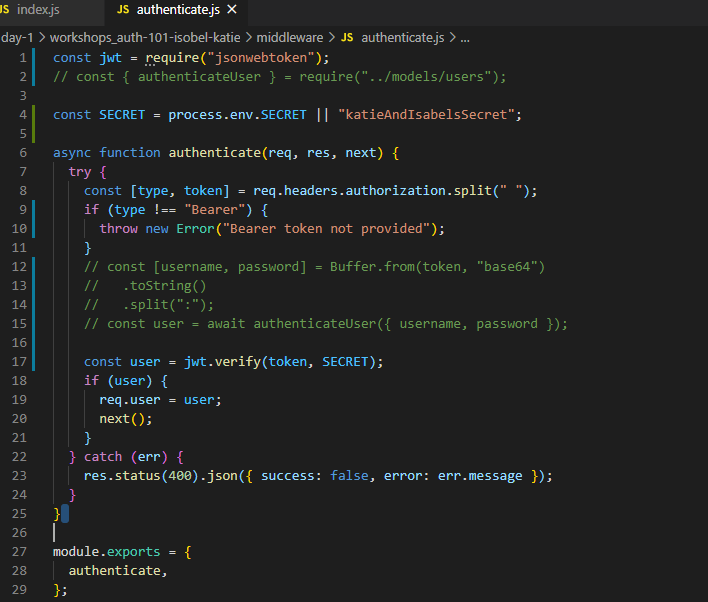

Creating a route for tokens:

### Day 47 of the MOB

_24th November_

### Today's progress:

- We had a great session this morning on CV's and building our digital profile. I learnt what I need to put on my CV to make it relevant to applying for tech jobs and also what to include on my LinkedIn and GitHub profile. We have to do a first draft of our CV's this week and I'm looking forward to getting that done.

- We learnt about the array method `reduce()` and did lots of exercises (reduce cardio!) to practice using it in different situations. I learnt that:

  - the `reduce()` method reduces the array to a single value
  - the return value of the function is stored in the accumulator
  - it does not mutate the original array
  - it takes 4 arguments 1) accumulator 2) current value 3) current index (optional) 4) source array (optional)

  99% of the time, `reduce()` is better that `map()` and `filter()`. But occasionally there might be a reason not to use `reduce()` such as:

  - it might create more cognitive load / be harder for humans to read and understand (we are constantly weighing up efficiency vs readability)
  - sometimes it might be more efficient to filter an array first (if it's very large) before using `reduce()` or any other array methods on it

- This afternoon we had a guest lecture on Psychological Safety. I learnt that psychological safety is _"a shared belief held by members of a team that the team is safe for interpersonal risk-taking"._ Psychological safety makes teams more effective and it means that:

  - people can ask questions and share ideas without fear
  - they can learn from mistakes rather than there being a blame culture
  - they have an equal voice in the team
  - it is easy to ask for help
  - there are regular healthy debates

  It is not:

  - being nice
  - to do with personality type
  - mean there are low standards

  These are common misconceptions.

  Ways to increase psychological safety:

  - Active listening
  - Avoid dominating meetings and encourage others to participate
  - React to mistakes with curiosity and a desire to learn
  - Show your vulnerable side
  - Respond appropriately to feedback

### Thoughts:

I got some feedback on the recap task from yesterday and I'm really happy as I got an A grade and some really good comments on my code. Definitely made the right choice to take my time and work through things properly. There were a couple of stretch points for me to think about which have been helpful feedback, but I'm really happy that my hard work is paying off and that I'm on the right track! 🙂

Also, I think we did really well with the reducer cardio tasks this afternoon and managed to complete a lot of them without too much trouble. I'm definitely feeling a lot more comfortable with array methods now and have more confidence approaching problems and coming up with solutions.

### Links to work / resources:

Our `reduce()` cardio exercises:

### Day 48 of the MOB

_25th November_

### Today's progress:

- This morning we had a guest lecture from a senior developer at Click Travel on Domain Driven Design (DDD):

- We had a quick recap on CSS Flexbox & Grid and played [Flexbox Froggy](https://flexboxfroggy.com/) and [Grid Garden](https://cssgridgarden.com/)!

- We had a great talk from two developers from Loupe Testing & Software about user journey testing. They told us about a technology called [Cypress](https://www.cypress.io/) which automates and tests the user flow. It is different to and more powerful than Jest (Jest is good for unit testing). I liked its visual aspect (you can see it run through the user flow) and could can see all tests that passed and failed with details of why. I'd like to try using this myself and look into it more.

- To end the day we looked at scope, closures and recursion. My main learning points were:
  - Hoisting is JavaScript's default behaviour of moving all declarations to the top of the current scope (to the top of the current script or the current function).
  - Lexical Scope: JavaScript implements a scoping mechanism named lexical scoping (or static scoping). Lexical scoping means that the accessibility of variables is determined statically by the position of the variables within the nested function scopes: the inner function scope can access variables from the outer function scope.
  - ES6 arrow functions use lexical scope where as traditional functions do not
  - Closures: A closure is the combination of a function bundled together (enclosed) with references to its surrounding state (the lexical environment). In other words, a closure gives you access to an outer function's scope from an inner function.
  - Recursion is a method of solving a problem where the solution depends on solutions to smaller instances of the same problem. Such problems can generally be solved by iteration, but this needs to identify and index the smaller instances at programming time. Recursion solves such recursive problems by using functions that call themselves from within their own code. The approach can be applied to many types of problems, and recursion is one of the central ideas of computer science.

### Thoughts:

I enjoyed learning about some new things today. I'd not heard of Domain Driven Design before so that was new to me. I really enjoyed seeing Cypress run some user flow tests and to learn about a different testing technology. We covered some complex topics at the end of the day and I know I need to look into these concepts a little more to take my current understanding to the next level! Great to be learning about these things though and glad we are getting taught about more complex theories and topics.

### Links to work / resources:

A basic example of recursion:

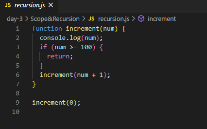

### Day 49 of the MOB

_26th November_

### Today's progress:

- This morning we had a great lecture on Perspectives & Problem Solving and how to prepare our minds to work together. Sometimes when something happens or someone says something which doesn't fit into our existing way of thinking it can be challenging to relate or connect to that person. Ways that we can try to overcome this disconnect are:

  - always be prepared to listen
  - be open to different perspectives
  - 'Sawubona' - "I see you..." - There's a principle in it about two people coming together with a mindset of 'what does being with each other at this moment in time enable us to achieve together'.
  - try to be less black and white / right and wrong and see things more as 'interesting'. Interesting is much more powerful than black and white and allows us to be open to different perspectives. Be more grey!
  - The Dreamer, Realist and Critic model can be a helpful construct for allowing a place for freedom of thinking (Dreamer phase) where anything goes without critique.
  - self awareness is key - am I being positional? Being positional isn't always bad - we just need to be aware when we are taking that stance.

- We had a talk from Liz about some some Atlassian products which we will most likely be using in our tech teams. We delved into:

  - Trello: we already use Trello but there are some features I used yet so I want to explore it's potential more
  - Jira: is Trello's older sibling! (and not free!) It has some very useful features such as a backlog, cards can have a unique ID, story point estimates, team velocity
  - Jira uses Epics to organise workloads with a hierarchy. We also looked into Themes / initiatives: These are big blocks of work / a whole project, and they can be broken down into Epics, then Stories, then Tasks/Tickets
  - [The Atlassian Playbook](https://www.atlassian.com/team-playbook): A bit like an Agile handbook which contains lots of ideas for running stand up's, retro's, etc. They are set out a bit like a recipe - what you need, how to run it, etc.

    We learnt how to write Documentation. Docs are for users, developers, stakeholders and also ourselves! Good documentation should include (but isn't limited to!) the following:

  - Purpose - what problem is it solving?
  - What your components do and how they fit together - component tree
  - How to start it and instructions for use
  - Examples showing your software in use
  - Dependencies list and what each dependency does in your code
  - Any other information users and developers might need to know

  Great resources on writing good documentation:

[Write The Docs](https://www.writethedocs.org/guide/writing/beginners-guide-to-docs/)

[Atlassian Confluence: Building Better Documentation](https://www.atlassian.com/software/confluence/documentation)

- This afternoon we learnt about component based thinking. I learnt that components should be:

  - INDEPENDENT: they should be able to be used on their own and rely on only a limited set of dependencies
  - CLEARLY DEFINED: they should be useful but have limited scope
  - ENCAPSULATED: they should 'wrap-up' their functionality within themselves and provide set ways of implementation
  - RE-USEABLE: they should be built with useability in mind although they may initially only be implemented once

  Component Libraries:

  - Ant Design
  - Chakra-UI
  - Material-UI
  - Semantic-UI

  Advantages of frameworks:

  - consistent
  - maintainable
  - scaleable

We learnt about and used Storybook for the first time. Storybook is a tool for UI development. It generates a component library for your project. It makes development faster and easier by isolating components. This allows you to work on one component at a time.

### Thoughts:

Today we learnt about quite a few new technologies which I know will be really useful when we get into the industry and I am hoping to set aside some time to explore these more. I missed not doing as much actual coding today. I think that's a good sign! 🙂 Also, I am attending an online Fusion meetup tonight and it's great to feel part of the Birmingham tech community. I just wish we were meeting in real life!

### Links to work / resources:

My first attempt at writing docs for a simple weather app I made in Week 7 of the bootcamp:

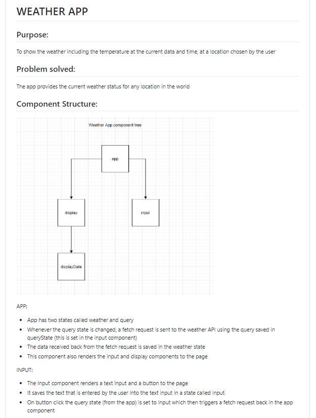

### Day 50 of the MOB

_27th November_

### Today's progress:

- Today was Hackathon Friday and this week it was an Auth hackathon! Our task this week was to make anything we wanted as long as the user had to log in to use it. We chose to use Auth0 for our authentication which is a service that will allow you to have users sign into your project.

- We decided to focus on working in an Agile way and spent quite a bit of time on our Ideation & Planning phase which I was really pleased about. We made a great Trello board to record our ideas and then plan our our smaller tasks. We also had a go at writing an Epic, User Stories and Tickets which was really helpful and meant that we could keep coming back and checking we were sticking to the plan! The actual app that we decided to make was a Community Noticeboard where you could login, see any community notices for your street/area and publish a notice. All the notice data is stored on a database and we made GET and POST requests to it. One of our MLP's would be to have the ability to comment on or like a post. In terms of how we ordered our work, we decided to get the Auth done first as we hadn't done it before and didn't know how long it would take. I think this was a good choice as it meant we had time to get it done and learn about it (as that was our main learning objective for the day) rather than leaving it to the end and not having time to complete it.

- It was also really good practice to set up a backend node project from scratch again as lately we have been using repos which already have this done for us. So we had to remember to git init, install express, postgres, dotenv and cors for it all to work!

### Thoughts:

I am so pleased with how Isobel and I worked together today. I'm super glad we took the time to ideate using the Disney ideation method, refine ideas, come up with our MVP and MLP, write user stories and use Trello to plan our work flow - all of which helped us to work in an Agile way. We pushed ourselves and got a working back-end, an almost working front end! (just didn't have enough time to render the data from the db) and we learnt how to make a user login with Auth0. I feel like we went about things in the right way, the Agile way, and it's great to have to chance to practice doing this with hackathons. Very happy 🙂

I'm really tired this evening - been pushing myself this week with late nights, staying up late to work. But I've got my LinkedIn looking great now and I'm ready to start work on my CV this weekend!

### Links to work / resources:

Our Ideation & Planning phases on Trello:

We had a go at writing an Epic and User Stories:

The homepage of our app:

Using Auth0 to login:

### Day 51 of the MOB

_30th November_

### Today's progress:

- This morning we learnt a bit more about Test Driven Development (TDD). Things I learnt about TDD:
  - you write the tests before the code
  - then you write code which will pass the tests
  - the tests are formulated such that they result in requirements being met
  - the aim of TDD is to create clean, simple code that satisfies the requirements with no or minimal bloat

- This afternoon we learnt about Web Sockets. A WebSocket is a persistent connection between a client and server. WebSockets provide a bidirectional, full-duplex communications channel that operates over HTTP through a single TCP/IP socket connection. At its core, the WebSocket protocol facilitates message passing between a client and server.

- Our workshop this afternoon was to follow a [tutorial on Socket.IO](https://socket.io/get-started/chat/) to make a chat app. It was really interesting and part of it involved translating some jQuery into JavaScript. I'd never used or worked with jQuery before so this required some detective work but it was great to learn how to translate one into another. We used [ngrok](https://dashboard.ngrok.com/get-started/setup) (a cross-platform application that enables developers to expose a local development server to the Internet) to enable us to chat to each other. It was pretty exciting!

### Thoughts:

I enjoyed covering TDD and Web Sockets today. Over the weekend I spent a lot of time working on my CV and also looking into some DevOps practices such as the CI/CD pipeline and infrastructure as code. I also started work on my technical blog post which I am writing about 'what happens when you click on a link in a web browser?'. It's a busy time at the moment but I'm enjoying the momentum of building up to the final project and job interviews. It's giving me real purpose. 🙂

### Links to work / resources:

Translating jQuery into JavaScript:

### Day 52 of the MOB

_1st December_

### Today's progress:

We've been learning about lots of different technologies / libraries / frameworks today. We covered:

- NodeMailer

  - a single module with zero dependencies for Node.js designed for sending emails
  - main features include security, in particular, email delivery with TLS/STARTTLS and DKIM email authentication
  - in our workshop we created a simple emailer where we were able to send emails by running our index.js file in node
  - then we made it more secure by using authentication tokens instead of the actual login credentials
  - then we abstracted the functionality away by wrapping our email-sending logic into a function to use anywhere in our app.
  - Important things to remember - when storing credentials in the .env file I must install dotenv and then use the --require (-r) command line option to preload dotenv in the scripts
  - The four things you need to obtain during the "OAuth2" dance in order to securely connect your Nodemailer app to Gmail (or another email provider) are client ID, client secret, refresh token and access token

- Web Scraping with Axios and Puppeteer

  - _What is it?_ Web scraping (web harvesting or web data extraction) is data scraping used for extracting data from websites. Web scraping software may access the World Wide Web directly using the Hypertext Transfer Protocol, or through a web browser. While web scraping can be done manually by a software user, the term typically refers to automated processes implemented using a bot or web crawler. It is a form of copying, in which specific data is gathered and copied from the web, typically into a central local database or spreadsheet, for later retrieval or analysis.
    - We had a go at using two libraries to scrape data from the web - Axios and Puppeteer
  - Axios - a library that allows you to make fetch() requests from the browser, make fetch() requests from node.js, supports the Promise API, intercept request and response, transform request and response data, cancel requests and performs automatic transforms for JSON dat. It gives us back HTML. fetch() is a browser API (not a core node.js API) and cannot be used on the backend which is why we must use Axios.
  - you can use a headless browser to load the page's DOM upon which you can use the normal DOM methods to interrogate
  - jsdom is a web package which allows us to access the DOM on the backend. eg, `dom.window.document` gives us access to normal DOM properties and methods. jsdom is a pure-JavaScript implementation of many web standards for use with Node.js. In general, the goal of the project is to emulate enough of a subset of a web browser to be useful for testing and scraping real-world web applications.
  - there are two types of HTML pages - static and dynamic. Axios is good for working with static pages and Puppeteer is good for dynamic pages.

- Animation Frameworks (Motion API & React-Spring)
  - the benefits of React animation libraries over other CSS animations are that they help keep our code maintainable and scaleable, and they provide a more intergrated wasy to control animations in our React components
  - in my group we looked into and used Motion API which is an animation and gesture library. We found the docs really useful and clear and were able to implement some basic animation on our webpage.
  - in general, you might want to use CSS animations for simpler "one-shot" transitions, like toggling UI element states but it is probably easier and better to use use JavaScript animations when you want to have advanced effects like bouncing, stop, pause, rewind, or slow down.
  - all of my CSS drawing work came in handy this afternoon when we were animating. Glad to be using my knowledge!

### Thoughts:

Wow, we really are being introduced to a lot of different things this week! It's great but a little overwhelming at times! Glad we are getting exposed to all these different libraries though - we obviously won't be able to become pros in all of them right now but it's good to be thinking which we might want to look into more and use in our final projects. Very tired this evening though! (also it's my birthday 🙂 🎈)

### Links to work / resources:

How we sent an email using NodeMailer:

We got some data back on the Premier League using Axios:

Using MotionAPI to animate a cocktail being poured!

### Day 52 of the MOB

_2nd December_

### Today's progress:

- This morning we had a guest lecture on another programming language - Go. My main learning points were:

  - Go prizes simplicity, clarity and performance
  - It evolved from C
  - It was designed by 3 programmers who have all worked at Google at some point or another in R&D. At the time they were coding in C++ - a complied language - which took ages to compile. So they designed a new language.
  - Go is designed, not evolved.
  - There are two types of languages - complied and interpreted.
  - With complied languages (eg. C++, Go), the code the computer runs is not the code that you've written:
    CODE => COMPLIED => OUTPUT RUN BY COMPUTER
    They are statically typed / strongly typed (once a given type, always a given type). They are faster at run time but can be a pain to work with! You have to wait for them to compile.
  - Interpreted languages (eg. JavaScript) are dynamically typed / loosely typed (you can change the type - no type safety). They are fun to write in but can take longer to run as they are complied at run time.
  - Another difference is that Go is multi-threaded where as JavaScript is single-threaded
  - Check out the Go Proverbs. As important to the syntax and semantics of Go are it's philosophies. Another language that is similar to this is Python.
  - Uses for Go - Docker and Kubenetes are written in Go. G is often used when producing software for the cloud.
  - Go developers are affectionately known as Gophers!
  - The Go Playground is an online platform where you can write and run programmes in Go.
  - We learnt about types, variables, functions and packages
  - Packages are a way of controlling the visibility of your codes components. A package typically refers to a directory (folder) in your application
  - The struct type is like a class in JS
  - `func main` is the standard entry point into an app
  - You must always use double quotes for strings in Go
  - Some general advice in regards to programming:
    - don't be afraid to explore other languages
    - use the best tool for the job
    - beware of the language zealot!

- In the afternoon we delved a little deeper into React and learnt about React Context. Context is designed to share data that can be considered “global” for a tree of React components, such as the current authenticated user, theme, or preferred language. So far we have been handing data down as props which is fine if the component tree is quite small but can be less convenient if your component tree is very large. In this situation, context can help (although be warned- it's not always the answer!). The process you have to go through to get data to parts of the React Component tree is also known as prop drilling or threading.
  - Use cases: user data, colour themes, language, react router, Auth0

### Thoughts:

It was really interesting to learn another programming language today and to understand how it compares to JavaScript. I liked learning the differences between complied and interpreted languages and to learn a bit more about language history. I think that now we have a solid understanding of JavaScript it will make it easier to learn other programming languages as we can pick out the similarities and differences and have a reference point to hang the new syntax on.

### Links to work / resources:

REACT CONTEXT

Creating the context:

Providing the context:

Comsuming the context:

### Day 53 of the MOB

_3rd December_

### Today's progress:

- A team from The Economist came in to talk to us about AWS. It really helped to clarify some big picture stuff for me including:

  - With cloud, everything is done with an API
  - Infrastructure that previously used to be a hardware issue is now a software issue. Infrastructure such as servers used to be physically installed in work places (actual computers) that engineers had to set up and configure. Now we can do all of that through code (like with AWS) which is why we now talk about infrastructure as code. Obviously the hardware still exists in huge Google and Amazon warehouses but it has been abstracted away from the users. Infrastructure as Code is good because it is easy to scale, it is consistent and it is less costly to set up in terms of time and manpower.
  - Services we were introduced to were:
    - EC2 which we can use to commission a cloud server
    - S3 (Simple Storage System) which is a storage bucket
    - CDN (Content Distribution Network) which is a highly-distributed platform of servers that helps minimize delays in loading web page content by reducing the physical distance between the server and the user. This helps users around the world view the same high-quality content without slow loading times. It involves caching.
    - Lamda which AWS is a service that runs your code (functions) in response to events and automatically manages the underlying compute resources for you.
    - DynamoDB which is a native AWS database
    - RDS is database management
    - IAM which is an identity & access management - a way to keep your AWS account secure

- The CTO of Wealth Wizards can in to talk to us about different roles in tech and gave us some insights into the tech industry. It was great to hear from him and I learnt that it's very possible to have a career in tech and never be a developer! Other possible important job roles are Platform Engineer, Operations, Infrastructure Engineer, Product Manager/ Owner (a very valuable role and one of the better paid) and Architect. I liked the way he described DevOps - as the 'operations equivalent of Agile'.

### Thoughts:

Big day today - so much to take in with regards to AWS. So grateful for the opportunity to be learning this stuff at SoC though as I know many bootcamps don't offer this. I really enjoyed learning about the different services and getting to work with developers from The Economist who helped us with the tasks. I think I might like to get the AWS Cloud Practitioner certification as I think it would really help me to learn more about it all and look really great on my CV. So I am going to look into doing this after SoC (if I have a bit of time before I get a job).

### Links to work / resources:

What is the cloud?

An example of Infrastructure as Code - using code to create a server:

### Day 54

_4th December_

### Today's progress:

- We spent all morning learning about some Project management processes and explored new tools to help with PM. We reflected in our small groups on our project / PM experiences so far and spent a lot of time thinking about how an effective teams functions and what processes you need in place. It was really useful and a great time to be growing in this area with the final projects only being a week away. I learnt that TRIZ (The Theory of Inventive Problem Solving) may help us to be more creative in the initial dreamer phase of the project and may be a good tool to use even before the Disney Ideation Method. I also learnt about the Pre-Mortem Technique which is where you consider the worse possible outcome of the project (before it's even started). It's useful as it gives people permission to call things out that might break / slip. Questions to consider are what happened that led to that outcome? What did we do / not do / miss? How can we make sure that doesn't happen? Within our break-out sessions I researched and learnt about a new PM tool called a Gantt chart. Gantt charts are a simple, visual way to track tasks across the lifecycle of a project and they can be used in an Agile way to help capture and plan a sprint.

- This afternoon we learnt about some design ideas / tools to help us create great look, user friendly, responsive websites. Things to consider:
  - White space
  - Alignment
  - Contrast
  - Scale
  - Colours
  - Fonts
  - Visual hierarchy
  - Use media queries to help build responsive sites
  - Decide whether you are taking a mobile first or website first approach - it depends on what your website is for and how it's going to be used

### Thoughts:

I enjoyed Joe's session this morning and it was really helpful to reflect on the team dynamic/ethos, planning phase and development timeline of a project. It's going to be super useful as we go into our final projects. It was good to go over a few design basics this afternoon - I've not designed for mobile-first before so this could be a good side project to look into. It's the end of a very busy week with so many new things covered. But I'm feeling good and think that it's fantastic that we've had exposure to all of these tools and technologies because as long as we know they exist we can learn how to use them when we need them.

### Links to work / resources:

An example of a Gantt chart:

### Day 55 of the MOB

_7th December_

### Today's progress:

- We spent the first part of the morning working on a recap task which covered React Context and a couple of new libraries. I learnt about:

  - Luxon: a library for working with dates and times in JS. The features I used were the DateTime and Duration types.
  - Supertest: is an HTTP assertions library that allows you to test your Node. js HTTP servers. I used it along with Jest to test API endpoints and make sure that my routes are behaving as I expected.

- We learnt about CSS modules which are CSS files in which all class names and animation names are scoped locally by default. `createReactApp` comes with CSS modules already installed. To use them we have to: `import classnames from "classnames";`, rename our CSS files: `App.module.css`, then import the css file where we want to use it: `import css from "./App.module.css`, and then we use it in our components like so: `className = {css.className}`. You cannot use kebab-case for you class names so much use camelCase.

- We spent the afternoon looking at Promises. We've touched on them before but it was really helpful to do more of a deep dive on them. Main learning points:
  - A JavaScript Promise object can be pending, Fulfilled or rejected
  - The Promise object supports two properties: state and result.
  - While a Promise object is "pending" (working), the result is undefined.
  - When a Promise object is "fulfilled", the result is a value.
  - When a Promise object is "rejected", the result is an error object.
  - an async function always returns a promise
  - async functions are syntactic sugar
  - promises are also syntactic sugar on callback functions. We use them to avoid callback hell!
  - the node.js callback pattern is `(err, data) => {//code}`
  - util is a core module which allows us to promisify!
  - The `Promise` constructor is primarily used to wrap functions that do not already support promises.
  - The `Promise.all()` method takes an iterable of promises as an input, and returns a single Promise that resolves to an array of the results of the input promises. This returned promise will resolve when all of the input's promises have resolved, or if the input iterable contains no promises. It rejects immediately upon any of the input promises rejecting or non-promises throwing an error, and will reject with this first rejection message / error.
  - The `Promise.allSettled()` method returns a promise that resolves after all of the given promises have either fulfilled or rejected, with an array of objects that each describes the outcome of each promise. It is typically used when you have multiple asynchronous tasks that are not dependent on one another to complete successfully, or you'd always like to know the result of each promise.
  - In comparison, the Promise returned by `Promise.all()` may be more appropriate if the tasks are dependent on each other / if you'd like to immediately reject upon any of them rejecting.

### Thoughts:

Learning about CSS modules was really useful today as now we are using React and working with multiple components and stylesheets I have experienced the scoping issue and had to come up with some rather inventive class names! Using modules is much easier and clearer - I like it! I found the work on promises more challenging but really useful and I think I am starting to get more of the nitty gritty now!

### Links to work / resources:

Using Luxon to work with dates and times in JS:

An example of using Promise.allSettled():

### Day 56 of the MOB

_8th December_

### Today's progress:

- We had a great guest talk first thing this morning from the Principle Consultant from Hippo Digital who talked to us about tech team roles. It was super interesting to learn about all the different roles and what they involve, especially as we head into final projects next week. The roles we learnt about:

  - Product Owner (PO)
  - Delivery Manager (DM)
  - User Researcher (UR)
  - Content Designer (CD)
  - Performance Analyst (PA)
  - User Experience Designer (UX)
  - Technical Architect (TA)
  - Developer (D)
  - Quality Assurance Tester (QA)

- We spent some time looking into UI libraries. They are useful because they allow your components to be reuseable, consistent and scaleable. My partner and I looked in Chakra UI and played around with using some of their components. It was a really useful session as I am fairly certain we might use a UI library in our final projects.

- This afternoon we had a session on debugging tools abd learnt how to use the debugger in Google Chrome. You write `debugger;` in your code at the line you want to pause from and then open the debugger in the dev tools and it pauses at each step so you can inspect what is going on and hopefully find some clues as to where the bug is.
  - Debugging checklist
    1. Recognise the bug
    2. Investigate the source
    3. Identify the cause
    4. Test the solution
    5. Fix the bug
    6. Review the code

### Thoughts:

I really enjoyed hearing from Colin this morning about tech roles. I need to start deciding which direction I want to go in but it's hard because I enjoy so much! The debugging tools were also very useful and something I'd not used before so really good to learn!

### Links to work / resources:

Using the debugger tool in Google Chrome:

### Day 57 of the MOB

_9th December_

### Today's progress:

- We started the day by recapping on some Agile Principles, roles and practices. Agile methodology is a type of project management which values:

  - early and continuous development
  - customer satisfaction
  - frequent delivery
  - working software
  - sustainable development
  - face to face communication
  - self-organising teams
  - reflection

  - Roles include Product Owner, Scrum Master / Delivery Manager, Dev team members and stakeholders.
  - What's involved? Product planning, Sprints, Sprint Reviews and Retrospectives

  - Definition of done:
    - business or functional requirements
    - quality
    - non-functional requirements

- We learnt about Figma and used it for the first time to design a mobile layout. It was pretty easy to use and I'm really looking forward to using it in the final project!

- We learnt about static side generation v. server side rendering. We looked into Gatsby and made our app using Gatsby. The other teams did Next.js and we shared knowledge at the end.

### Thoughts:

Really enjoyed learning how to use Figma - it is something I know I want to use in our final projects so it was great to have some time exploring it in class. Still lots to get my head around regarding server-side rendering v static page generation as I don't think I fully understand what's happening yet or in which cases you would use them.

### Links to work / resources:

Using Figma for the first time to design a PubFinder mobile app:

### Day 58 of the MOB

_10th December_

### Today's progress:

- This morning we had our final session from Joe on Mindset and today we learnt about Project Mindset and reflected on being intentional and purposeful, having a personal vision and co-elevation mindset. We spent some time free writing on:

  - Dharma: my impact on the team - what do I want to do
  - Artha: my technical skills development - who I want to become
  - Moksha: my mindset development
  - Co-elevation: supporting each other as a team, moving from good to great. It's a choice!

- We had a guest lecture on having a customer centric approach and engaging with your customer in a way that provides a positive customer experience. We also covered creating a culture within teams and creating a system of shared values and behaviours.

- Our main technical learning for the day was about containers and using Docker. My main learning points were that:

  - containers allow our code to run on every computer. This is good because we want it to work in every environment
  - containers provide an environment in which to run our code
  - inside the container is everything your app needs to run on
  - containers enabled the move to microservice architecture

  Monoliths v Microservices
  MONOLITHS

  - single application
  - high dependant
  - one language
  - difficult to scale
    MICROSERVICES
  - one app per service eg. database, payment
  - communicate via API's
  - easy to iterate
  - easy to scale

- We spent the afternoon following a Docker tutorial on setting up a container, creating an instance of it and running it. Getting Docker desktop installed and working on my laptop was the biggest challenge and I did some amazing troubleshooting and problem solving to get it working! I was really pleased with myself. We followed the Docker Getting Started tutorial and built an app container image, started the container and saw the running app, updated our source code and replaced our container, learnt how to share our images by creating a repo on Docker Hub and pushing our image there, ran our app on a brand new instance, learnt about persisting our DB with container volumes, earnt about bind mounts which we can use to control the exact mountpoint on the host. There was also a section on multi-container apps and Docker compose which we didn't get on to but I am planning to finish this at the weekend.

### Thoughts:

I've been excited to learn about containers and use Docker for a while now so I'm really pleased we got a chance to today. It was quite a lot to take in but it was a good learning curve and good practice at reading docs, following instructions and trouble shooting. I'm looking forward to trying it again and maybe using Docker in our final project!

### Links to work / resources:

Using Docker for the first time:

### Day 59 of the MOB

_11th December_

### Today's progress:

- Today is the last day before the final projects start! We started the day with some Codewars and I was really pleased with a 6kyu kata that I managed to solve!

- For the rest of the day we were working on an AWS hackathon. The AWS services I used were:
  - IAM: Identity and Access Management enables you to manage access to AWS services and resources securely. Using IAM, you can create and manage AWS users and groups, and use permissions to allow and deny their access to AWS resources.
  - S3: Simple Storage Service - static storage which stores our code in a 'bucket'.
  - API Gateway: holds our endpoints and acts like a router. A service for creating, publishing, maintaining, monitoring, and securing REST, HTTP, and WebSocket APIs at any scale.
  - Lamda: holds our functions that talk to our database and acts like models. Lambda is a compute service that lets you run code without provisioning or managing servers. Lambda runs your code only when needed and scales automatically, from a few requests per day to thousands per second. You pay only for the compute time that you consume—there is no charge when your code is not running.
  - DynamoDB: non-relational database that stores data in key-value pairs

Other learning points were:
YAML

- YAML is a human-readable data serialization standard that can be used in conjunction with all programming languages and is often used to write configuration files.
- YAML files use indentation instead of brackets / semi-colons - white space matters!
- It's commonly used for configuration files ad in apps where data is being stored or transmitted
- The YAML file in our app is like a map for the Lambda functions

SERVERLESS ARCHITECTURE

- serverless doesn't mean no servers!
- Instead, it's Functions as a Service (FaaS). You send your code to a cloud provider who runs it as a function when triggered by an event (like a HTTP request)
- Your code is still on their servers but they dynamically allocate resource to you and you're only charged for what you use
- This differs from traditional servers where you're responsible for maintainence and security updates, paying for upkeep even when the server isn't receiving requests, and managing scaling based on traffic / amount of requests

SERVERLESS

- Serverless (with a big S!) is an application framework that offers easy YAML and CLI deployment of serverless API's to cloud providers like AWS
- a single config file allows you to list your functions (models) and define the endpoints (routes) that they're subscribed to.
- you can view traffic, useage and other stats on the online dashboard

OTHER

- Objects in AWS can't be kebab-case
- When accessing data from Dynamo DB we don't do a query, we write `scan`
- One of the ways that a non-relational database differs to a relational database if that with non-relational you don't have to define the structure up front - it's like a big JS object

### Thoughts:

Today was quite challenging as we were using lots of new AWS services for the first time but I really enjoyed it and it was great to get some hands on experience of using AWS. We went through writing the YAML file in lots of detail which really helped as I feel like I really understand what everything is doing now. A great way to round off our final non-proect week!

### Links to work / resources:

A 6kyu Codewars Kata I solved today:

The serverless flow:

Serverless V Express:

Our YAML file:

---

### I'm going to finish my 100 Days of Code / SoC Bootcamp Diary here as we're about to start our Final Project for the last four weeks of the bootcamp. I'm going to be keeping a separate log for the last few weeks to document my progress through my final project! Doing 100 Days of Code and then continuing to keep this diary during the SoC bootcamp and been a discipline but I am so happy I've done it. I've now got an amazing record of all my progress and achievement and it's already amazing to look back and see how far I've come! It's been a fantastic year of learning and I can't wait to get a job as a Software Developer in the new year. Here's to more happy coding!
