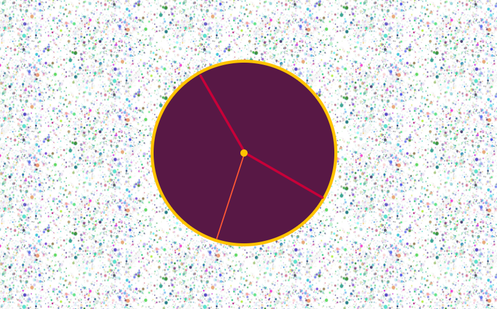

# 100 Days Of Code Diary 2020

## Day 1

_30th June_

### Today's progress:

- I learnt a new mark-up language called Markdown (the very language I'm now writing in!)
- I sorted out my GitHub repos and pushed up any new changes to my projects.
- I used markdown to create README docs for some of my GitHub repos.

### Thoughts:

I'm feeling really excited to have started 100 Days Of Code and already feel more motivated to code every day. I think having a goal of just one hour a day seems very managable for me, rather than feeling like unless I spend at least 3 hours a day learning it's not worth it.

### Links to work / resources:

[An example of the README files I have started making](https://github.com/katiehawcutt/interval-timer-app)

## Day 2

_1st July_

### Today's progress:

- I started learning SQL and I now know a bit more about databases, select queries, the insert into, update and delete statements, joins, views and indexes. I really enjoyed watching these quirky Socratica videos to get a good overview of the basics!
- Attended a CodeFirstGirls online event at lunchtime to find out more about life as an engineer.

### Thoughts:

I really enjoyed learning something brand new today (SQL) and exploring a different area of programming. I was feeling like I needed something fresh and a little break from HTML, CSS and JavaScript and this hit the spot! It's amazing how quickly I am picking up new languages now that I've got a good grasp of HTML, CSS and JS. They all have similarities which really helps.

### Links to work / resources:

[Socratica SQL videos](https://www.youtube.com/results?search_query=socratica+sql)

## Day 3

_2nd July_

### Today's progress:

- I practised some SQL using SQL Bolt which was a really good way to put some theory into practice. I got up to Lesson 10.
- I completed a CodeWars ("Largest Pair Sum In An Array") using the array method `sort()`. I then refactored it to make it cleaner and more consise.

### Thoughts:

I enjoyed putting my SQL learning into pratice and found that I could recall a lot of what I watched in the videos yesterday which really helped me to complete the exercises. I'm really excited that I was able to complete a 7kyu Kata and then refactor it myself with no help at all! It really boosted my confidence and I finished today's learning on a high!

### Links to work / resources:

[SQL Bolt Exercises](https://sqlbolt.com/lesson/introduction)

CodeWars Challenge:

## Day 4

_3rd July_

### Today's progress:

- I spent some time working on another CodeWars 7kyu Kata ("Sentences Should Start With Capital Letters"), using some string methods (`split()` and `slice()`) and array methods (forEach()) to complete it. I found this one harder than yesterday's challenge and needed a little help to complete it. I hadn't used `split(". ")` like this before so it was a really good learning point.

### Thoughts:

I used to always feel like I'd failed if I couldn't complete a CodeWars kata all by myself and had to ask for help. Rather than seeing it as an opportunity to learn I'd just feel frustrated and disappointed (something to do with me wanting to acheive perfection the whole time!). I've really been working hard to create new pathways in my brain that allow me to not be perfect and to be okay with not knowing things straight away. I'm pleased to say that I'm getting much better at it! I see this kata as a success as I was 80% there and then just needed a little help to get over the final hurdle (in which I learnt something new so that was a valuable process). I think the universe rewarded me as I then got a new rank of 6kyu!

### Links to work / resources:

CodeWars Challenge:

## Day 5

_4th July_

### Today's progress:

- Listened to a SyntaxFM podcast on servers and what makes them fast. I learnt about :

  [RAM](https://www.digitaltrends.com/computing/what-is-ram/) (Random Access Memory) which is basically short term memory in your deivce. It is an extremely fast component that temporarily stores all the information your PC needs right now and in the near future.

  [CPU's](https://www.digitaltrends.com/computing/what-is-a-cpu/) (Central Processing Units) which are responsible for processing and executing instructions.

  [GPU's](https://www.itpro.co.uk/hardware/30399/what-is-a-gpu) (Graphics Processing Unit) which are processors that are specially-designed to handle intensive graphics rendering tasks.

  [SSD's](https://www.avast.com/c-what-is-ssd) (Solid-State Drives) which are a new generation of storage device used in computers. SSDs replace traditional mechanical hard disks by using flash-based memory which is significantly faster.

- I also watched Lecture 2 (Arrays) of Havard's CS50 course. I'm learning more C as we go along and although it feels a bit different I am noticing the similarities it has with JavaScript.

### Thoughts:

I'm about to write my own server so it was interesting to listen to this podcast and learn about some of their components. When I first started listening to SyntaxFM podcasts I didn't really understand or know about anything they discussed (I just tried to absorb everything). It's nice now to feel a little less out of my depth and to understand much more of what they talk about!

The teaching on the CS50 course is really good and I'm enjoying these videos a lot. It's also interesting to learn a slightly lower level programming language (C) and to understand how things fit together in the wider spectrum of Computer Science.

### Links to work / resources:

[SyntaxFM Server Episode](https://open.spotify.com/episode/0NqiSqPzkKFnBH34g6Cvxg?si=LHrcv-6JRs60pPFXxn_tNA)

[CS50 Lecture 2: Arrays](https://www.youtube.com/watch?v=8PrOp9t0PyQ)

## Day 6

_5th July_

### Today's progress:

- I did a recap on node.js and learnt how to create and run a programme in node using npm (node package manager).
- I created and edited a package JSON.
- I made my own server using http (a core node module) and then using Express.

### Thoughts:

I understand how it works and want to practice creating more node.js programs and servers to establish some muscle memory with it all. Still not totally sure how it fits into the bigger picture of things though so looking forward to a project where I can work on both the front end and back end which will help me to join the dots.

### Links to work / resources:

## Day 7

_6th July_

### Today's progress:

- Continued with Wes Bos' CSS Grid Course and learnt how to make a responsive website with grid without using any media queries! You use the `minMax` property instead - pretty cool!

### Thoughts:

Found it hard to focus today as I had lots of other non-code related things on my mind which kept distracting me. So I did a shorter session but really pleased I still did something.

### Links to work / resources:

[Wes Bos CSS Grid Course](https://wesbos.com/courses)

## Day 8

_8th July_

### Today's progress:

- I did Wes Bos' Mastering Markdown course and learnt a few new tricks! It was really helpful seeing as I'm going to be using markdown a lot more over the coming weeks as I do this diary.
- I finished writing README files for all my GitHub repo's which was a really useful and productive activity. As I was reflecting on my main learning points for each project, it allowed me recap on lots of useful topics (fetch, asynchronous callback functions, promises, JSON). A really good refresher!
- I created this 100 Days Of Code diary and filled in the last weeks worth of notes. I'm really pleased I'm doing this diary as part of the challenge as it is helping me to reflect upon and consolidate my learning. I think it's also going to be super encouraging to be able to look back on all I've learnt and see how much I've progressed.

### Thoughts:

I'm feeling really good about code at the moment and I've got quite a few things I want to learn about/ achieve this week. I'm in a good flow currently and having the target of one hour a day really helps to motivate me. I am also enjoying the twitter community of 100DaysOfCode and it's encouraging to see other code newbies learning code / having fun / struggling / overcoming problems too. I feel part of something bigger which is a good driving force.

### Links to work / resources:

[My GitHub repos's with all my README files](https://github.com/katiehawcutt?tab=repositories)

[Wes Bos Mastering Markdown Course](https://wesbos.com/courses)

## Day 9

_9th July_

### Today's progress:

- I made a program called Randomizer that console logged a random number between 1 and 6. I created a package JSON and then ran the program in node.
- I made another http server by myself to see if I could remember how (and I could!)
- I finished working through the SQL Bolt Interactive Tutorial and learnt how to implement aggregate expressions (functions), recapped the order of execution of a select query, and then practiced inserting, updating and deleting rows in a table, creating, altering and dropping tables.

### Thoughts:

It was good to dive back in to SQL after a few days away from it. I had to look a few things up again to start with but I soon got back in to it. I found creating the program in node quite easy. I've done a lot of learning theory for the last week so I might start another little project again soon.

### Links to work / resources:

## Day 10

_10th July_

### Today's progress:

- I started a new project with Scratch and made an interactive animation about a dancing dinosaur called Dino! It was my first time properly using Scratch and I really enjoyed it. Looking forward to exploring more of its potential.

### Thoughts:

It felt good to work on something creative again after getting stuck into a lot of theory over the last couple of weeks. I really enjoyed the design aspect of it as well as getting it to function in the way I wanted.

### Links to work / resources:

[Dino The Dancing Dinosaur animation using Scratch](https://scratch.mit.edu/projects/410791742)

### Day 11

_13th July_

### Today's progress:

- I read a really good article entitled [23 Alternative Career Paths That Software Developers Can Grow Into](https://www.freecodecamp.org/news/alternative-career-paths/) and spent some time reflecting and researching into which areas of work I might be interested in / suited to. It was really helpful to think about the bigger picture and my end goal for learning to code / getting into tech.

### Thoughts:

As well as being exciting, it can be overwhelming thinking ahead as I am venturing into a industry which is completely new to me. I don't even know all the possible jobs I could get let alone which one I want! But reading this article and looking into a few more roles specifially has helped, and I do know that I want to work as part of team, I really love organising things, communicating with people and feeling on top of / managing situations. At the moment, the roles that I am most drawn to are project manager, product manager, scrum master and teacher / trainer (I have prior experience in teaching), as well as web develper. It's good to bear this in mind as I move forward as I can aim to upskill in the releavent areas and try to connect with people currently in those roles to find out more about them.

### Links to work / resources:

[23 Alternative Career Paths That Software Developers Can Grow Into](https://www.freecodecamp.org/news/alternative-career-paths/)

[How To Get Into Product Management](https://medium.com/hackernoon/how-to-get-into-product-management-78c58bd9c8cf)

[How To Succeed In A Project Manager Role In The Tech Industry](https://www.randstad.co.uk/career-advice/career-guidance/how-to-succeed-a-project-manager-role-tech-industry/)

### Day 12

_14th July_

### Today's progress:

- I spent all morning researching and learning about Agile Methodolody and the Scrum framework. I found the [Atlassian website](https://www.atlassian.com/agile) particuarly helpful along with their YouTube videos and I now feel like I have a much clearer understanding of agile priciples and agile project management frameworks.

- I also read an article on [Mission, Strategy, Tactics and Vision](https://boz.com/articles/strategy-tactics). I learnt more about what each of them are and why they are important.

### Thoughts:

Having looked into lots of possible job roles yesterday, I realised that the one skill that ties a lot of them together is the ability to be able to work effectively in a team. This inspired me to look into agile methodology and the scrum framework as I know these are widely used approaches in the tech sector. (I'd also like to look into other frameworks such as Kanban and XP.) I felt inspired after my research / learning and it increased my desire to work in an environment like this and be part of such a well functioning team. Whatever line of work I go into, I know these skills and knowledge will be very useful. I can't wait to join a bootcamp and start learning / working as a team rather than as a solo learner!

### Links to work / resources:

[The Original Agile Manifesto](https://agilemanifesto.org/)

[Atlassian Website](https://www.atlassian.com/agile)

[Atlassian YouTube videos on What Is Scrum?](https://www.youtube.com/watch?v=dJNCHvqKljU&list=PLaD4FvsFdarT0B2yi9byhKWYX1YmrkrpC&index=10)

### Day 13

_16th July_

### Today's progress:

- I completed the first stage of the School of Code bootcamp applicaton process. I made three avatars using the School of Code's introduction to HTML, CSS and JavaScript on their learning platform. I also had to write a little bit about why I wanted to do the bootcamp.
- I listened to a Syntax Podcast episode and learnt a bit more about frameworks, fonts and CMS's.

### Thoughts:

I'm really excited to be starting the application stages for SoC and although I found it an easy task and didn't struggle to complete it, I was still a bit nervous about it. I think it's because I've had a lot of time over the last few months to think about how much I want to do the course and it's become quite a big deal to me now. I'm trying to keep things in perspective, stay calm and just do my thing!

### Links to work / resources:

SoC Application Avatar Task:

[Syntax FM Podcast - Potluck on fonts, framworks, and more...](https://open.spotify.com/episode/3bktBVChDHgDnOFqU8Cakv?si=qMKxNr36ToKIoVwxjyuD3w)

### Day 14

_17th July_

### Today's progress:

- I completed the FreeCodeCamp learning section on Applied Accessibility. I learnt that "accessibility" generally means having web content and a user interface that can be understood, navigated, and interacted with by a broad audience. This includes people with visual, auditory, mobility, or cognitive disabilities.The main points I took away were that it's important to:

  1. Have well-organized code that uses appropriate markup

  2. Ensure text alternatives exist for non-text and visual content

  3. Create an easily-navigated page that's keyboard-friendly

I learnt about some HTML tags that are particulay useful and important for this (eg. main, header, footer, section, article, fieldset, legend, date) and that it's important to label images / inputs /graphs, etc. appropriately using alt / for / figcaption. We should also style our pages with CSS in a colour friendly way and use the correct contrast.

### Thoughts:

I was listening to a podcast yesterday in which they mentioned accessibility and it reminded me that it was something I wanted to look into again. I did cover it when I first got into coding but I wanted to refresh myself. It was much easier to take it all in now I've learnt more and have a framework in my mind to attch new knowledge too. It nice to be reminded of how far I've come since March!

### Links to work / resources:

### Day 15

_18th July_

### Today's progress:

- I worked on a couple of Codewars challenges and learnt how to chain array methods together!

### Thoughts:

I was really pleased as I managed to complete the 7kyu kata by myself (which I still get really excited about!). I'm finding myself being able to think through the logic of the solution so much faster and I'm able to break down the solution into manageable chunks. This really encourged me as it used to take me ages to even be able to formulate a pseudo plan. It's now happening much more quickly and naturally. Ben helped me with the 6kyu kata and I learnt how to chain together array methods which we'd talked about before but I'd never actually done. This was a really good learning session.

### Links to work / resources:

### Day 16

_21st July_

### Today's progress:

- I submitted my School of Code Bootcamp Video Application. This involved answering four different questions (with around a minute for each question) and then ediitng them together into a little film.

- I read an article on [How To Go From A Junior Developer To A Mid-Level Developer](https://www.freecodecamp.org/news/how-to-go-from-junior-developer-to-mid-level-developer/). I know I'm a way off yet but it's good to look ahead and make sure I'm going in the right direction!

### Thoughts:

I've had a couple of days off from actual coding as I've been working on my School of Code Bootcamp Video Application which I submitted last night. This involved me spending quite a lot of time planning my answers to four questions and then filming them / editing them together into a little video. I have never done a video interview before and I found it difficult. I think I tend to over-think these things and would have much preferred a live interview! After I'd filmed the different questions I found a video editor on my laptop (which I'd never used before) and I really enjoyed editing the different sections of film together. It was a great new experience and I'd like to do more of it!

### Links to work / resources:

### Day 17

_22nd July_

### Today's progress:

- I started work on a little CodePen project using CSS to draw a beach scene. I've not used CoedPen before so it was fun to try it out!

### Thoughts:

It was great to be using CSS again as I've haven't used any for a few weeks. I really enjoy the visual design aspect of coding and get into a nice work flow with it. As I'm in Devon near the beach at the moment I thought I'd create something relevant! Looking forward to finishing this off and getting more stuck into CSS.

### Links to work / resources:

### Day 18

_24th July_

### Today's progress:

- I finished my first Scratch project - an interactive animation called Deeno The Dancing Dinosaur. This is the third part of my School of Code Application and I'm very pleased to have submitted it today!

### Thoughts:

I really enjoyed working on this animation project and absolutely loved the creative aspect of it. I also really enjoyed using Scratch - the coding building blocks (with their different shapes and colours) remind me of Lego and serve as a really helpful visual aid to building code. It was a good recap on logical / programmatic thinking.

### Links to work / resources:

[Deeno The Dancing Dinosaur](https://scratch.mit.edu/projects/410791742)

### Day 19

_29th July_

### Today's progress:

- I learnt about the history of open source by listening to a couple of great Command Line Heroes podcasts called OS Wars: Part 1 & 2. It was really interesting to learn more about the history of computing, the development of operating systems and the battles between the big players - Microsoft, Apple and Linux.

### Thoughts:

After completing my School of Code application last week I had a few days off from coding / learing to refresh myself as I realised I'd been feeling quite anxious about the bootcamp application and it felt right to have a little break. Listening to these podcasts was a great was to ease myself back in and I'm feeling inspired to get down to some good coding over the coming weeks!

### Links to work / resources:

[OS Wars: Part 1](https://open.spotify.com/episode/1YyKEZ71i9af1hohHoNjYu?si=qA0vnm4WSquFe08gfCHJzg)

[OS Wars: Part 2](https://open.spotify.com/episode/5cQ9coeieMnnnpUedANIqe?si=tJMikHFXS2udh3vOhIP98Q)

### Day 20

_31st July_

### Today's progress:

I followed a CodePen tutorial and made a CSS sheep! It was a really helpful exercise and I learnt about quite a few new things such as:

- How to use clip-path to make shapes (and I used [Clippy](https://bennettfeely.com/clippy/) to help)

- Using CSS variables

- Using `::before` and `::after` selectors

I also got to recap on a few things which I'd not done for a while:

- The position property - specifically using absolute and relative

- Positioning elements with %'s

### Thoughts:

I really enjoyed making this little sheep! As well as learing a few new things it opened my eyes to how many lines of code is needed just to make one small image with CSS!

### Links to work / resources:

[My CSS Sheep on CodePen](https://codepen.io/katiehawcutt/pen/jOWgOwR)

### Day 21

_2nd August_

### Today's progress:

I used what I learnt making my CSS sheep to add to my Beach Scene (in Codepen):

- I added quite a few other elements including a kite, spade, shark-fin, starfish and shell and I used clip-path to make the shapes of these elements
- I took the process I used to make the sheep fluff and used it to make the cloud (they are very similar!)
- I used the `::before` and `::after` selectors quite a few times to cut down on div's
- I got much better at positioning using % and px
- I added some animation to the elements using `@keyframes` and the transform / trnaslate properties

### Thoughts:

I really enjoyed making this animated picture and it was great to implement lots of the things I'd learnt about making the CSS sheep into my own project. It's been a really useful few days getting into CSS again and going into detail with positioning and creating shapes.

### Links to work / resources:

[My Beach Scene on CodePen](https://codepen.io/katiehawcutt/pen/QWyYvGe)

### Day 22

_3rd August_

### Today's progress:

- I started Wes Bos' JavaScript30 Course and made a drum-kit by following his first tutorial! I learnt about key events, playing audio and listening for the transition end event. I also used an attribute selector which I'd not done before. Then I custom styled it with a video background of a concert so I feel like a rock star when I'm playing it!

- I talked through the code with Ben when I'd finished and explained to him what everything did. I find this helps to solidify my learning and makes sure that I really know what's going on in detail on each line of code, rather than just getting the gist of things.

- I also looked into `this` as I had to use it again today and wanted a refresher. I found the below very helpful:

## What is this?

The JavaScript `this` keyword refers to the object it belongs to.

It has different values depending on where it is used:

    In a method, this refers to the owner object.

    Alone, this refers to the global object.

    In a function, this refers to the global object.

    In a function, in strict mode, this is undefined.

    In an event, this refers to the element that received the event.

    Methods like call(), and apply() can refer this to any object.

Handy tip: if you're not sure what 'this' is, just console log it!

### Thoughts:

I've made similar audio apps before so the ideas I used today weren't completely foreign to me but I definitely learnt some new things about events which was really helpful. In terms of technical understanding of the code and committing processes to memory I just find repetition so helpful so the more I can talk through the code / refactor / make more, the better!

### Links to work / resources:

My drumkit:

### Day 23

_4th August_

### Today's progress:

- I've started making a To-Do List App. I'm happy with the design and I've got it working but I want to refactor it tomorrow as I've got quite a bit of repetition in my code at the moment.

### Thoughts:

I tried to make this to-do list app a little while ago when I first started coding. I followed a tutorial at the time and didn't really understand what I was doing. Now when I look at the code I understand it all which is great! I never finished the project properly and I'd left it in quite a basic state. I've now overhauled the whole design and made three lists instead of one which meant adding quite a bit of new code. I felt a bit frustrated at the end as I wanted to refactor it straight away but I'm really tired now so I'll tackle it tomorrow when I'm fresh!

### Links to work / resources:

### Day 24

_5th August_

### Today's progress:

- I made an analogue clock with the help of the next JavaScript30 tutorial. I really enjoyed combining CSS and JavaScript to make something really functional. I found it surprisingly simple and although I did have help with the JS (in the tutorial) I feel like I understand what everything is doing and like I could recreate it on my own. Also, all the CSS I've been doing over the past few weeks really helped me to design my clock quickly, efficiently and confidently.

- I used the CSS property `transform-origin` for the first time which was very exciting! I could have done with that the other day when I was making my beach scene! I want to try and make a sun with rays of light now I've learnt about that.

- I started refactoring my To-Do List app but didn't get too far before I broke it! Struggled with it for a while and managed to reduce a few lines of code and get part of it working. But I'm a bit stuck now - I will ask Ben for a bit of help at some point.

### Thoughts:

I found the refactoring hard and I feel like I'm struggling to get my JavaScript to the next level. I know that I am able to do quite a few different things with JS and use methods / solve problems (for example, on Codewars I'm doing okay) but when it comes to pulling a real life app / project together I can't seems to connect all the dots. I know that with practice this will improve but I feel myself getting frustrated sometimes and like I'm having a complete blank! I'm happy I can get things working but I want my code to be as efficient and non-repetitive as possible. I'm choosing to see it as a good test of my mental robustness which I know I need to work on!

### Links to work / resources:

[Click here to see my clock in action!](https://codepen.io/katiehawcutt/pen/eYZYexw)

### Day 25

_6th August_

### Today's progress:

I made a litte app in which you can adjust the border width, color and blur of a photo. I made it as part of [Wes Bos' JavaScript30](https://wesbos.com/) course to practice using CSS variables and then updating them with JavaScript.

Things I learnt:

- I used the HTML `range` input and `color` input for the first time.

- I learnt that when you use `querySelector / querySelectorAll` it returns you a Node List which is very similar to an array except there are a lot less methods you can use on it. `forEach` _is_ one of the methods you can use on a Node List and I used this one today.

- I learnt that there is an `EventListener` called 'change'.

- I learnt that `document.documentElement` returns you the element which is the root element of the HTML document.

- I learnt how to update a CSS variable with JavaScript.

### Thoughts:

I really enjoyed this little project and learnt lots! I'm having a really positive week code-wise and feeling super motivated to learn everyday!

### Links to work / resources:

[Click here to see my app which uses JavaScript to update CSS variables!](https://github.com/katiehawcutt/CSS-variables-project)

### Day 26

_8th August_

### Today's progress:

- I refactored my To-Do-List app which I am so pleased about as although I was happy I'd got it working this week there was a lot of repetition in my code and the data wasn't stored in a very efficient way. With a little help from Ben, I did a big refactor and got 80 lines of JavaScript down to 47! I've changed the data structure so that the items are now stored in an array (rather than as HTML strings) and that allowed me to store and access the data more efficiently. I learnt a lot during the refactoring process including:

  - Thinking about good ways to store data - in this case, an array of objects.

  - Accessing data in an object using dot notation and using the index.

  - Saving data to `localStorage` and using the `setItem()` and `getItem()` methods on localStorage.

  - Using `JSON.stringify()` to save my array to localStorage (which only takes data in a string format) and `JSON.parse()` to get the data back out as an array.

  - Practiced using the array methods `forEach()`, `splice()` and `indexOf()`.

  - How to stop a page refreshing on 'submit' when using the HTML form element.

- I read a really good article about CSS positioning using %'s and what the %'s actually means ([What Does 100% Actually Mean In CSS?](https://wattenberger.com/blog/css-percents)). I've been getting into CSS more recently and using %'s but sometimes they haven't worked how I thought they would. This article clears it all up and is super helpful! This is the main thing to take away:

- I updated my GitHub repo README's so they contained a screenshot of my project before the little write-up. I think it really adds to be able to see a snapshot of each project and brings the README file to life a bit more!

### Thoughts:

I really enjoyed doing the refactor of my list app with Ben. It was so helpful to have some one to one help and I felt really positive about all the learning. I think grasping and understanding ideas about effective data structures will really help me going forward as I build new apps / projects.

I found out last night that I've got through to the final stage of the SoC bootcamp appilation stages so I'm feeling really happy about that! Just a final interview left to go next week!

### Links to work / resources:

[View my To-Do-List App source code on GitHub](https://github.com/katiehawcutt/to-do-list-app)

### Day 27

_9th August_

### Today's progress:

- I listened to two podcasts from the Command Line Heroes series about the Agile revolution and DevOps. I really enjoyed learning a bit more about the history of development and operations and it's helped me to understand more about the role of DevOps in the current world of tech.

### Thoughts:

I've got my School of Code Final Interview tomorrow so I'm looking forward to that (and a little bit nervous / excited as I've been working towards this for a while!).

### Links to work / resources:

[The Agile Revolution (Command Line Heroes Podcast)](https://open.spotify.com/episode/5GaPzvIM5cSffaULtGP3nR?si=p3iB3ng1RB6wOgvAbyXnIw)

[DevOps Tear Down That Wall (Command Line Heroes Podcast)](https://open.spotify.com/episode/7i4d7AYsSapMG6bDtVPY1y?si=7w5mV-qURHqSnETLiusS_w)

### Day 28

_10th August_

### Today's progress:

- I had my SoC final interview this morning!

- This afternoon I worked through the next JavaScript30 Challenge which was called Array Cardio (Day 1). I used `map()`, `filter()`, `sort()`, `reduce()` and `split()` to complete some exercises. I worked out a couple almost by myself but needed to watch the tutorial for the rest of them. I'd not used `sort()` in the way I used it today before so that was interesting. We also did one exercise in the browser using querySelector to access the div with the information we wanted. We then turned that information from a Node List into an array using `Array.from()` which was new to me. So lots to take in!

### Thoughts:

I was feeling quite tired this afternoon (it's very, very hot and I'd expended lots of energy building up to my interview this morning!) so I found the Array Cardio challenge this afternoon quite a slog - I kep losing concentration because I was tired! I'm pleased I powered through though (and drank lots of water!) as I learnt a lot from these exercises. I still find JavaScript overwhleming at times as there is a lot to learn and understand with all the maths. But I am getting there and I know the key to success is repetition so I am planning on trying to do at least one CodeWars kata everyday for the rest of this week to practice all these array methods and also practice some ES6 syntax such as arrow functions.

### Links to work / resources:

[Array Cardio Day 1](https://github.com/katiehawcutt/array-cardio)

### Day 29

_11th August_

### Today's progress:

- I spent a few hours working on some CodeWars challenges and tried to put into pratice some string methods, array methods and use what I learnt doing the JS30 Array Cardio yesterday.

### Thoughts:

I almost finished two more tricky kata but have got a bit stuck on the last hurdle so hoping to get some help finishing them this week. I made some good progress though and it was good to get back into some serious JavaScript!

### Links to work / resources:

Kata I worked on today:

[Ordered Count Of Characters (7kyu)](https://www.codewars.com/kata/57a6633153ba33189e000074)

[Sum Of Parts (6kyu)](https://www.codewars.com/kata/5ce399e0047a45001c853c2b)

### Day 30

_12th August_

### Today's progress:

- I'm all about the JavaScript this week so I continued working on some more CodeWars Kata. Did a few easier ones today including one called Keep Hydrated! (see below) which I thought was apt as it's sooo hot!

### Thoughts:

It feels good to be practising JavaScript everyday at the moment and I'm seeing good results. I'm getting much quicker at getting my head around the problem and coming up with the right steps to solve it. It's feeling more natural. I'm also getting much more confident using ES6 syntax which I'm really pleased about!

### Links to work / resources:

Keep Hydrated! Kata 8kyu:

### Day 31

_13th August_

### Today's progress:

- I solved another CodeWars kata called Fake Binary. With some help from Ben I then refactored it using `map()` rather than `forEach()` and cut down the lines of code quite significantly! It was good to practice chaining array methods.

- I completed the next JavaScript30 challenge and made a responsive image gallery. I used toggle for the first time!

### Thoughts:

I enjoyed my coding today and did a good mix of technical and creative work. As usual, I made the JS30 project my own and changed the background images, words and font.

### Links to work / resources:

Fake Binary Kata 8kyu:

[JS30 Responsive Image Gallery on GitHub](https://github.com/katiehawcutt/responsive-image-gallery)

### Day 32

_14th August_

### Today's progress:

- Today I woke up and wanted to make something cute so I created a little, grumpy, white cat on CodePen! I enjoyed using some of the skills I've recently learned. These included using `clip-path` to make the ears and nose, using the `transform-origin` property to rotate the whiskers correctly and using `::before` and `::after` to make the eyes, mouth and feet. I then added some animation at the end to make the eyes move!

### Thoughts:

I really enjoyed a very relaxed coding session today and ended up doing it all morning. It was a simple idea but I'm really pleased at how neat I managed to get it and I think adding the animation at the end really brings it to life!

### Links to work / resources:

[Cat on CodePen](https://codepen.io/katiehawcutt/pen/qBZbwmw)

### Day 33

_20th August_

### Today's progress:

- I finished a CodeWars Kata that I had got a bit stuck on and used a `Map object` for the first time. I was having trouble getting the numbers to show in order of appearance as somewhere along the way they were getting put into numerical order. That is why I ended up using Map as the Map object holds key-value pairs and remembers the original insertion order of the keys.

### Thoughts:

I needed some help to finish this one off and luckily Ben was on hand to assist! I hadn't used the Map object before so I did some good learning about that.

### Links to work / resources:

[Ordered Count Of Characters 7kyu Kata](https://www.codewars.com/kata/57a6633153ba33189e000074)

### Day 34

_25th August_

### Today's progress:

- I completed the next JavaScript30 Challenge which was called Type Ahead. It's a little feature which allows you to search a list of American cities / states for a specific word / group of letters. My main learning points were:

  - `fetch` returns a `promise`
  - a `promise` is `then-able`
  - using the spread operator to put data into an const variable
  - a regular expression is a pattern used to match character combinations in strings. As well as matching it can also perform "search-and-replace" functions
  - a regular expression is also an object (RegExp)

- I decided I wanted to learn more about RegExp's so I started the Regular Expressions section on freeCodeCamp and got two thirds of the way through. I used `match()` and learnt how to use modifiers, brackets, metacharacters and quantifiers to search for matches.

### Thoughts:

I'd already used `fetch` a couple of times before when making my quiz and a Kanye West quote generator. It was helpful to go over it again and it was nice that it felt like a familiar concept. The `RegExp` object was completey new to me so I decided to do a bit more learning around that afterwards to get to grips with it more.

I felt very tired this afternoon and found it hard to focus and take things in. Hoping I'll have more energy tomorrow!

### Links to work / resources:

JavaScript30 Type Ahead Challenge:

freeCodeCamp Regular Expressions:

### Day 35

_27th August_

### Today's progress:

- I finished off the Regular Expression section on freeCodeCamp.

- I did some more array method practice with Javacript30's Array Cardio 2! I used `some()`, `every()`, `find()` and `findIndex()`.

### Thoughts:

I enjoyed learning about RegExp and felt that I did grasp it by the end. It would be nice to practice using them some more as I feel like it's the kind of thing you need to be doing regularly to remember and get fluent with. The array cardio I did today was a bit easier than last time. I'd not used `some()` or `every()` before so it was good to learn those!

### Links to work / resources:

### Day 36

_28th August_

### Today's progress:

- I learnt about HTML5 `<canvas>` and made a little drawing app (part of the JavaScript30 challenge). I learnt that the `getContext()` method returns an object that provides methods & properties for drawing on the canvas. I'm planning to develop this more so that the user can change the color, thickness and style of the pen!

### Thoughts:

- I really enjoyed learning something totally new today - it's exciting to discover a new element in HTML! I definitly feel like I'm picking up and understanding JavaScript more quickly now which is great.

### Links to work / resources:

### Day 37

_2nd September_

### Today's progress:

- I recapped on Markdown and completed a Markdown Tutorial / Course on Gibhub. New things I learnt were:

  - How to write a reference link
  - How to format a soft break within a paragraph

I'm looking forward to using my Markdown skills to write my first blog post!

### Thoughts:

**I got into the School of Code and I can officially tell the world! Woohoo! I'm so excited and happy to be on the next bootcamp and I can't wait to get started!**

After all the work I've put in over the last 6 months it feels so fantastic to have this opportunity to take my coding to the next level and to have the chance to make a career in tech a reality. I can't quite believe it and it's amazing to think where I'll be in 6 months time. I really looking forward to meeting lots of new people on the course, making new friends and getting stuck in to a new industry! Bring on 21st September 😀

### Links to work / resources:

[Markdown Tutorial](https://www.markdowntutorial.com/)

### Day 38

_3rd September_

### Today's progress:

- I recapped on HTML using the [Learn HTML course on Codecademy](https://www.codecademy.com/learn/learn-html). It was really to go back to basics again and solidify my knowledge. I found it particularly helpful going over the `<table>` and `<form>` elements again.

- I refactored my SoC Avatar so it has the appropriate size hair (eg. very big) and I'm now really happy with it! I think it looks just like me 😀

- I also read quite a few interesting articles today which were on the suggested reading list from SoC. They included:

  - [Stack Overflow 2020 Developer Survey](https://insights.stackoverflow.com/survey/2020#work-hours-worked-per-week-overall) - I found this a really interesting insight into the wider context around the programming landscape and community. It's great to learn more about the industry I'm moving into.

  - [What is Pair Programming?](https://stackify.com/pair-programming-advantages/) - having been learning to code by myself this year I am so excited to work with actual other humans and do some pair programming on the bootcamp!

  - [HTTP Requests](https://www.codecademy.com/articles/http-requests) - as I was learning about the HTML `<form>` element the subject of `POST` requests came up so I decided to do a bit of reading into HTTP requests. Although I've learnt about these before it was a great article which clearly explains how the web browser communicates with the internet.

### Thoughts:

I really enjoyed recapping on some HTML today and I feel very comfortable with this language now. It shows how far I've come in the last six months and fills me with confidence about what I can achieve in the next few!

### Links to work / resources:

### Day 39

_4th September_

### Today's progress:

- I finished the Learn HTML Course on Codecademy and learnt about client side form validation and semantic HTML. I'd not done form validation before so I really enjoyed learning about that and it included a bit of RegExp which I learnt about last week so that was nice!

- I practiced some more JavaScript and did a couple of CodeWars Kata (8kyu and 7kyu). Still get a buzz when I solve one! Also, I'm really enjoying refatoring my solutions in ES6 syntax and getting more comfortable with arrow functions now.

### Thoughts:

Feeling motivated at the moment to keep pushing forward with my learning so I can hit the ground running when the bootcamp starts. I'm enjoying feeling more confident with the languages I'm learning and it's motivating me to learn even more!

### Links to work / resources:

### Day 40

_7th September_

### Today's progress:

- I made a drawing app called Let's Draw! by building on the concepts I learnt in JS30 (CSS Variables and HTML5-Canvas). I'm using `<canvas>` to draw and you can adjust the size, style and colour of the brush. There is also a magical rainbow mode! 🌈 I'm really pleased with this and feel great that I've been able to bring together a few different concepts and make something cool.

- I completed almost all of [CSS Diner](https://flukeout.github.io/) and praticed using CSS selectors. Getting better at this - I only got stuck on 19 and 24!

- I started the [CodePen course on CSS](https://www.codecademy.com/learn/learn-css) and completed the first couple of modules. Although I feel quite comfortable with CSS now I still learnt some new things:

  - Horizontal margins add
  - Vertical margins collapse
  - `margin: 0 auto;` horizontally centers an element inside of its parent content area, if it has a width.
  - the `visibility` property can `hide` or `show` elements.
  - Content box-model, border box-model and the `box-sizing` property.

- Here's more on the `box-sizing`:

  - The `box-sizing` property controls the box model used by the browser.
  - The default value of the box-sizing property is `content-box`.
  - In the default box model, box dimensions are affected by border thickness and padding.
  - The value for the new box model is `border-box`.
  - The `border-box` model is not affected by border thickness or padding. The height and width of the box will remain fixed. The border thickness and padding will be included inside of the box, which means the overall dimensions of the box do not change.

### Thoughts:

I'm really pleased with my JavaScript progress and can feel myself getting more confident and familiar with concepts all the time. A few weeks ago I definitely would not have been able to put Let's Draw! together - the JS30 Course has been amazing at introducing me to different concepts and showing me how to build using javascript. 🙂

Enjoying going over some CSS basics again - I'll finish the course tomorrow!

### Links to work / resources:

### Day 41

_8th July_

### Today's progress:

- Today is an exciting day as I deployed my first ever web app. Let's Draw! is live on the web! I spent some time today making it work for mobile and you can now save your image too! My main learning points were:

  - Mobile event listeners - touchstart, touchend and touchmove.
  - How to download a canvas image by using `canvas.toDataURL()`. This method returns a data URL containing a representation of the image in the format specified by the type parameter (defaults to PNG).
  - How to add an icon to the browser tab
  - `this` used in an arrow function refers to the whole window
  - Made a Netlify account and deployed my website

- I continued with the Codecademy CSS Course and have almost finished it. Recapped on a lot of CSS Grid stuff which was really useful and I also learnt some new things:

  - The `word-spacing` property changes how far apart individual words are.
  - The `letter-spacing` property changes how far apart individual letters are.
  - The vertical spacing between lines of text can be modified with the `line-height` property.
  - `Serif` fonts have extra details on the ends of each letter. `Sans-Serif` fonts do not.
  - Fallback fonts are used when a certain font is not installed on a user’s computer.
  - Local fonts can be added to a document with the `@font-face` property and the path to the font’s source.

### Thoughts:

I am super excited to have made something worthy of putting out in the real world and it was great to deploy my first ever website. I'm really proud of what I've achieved with Let's Draw! It's a relatively simple app but works well and is fun. Hoping I get some positive feedback from Twitter!

### Links to work / resources:

[Let's Draw!](https://letsdraw.netlify.app/)

### Day

### Today's progress:

### Thoughts:

### Links to work / resources:

### Day

### Today's progress:

### Thoughts:

### Links to work / resources:
